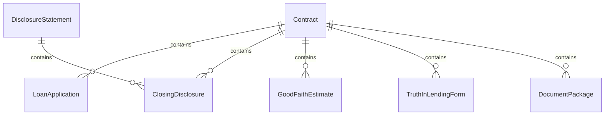
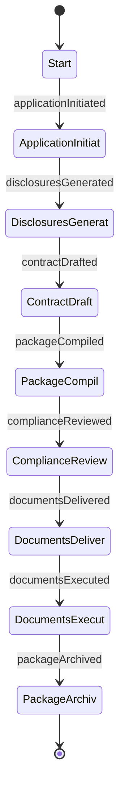
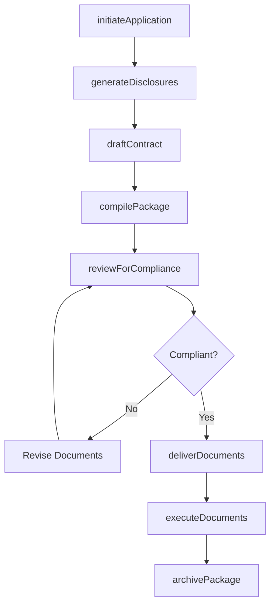
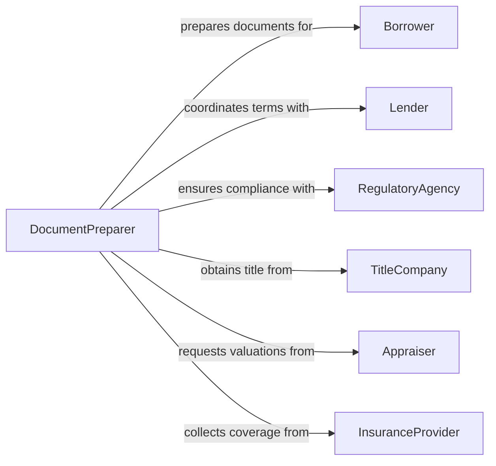

# Prepare Contracts, Disclosures, or Applications

> Business-as-Code definition for contract, disclosure, and application document preparation. Models the creation and management of regulated documents that govern financial transactions, consumer protections, and formal applications.

## Overview

Preparation of contracts, disclosures, and applications encompasses drafting binding agreements, generating required disclosure statements, and assembling application packages for financial products, real estate transactions, and regulated services. This definition ensures that all documents comply with consumer protection laws, truth-in-lending requirements, and industry-specific disclosure mandates while maintaining an auditable document trail.

## Actors

| Actor | Description |
|-------|-------------|
| Borrower | The individual or entity applying for a financial product or service |
| Lender | The financial institution providing credit or financing |
| RegulatoryAgency | Enforces disclosure requirements and consumer protections |
| TitleCompany | Manages title searches and closing documentation |
| Appraiser | Provides property or asset valuations for transaction documents |
| InsuranceProvider | Supplies coverage documentation required for transactions |

## Roles

| Role | Description |
|------|-------------|
| DocumentPreparer | Assembles contracts, disclosures, and application materials |
| LoanOfficer | Initiates and manages loan application documentation |
| ComplianceAnalyst | Verifies documents meet regulatory disclosure requirements |
| ClosingCoordinator | Manages the execution and delivery of transaction documents |

## Entities

| Entity | Description |
|--------|-------------|
| Contract | A binding agreement defining the terms of a transaction |
| DisclosureStatement | A document detailing fees, rates, or conditions required by law |
| LoanApplication | A formal request for credit or financing |
| ClosingDisclosure | A final statement of transaction terms provided before closing |
| GoodFaithEstimate | A preliminary estimate of fees and costs for a transaction |
| TruthInLendingForm | A federally required disclosure of credit terms |
| DocumentPackage | A bundled set of all documents required for a transaction |

## Actions

| Action | Description |
|--------|-------------|
| initiateApplication | Start a new loan or service application |
| generateDisclosures | Create required disclosure statements based on transaction type |
| draftContract | Assemble a contract using applicable templates and terms |
| compilePackage | Bundle all contracts, disclosures, and applications together |
| reviewForCompliance | Verify that all documents meet regulatory requirements |
| deliverDocuments | Transmit the document package to the appropriate parties |
| executeDocuments | Capture signatures and finalize the transaction |
| archivePackage | Store the completed document package for retention |

## Events

| Event | Description |
|-------|-------------|
| applicationInitiated | A new application has been started |
| disclosuresGenerated | Required disclosure statements have been created |
| contractDrafted | A transaction contract has been assembled |
| packageCompiled | All documents have been bundled for delivery |
| complianceReviewed | Documents have passed regulatory compliance review |
| documentsDelivered | The document package has been transmitted to parties |
| documentsExecuted | All signatures have been collected |
| packageArchived | The completed transaction package has been stored |

## Searches

| Search | Description |
|--------|-------------|
| findApplications | List applications by type, status, or applicant |
| getDisclosures | Retrieve disclosure documents for a specific transaction |
| findByCompliance | Locate documents flagged for compliance review |
| getPackageContents | List all documents within a transaction package |
| searchByTransaction | Find all documents associated with a transaction identifier |

## Entity Relationships



## State Diagram



## Workflow



## Actor Relationships



## Usage

### Calling Actions

```typescript
import { prepareContractsDisclosuresApplications } from '@headlessly/prepare-contracts-disclosures-applications'

const docs = prepareContractsDisclosuresApplications()

// Initiate a mortgage application
const application = await docs.initiateApplication({
  type: 'residential-mortgage',
  borrower: { name: 'Jane Doe', ssn: '***-**-1234' },
  property: { address: '742 Evergreen Terrace', apn: 'R-12345' }
})

// Generate required disclosures
await docs.generateDisclosures({
  applicationId: application.id,
  disclosureTypes: ['truth-in-lending', 'closing-disclosure', 'good-faith-estimate']
})

// Compile and deliver
const pkg = await docs.compilePackage({ applicationId: application.id })
await docs.deliverDocuments({ packageId: pkg.id, method: 'secure-portal' })
```

### Event-Driven Automation

```typescript
// Trigger compliance review when package is compiled
docs.packageCompiled(async ({ packageId }) => {
  await docs.reviewForCompliance({ packageId })
})

// Notify closing coordinator when documents are signed
docs.documentsExecuted(async ({ packageId, transactionType }) => {
  await notify({
    to: 'closing-team',
    message: `All documents executed for ${transactionType} - ready for funding`
  })
})
```
