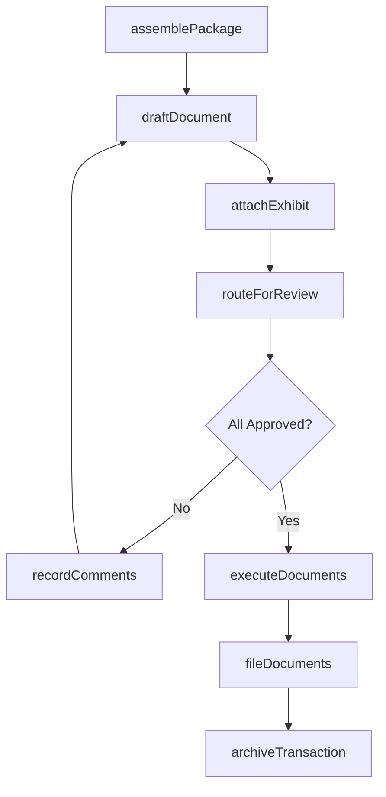
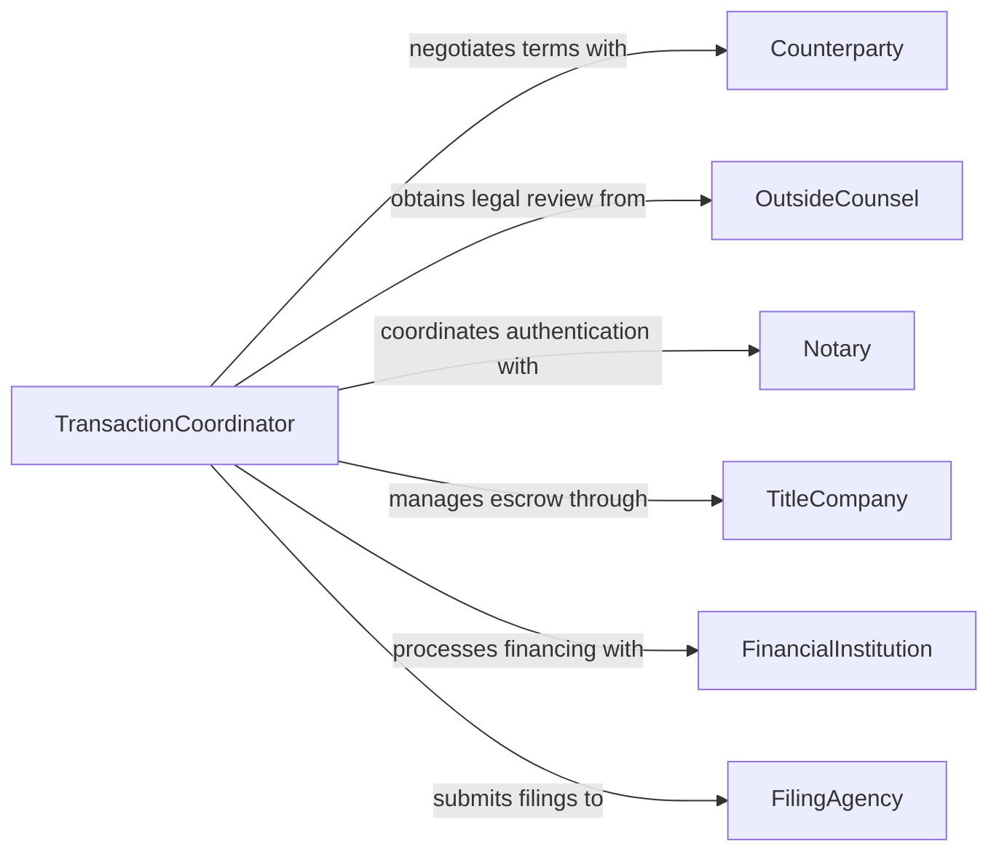

# Prepare Contracts and Transaction Documents

> Business-as-Code definition for contract and transaction document preparation. Models the creation, review, and management of legal instruments that formalize business transactions.

## Overview

Contract and transaction document preparation encompasses drafting agreements, purchase orders, bills of sale, closing documents, and other instruments that formalize commercial dealings between parties. This definition covers template management, clause assembly, multi-party review, and document execution, enabling organizations to standardize their transaction documentation processes and maintain auditable records.

## Actors

| Actor | Description |
|-------|-------------|
| Counterparty | The external party entering into the transaction |
| OutsideCounsel | External legal advisors reviewing document terms |
| Notary | Authenticates signatures and certifies documents |
| TitleCompany | Handles escrow and title-related transaction documents |
| FinancialInstitution | Provides financing documents and payment instruments |
| FilingAgency | Receives and records transaction documents for public record |

## Roles

| Role | Description |
|------|-------------|
| TransactionCoordinator | Manages the document preparation workflow across parties |
| ContractDrafter | Authors and assembles contract and transaction documents |
| ComplianceOfficer | Ensures documents meet regulatory and policy requirements |
| SigningAuthority | Authorized to execute documents on behalf of the organization |

## Entities

| Entity | Description |
|--------|-------------|
| TransactionDocument | A formal instrument recording the terms of a business deal |
| Contract | A binding agreement between two or more parties |
| PurchaseOrder | A buyer-issued document authorizing a purchase transaction |
| ClosingPackage | A collection of documents required to finalize a transaction |
| Exhibit | A supplementary document attached to a contract or agreement |
| Escrow | Funds or documents held by a third party pending conditions |
| ExecutionRecord | A log of signatures and dates for document execution |

## Actions

| Action | Description |
|--------|-------------|
| assemblePackage | Compile all required documents for a transaction |
| draftDocument | Create a transaction document from template and deal terms |
| attachExhibit | Append supporting documents to the transaction package |
| routeForReview | Send documents through the approval and review chain |
| recordComments | Capture reviewer feedback and requested modifications |
| executeDocuments | Collect signatures and finalize the transaction package |
| fileDocuments | Submit executed documents to the appropriate filing agency |
| archiveTransaction | Store completed transaction documents for retention |

## Events

| Event | Description |
|-------|-------------|
| packageAssembled | All transaction documents have been compiled |
| documentDrafted | A new transaction document has been created |
| exhibitAttached | A supporting document has been appended |
| reviewCompleted | All reviewers have provided feedback |
| documentsExecuted | All parties have signed the transaction documents |
| documentsFiled | Executed documents have been submitted for recording |
| transactionArchived | The completed transaction has been archived |

## Searches

| Search | Description |
|--------|-------------|
| findTransactions | List transactions by type, counterparty, or date range |
| getPackageDocuments | Retrieve all documents within a transaction package |
| findPendingReview | Locate documents awaiting reviewer action |
| getExecutionHistory | Retrieve signature and execution records for a transaction |
| searchByClause | Find transactions containing specific contractual language |

## Workflow



## Actor Relationships



## Usage

### Calling Actions

```typescript
import { prepareContractsTransactionDocuments } from '@headlessly/prepare-contracts-transaction-documents'

const transactions = prepareContractsTransactionDocuments()

// Assemble a closing package
const pkg = await transactions.assemblePackage({
  transactionType: 'asset-acquisition',
  counterparty: { name: 'Meridian Industries', entity: 'LLC' },
  closingDate: '2026-03-15'
})

// Draft the purchase agreement
await transactions.draftDocument({
  packageId: pkg.id,
  template: 'asset-purchase-agreement',
  terms: { purchasePrice: 1200000, earnout: true }
})

// Execute and file
await transactions.executeDocuments({
  packageId: pkg.id,
  signers: ['ceo@company.com', 'president@meridian.com']
})
```

### Event-Driven Automation

```typescript
// Notify filing team when documents are executed
transactions.documentsExecuted(async ({ packageId, transactionType }) => {
  await notify({
    to: 'records-management',
    message: `${transactionType} documents executed - ready for filing`
  })
})

// Auto-archive after filing confirmation
transactions.documentsFiled(async ({ packageId }) => {
  await transactions.archiveTransaction({ packageId, retentionYears: 7 })
})
```
