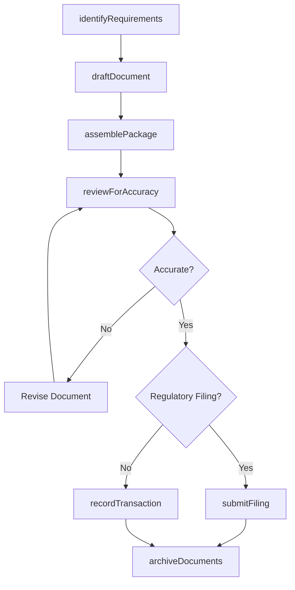
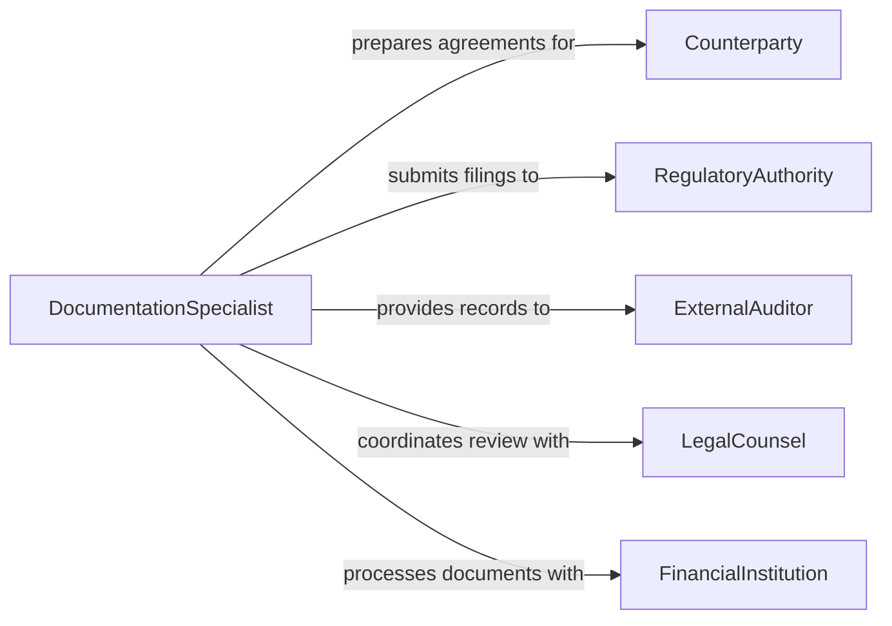

# Prepare Documentation for Contracts, Transactions, or Regulatory Compliance

> Business-as-Code definition for contract, transaction, and regulatory compliance documentation. Models the end-to-end preparation of documents that formalize business dealings and satisfy regulatory obligations.

## Overview

Documentation preparation for contracts, transactions, and regulatory compliance involves assembling agreements, transactional records, and compliance filings into coherent document packages. This definition spans the creation of commercial contracts, the recording of transaction details, and the generation of regulatory submissions, enabling organizations to maintain a unified documentation pipeline that satisfies both business and legal requirements.

## Actors

| Actor | Description |
|-------|-------------|
| Counterparty | The external party to the contract or transaction |
| RegulatoryAuthority | The government body requiring compliance filings |
| ExternalAuditor | Reviews documentation for regulatory and financial compliance |
| LegalCounsel | Provides legal review and risk assessment of documents |
| FinancialInstitution | Processes transaction-related financial documentation |
| IndustryAssociation | Sets voluntary standards that documentation may reference |

## Roles

| Role | Description |
|------|-------------|
| DocumentationSpecialist | Prepares and assembles all required documents |
| ComplianceManager | Oversees regulatory filing requirements and deadlines |
| ContractManager | Manages contract lifecycle and version control |
| RecordsAdministrator | Maintains organized archives of completed documentation |

## Entities

| Entity | Description |
|--------|-------------|
| Contract | A binding agreement between the organization and a counterparty |
| TransactionRecord | A documented account of a completed business transaction |
| ComplianceFiling | A regulatory submission required by law or regulation |
| DocumentTemplate | A standardized format for recurring document types |
| Attachment | Supporting evidence or supplementary materials |
| FilingDeadline | A regulatory due date for required submissions |
| AuditTrail | A chronological record of document creation and modifications |
| RetentionPolicy | Rules governing how long documents must be preserved |

## Actions

| Action | Description |
|--------|-------------|
| identifyRequirements | Determine which documents are needed for a transaction or filing |
| draftDocument | Create a document from a template with populated data |
| assemblePackage | Compile all related documents into a submission-ready package |
| reviewForAccuracy | Validate document content against source records |
| submitFiling | Transmit compliance documentation to the regulatory authority |
| recordTransaction | Document the details of a completed business transaction |
| trackDeadlines | Monitor upcoming filing deadlines and send reminders |
| archiveDocuments | Store completed documents per the retention policy |

## Events

| Event | Description |
|-------|-------------|
| requirementsIdentified | The documentation requirements have been determined |
| documentDrafted | A new document has been created from template |
| packageAssembled | All documents have been compiled for submission |
| accuracyVerified | Document content has been validated against sources |
| filingSubmitted | Compliance documentation has been transmitted |
| transactionRecorded | A business transaction has been formally documented |
| deadlineApproaching | A filing deadline is within the notification threshold |
| documentsArchived | Completed documents have been stored for retention |

## Searches

| Search | Description |
|--------|-------------|
| findDocuments | List documents by type, transaction, or creation date |
| getFilings | Retrieve compliance filings by authority, status, or period |
| findUpcomingDeadlines | Locate filing deadlines within a specified date range |
| getTransactionRecords | Retrieve transaction documentation by counterparty or amount |
| searchByRetention | Find documents by retention policy or expiration date |

## Workflow



## Actor Relationships



## Usage

### Calling Actions

```typescript
import { prepareDocumentationContractsTransactionsRegulatory } from '@headlessly/prepare-documentation-contracts-transactions-regulatory'

const docs = prepareDocumentationContractsTransactionsRegulatory()

// Identify documentation requirements
const requirements = await docs.identifyRequirements({
  transactionType: 'vendor-agreement',
  jurisdiction: 'US-NY',
  regulatoryFramework: 'SOX'
})

// Draft and assemble
const contract = await docs.draftDocument({
  template: 'master-service-agreement',
  counterparty: { name: 'Global Services Inc' },
  terms: { value: 500000, duration: '12 months' }
})

const pkg = await docs.assemblePackage({
  documents: [contract.id],
  attachments: ['certificate-of-insurance', 'w9-form']
})

// Submit regulatory filing
await docs.submitFiling({
  packageId: pkg.id,
  authority: 'SEC',
  filingType: 'material-contract-disclosure'
})
```

### Event-Driven Automation

```typescript
// Alert compliance team on approaching deadlines
docs.deadlineApproaching(async ({ filingType, dueDate, daysRemaining }) => {
  await notify({
    to: 'compliance-team',
    message: `${filingType} filing due in ${daysRemaining} days (${dueDate})`
  })
})

// Auto-archive after filing confirmation
docs.filingSubmitted(async ({ packageId, authority }) => {
  await docs.archiveDocuments({
    packageId,
    retentionPolicy: 'regulatory-7-year'
  })
})
```
