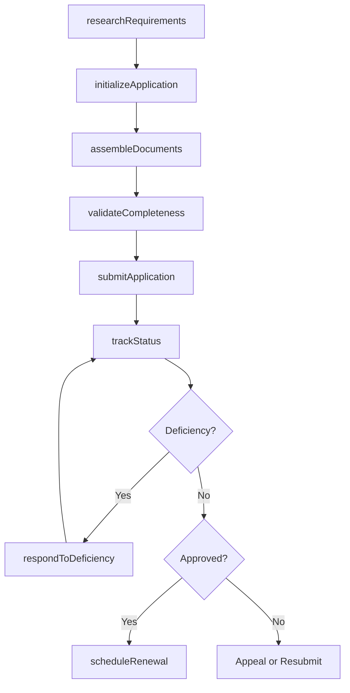
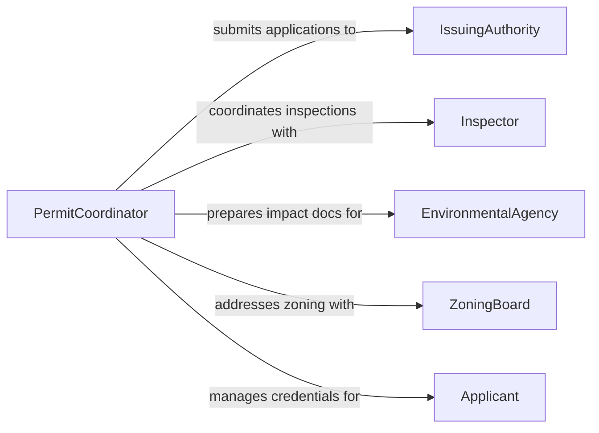

# Prepare Documentation for Permits or Licenses

> Business-as-Code definition for permit and license documentation preparation. Models the assembly, submission, and tracking of documentation required to obtain regulatory permits and professional licenses.

## Overview

Permit and license documentation preparation involves gathering required forms, compiling supporting evidence, assembling application packages, and submitting them to issuing authorities. This definition covers the full application lifecycle from initial requirements research through approval tracking and renewal management, enabling organizations to maintain compliance with local, state, and federal permitting requirements.

## Actors

| Actor | Description |
|-------|-------------|
| IssuingAuthority | The government agency that grants permits or licenses |
| Inspector | Conducts site inspections or reviews as part of the approval process |
| EnvironmentalAgency | Requires environmental impact documentation for certain permits |
| ZoningBoard | Reviews land use and zoning compliance for construction permits |
| ProfessionalBoard | Governs licensure requirements for regulated professions |
| Applicant | The individual or entity applying for the permit or license |

## Roles

| Role | Description |
|------|-------------|
| PermitCoordinator | Manages the permit application process and document assembly |
| ComplianceSpecialist | Ensures all documentation meets regulatory requirements |
| ProjectManager | Oversees the project that requires permitting |
| LegalAdvisor | Reviews applications for legal sufficiency and risk |

## Entities

| Entity | Description |
|--------|-------------|
| Application | A formal request for a permit or license |
| Permit | An authorization granted by a regulatory authority |
| License | A credential authorizing a professional practice or business activity |
| SupportingDocument | Evidence or attestation required as part of an application |
| InspectionReport | A record of findings from a regulatory inspection |
| RenewalNotice | A reminder that an existing permit or license requires renewal |
| FeeSchedule | The costs associated with application processing and issuance |
| ComplianceCertificate | Documentation attesting to regulatory compliance |

## Actions

| Action | Description |
|--------|-------------|
| researchRequirements | Identify documentation and criteria for a specific permit type |
| initializeApplication | Start a new permit or license application |
| assembleDocuments | Compile all required forms and supporting evidence |
| validateCompleteness | Verify that the application package meets all requirements |
| submitApplication | File the application with the issuing authority |
| trackStatus | Monitor the progress of a submitted application |
| respondToDeficiency | Address requests for additional information or corrections |
| scheduleRenewal | Set up automated renewal tracking for approved permits |

## Events

| Event | Description |
|-------|-------------|
| applicationInitialized | A new permit or license application has been started |
| documentsAssembled | All required documents have been compiled |
| applicationSubmitted | The application has been filed with the issuing authority |
| deficiencyNotified | The authority has requested additional information |
| inspectionScheduled | A regulatory inspection has been scheduled |
| permitApproved | The permit or license has been granted |
| permitDenied | The application has been rejected |
| renewalDue | An existing permit or license is approaching renewal |

## Searches

| Search | Description |
|--------|-------------|
| findApplications | List applications by type, status, or jurisdiction |
| getPermits | Retrieve active permits by project, location, or expiration date |
| findExpiring | Locate permits or licenses nearing expiration |
| getDeficiencies | List outstanding deficiency notices requiring response |
| searchByAuthority | Find applications or permits by issuing authority |

## Workflow



## Actor Relationships



## Usage

### Calling Actions

```typescript
import { prepareDocumentationPermitsLicenses } from '@headlessly/prepare-documentation-permits-licenses'

const permits = prepareDocumentationPermitsLicenses()

// Research requirements for a building permit
const requirements = await permits.researchRequirements({
  permitType: 'commercial-building',
  jurisdiction: 'US-CA-LA',
  projectScope: 'new-construction'
})

// Initialize and assemble the application
const application = await permits.initializeApplication({
  type: 'commercial-building-permit',
  applicant: { name: 'Vertex Development LLC' },
  project: { address: '1200 Commerce Blvd', parcel: 'APN-4455-001' }
})

await permits.assembleDocuments({
  applicationId: application.id,
  documents: ['site-plan', 'structural-drawings', 'environmental-review']
})
```

### Event-Driven Automation

```typescript
// Alert team when deficiency notice is received
permits.deficiencyNotified(async ({ applicationId, items }) => {
  await notify({
    to: 'permit-team',
    message: `Deficiency notice received for application ${applicationId}: ${items.length} items`
  })
})

// Auto-schedule renewal reminders
permits.permitApproved(async ({ permitId, expirationDate }) => {
  await permits.scheduleRenewal({
    permitId,
    reminderDays: [180, 90, 30]
  })
})
```
