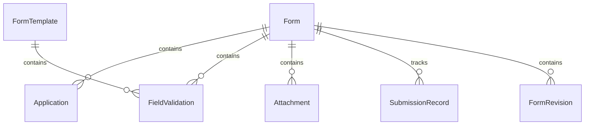
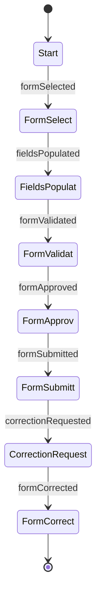
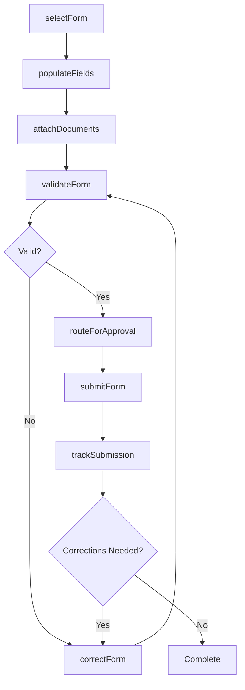
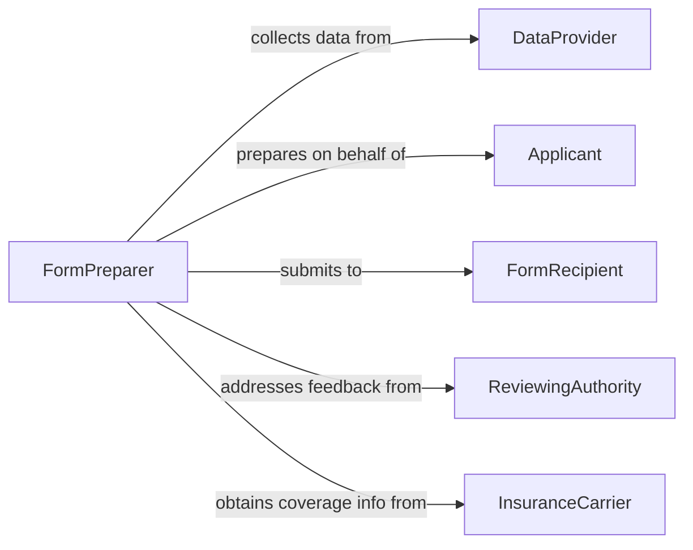

# Prepare Forms and Applications

> Business-as-Code definition for form and application preparation. Models the design, population, validation, and submission of standardized forms and application documents across business processes.

## Overview

Form and application preparation involves selecting appropriate form templates, populating fields with accurate data, validating entries against business rules, and routing completed forms for processing or submission. This definition covers internal administrative forms, external regulatory applications, and customer-facing intake documents, enabling organizations to streamline document workflows and reduce processing errors.

## Actors

| Actor | Description |
|-------|-------------|
| FormRecipient | The agency, institution, or department that receives and processes the form |
| Applicant | The person or entity on whose behalf the form is being prepared |
| DataProvider | Supplies information needed to complete form fields |
| ReviewingAuthority | Evaluates submitted forms and issues decisions |
| InsuranceCarrier | Provides coverage information required on certain applications |

## Roles

| Role | Description |
|------|-------------|
| FormPreparer | Selects, completes, and submits forms and applications |
| DataEntrySpecialist | Populates form fields with verified information |
| QualityChecker | Validates completed forms for accuracy and completeness |
| ProcessAdministrator | Routes forms through approval and submission workflows |

## Entities

| Entity | Description |
|--------|-------------|
| Form | A structured document with defined fields for data collection |
| FormTemplate | A blank or pre-configured form layout for a specific purpose |
| Application | A formal request document submitted for evaluation |
| FieldValidation | A rule that checks data accuracy in a specific form field |
| Attachment | A supporting document required alongside the form |
| SubmissionRecord | A receipt or confirmation of form filing |
| FormRevision | A corrected or updated version of a previously submitted form |

## Actions

| Action | Description |
|--------|-------------|
| selectForm | Choose the appropriate form template for the task |
| populateFields | Enter data into form fields from source records |
| validateForm | Check all fields against completeness and format rules |
| attachDocuments | Append required supporting materials to the form |
| routeForApproval | Send the completed form through internal review |
| submitForm | File the form with the receiving authority or department |
| correctForm | Revise and resubmit a form with errors or omissions |
| trackSubmission | Monitor the processing status of a submitted form |

## Events

| Event | Description |
|-------|-------------|
| formSelected | A form template has been chosen for preparation |
| fieldsPopulated | Form data entry has been completed |
| formValidated | The form has passed all validation checks |
| formApproved | The form has been approved for submission |
| formSubmitted | The form has been filed with the receiving party |
| correctionRequested | The receiving party has requested form corrections |
| formCorrected | A revised form has been submitted |

## Searches

| Search | Description |
|--------|-------------|
| findForms | List forms by type, status, or submission date |
| getFormTemplates | Retrieve available templates by category or purpose |
| findPendingApprovals | Locate forms awaiting internal approval |
| getSubmissionHistory | Retrieve the submission history for a specific form type |
| findIncomplete | List forms with missing required fields |

## Entity Relationships



## State Diagram



## Workflow



## Actor Relationships



## Usage

### Calling Actions

```typescript
import { prepareFormsApplications } from '@headlessly/prepare-forms-applications'

const forms = prepareFormsApplications()

// Select and populate a form
const form = await forms.selectForm({
  templateId: 'business-license-application',
  jurisdiction: 'US-TX-Houston'
})

await forms.populateFields({
  formId: form.id,
  fields: {
    businessName: 'Summit Consulting Group',
    ein: '82-1234567',
    businessType: 'Professional Services',
    address: '500 Main Street, Houston, TX 77002'
  }
})

// Validate and submit
const validation = await forms.validateForm({ formId: form.id })
if (validation.isValid) {
  await forms.submitForm({ formId: form.id })
}
```

### Event-Driven Automation

```typescript
// Alert preparer when corrections are requested
forms.correctionRequested(async ({ formId, issues }) => {
  await notify({
    to: 'form-preparers',
    message: `Corrections needed for form ${formId}: ${issues.length} items`
  })
})

// Auto-validate after fields are populated
forms.fieldsPopulated(async ({ formId }) => {
  await forms.validateForm({ formId })
})
```
