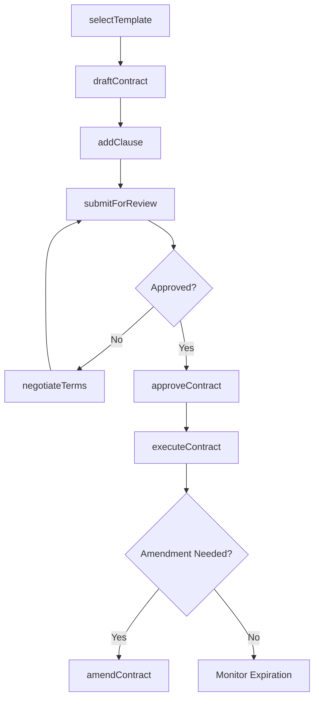
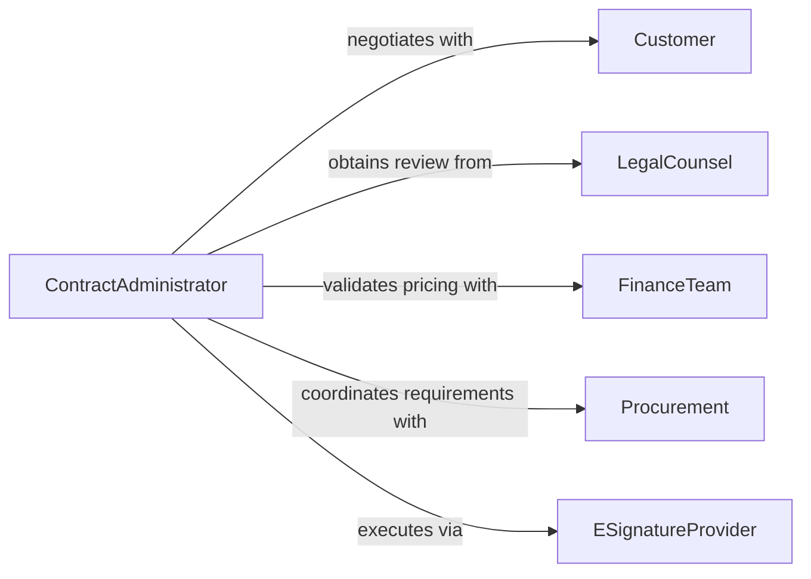

# Prepare Sales Contracts

> Business-as-Code definition for sales contract preparation. Models the drafting, negotiation, execution, and management of sales agreements and commercial contracts.

## Overview

Sales contract preparation involves drafting commercial agreements, incorporating standard terms and conditions, negotiating modifications with counterparties, obtaining approvals, and executing final documents. This definition automates the contract lifecycle from initial template selection through signature and archival, ensuring compliance with organizational policies and applicable regulations.

## Actors

| Actor | Description |
|-------|-------------|
| Customer | The purchasing party who reviews and signs the contract |
| LegalCounsel | External attorneys who review contract terms for compliance |
| FinanceTeam | Validates pricing, payment terms, and revenue recognition |
| Procurement | Manages vendor-side contract requirements and approvals |
| RegulatoryAuthority | Governs industry-specific contract requirements |
| ESignatureProvider | Facilitates digital contract execution and verification |

## Roles

| Role | Description |
|------|-------------|
| ContractAdministrator | Drafts, tracks, and manages contract documents |
| SalesRepresentative | Initiates contracts and negotiates commercial terms |
| LegalReviewer | Reviews contract language for legal compliance |
| ApprovalManager | Authorizes non-standard terms and final execution |

## Entities

| Entity | Description |
|--------|-------------|
| Contract | A legally binding sales agreement between parties |
| ContractTemplate | A pre-approved document framework for specific deal types |
| Clause | An individual provision or term within a contract |
| Amendment | A formal modification to an existing contract |
| Signature | A recorded execution mark from an authorized signer |
| Attachment | A supplementary document appended to the contract |
| ApprovalRecord | A log of internal approvals required before execution |
| PaymentSchedule | The agreed timeline and amounts for contract payments |

## Actions

| Action | Description |
|--------|-------------|
| selectTemplate | Choose a contract template based on deal type and jurisdiction |
| draftContract | Generate a contract document with populated terms and parties |
| addClause | Insert or modify specific clauses in the contract |
| submitForReview | Send the draft contract for legal and business review |
| negotiateTerms | Record proposed changes from the counterparty |
| approveContract | Grant internal approval for contract execution |
| executeContract | Capture signatures and finalize the agreement |
| amendContract | Create a formal amendment to an existing contract |

## Events

| Event | Description |
|-------|-------------|
| contractDrafted | A new contract draft has been generated |
| contractSubmittedForReview | The contract has been sent to reviewers |
| termsNegotiated | Counterparty modifications have been recorded |
| contractApproved | Internal approval has been granted |
| contractExecuted | All parties have signed the agreement |
| contractAmended | A formal amendment has been applied |
| contractExpiring | A contract is approaching its expiration date |

## Searches

| Search | Description |
|--------|-------------|
| findContracts | List contracts by customer, status, or date range |
| getAmendments | Retrieve amendment history for a specific contract |
| findByClause | Locate contracts containing specific clause language |
| getExpiringContracts | List contracts approaching expiration within a period |
| getPendingApprovals | Retrieve contracts awaiting internal approval |

## Workflow



## Actor Relationships



## Usage

### Calling Actions

```typescript
import { prepareSalesContracts } from '@headlessly/prepare-sales-contracts'

const contracts = prepareSalesContracts()

// Draft a new sales contract
const contract = await contracts.draftContract({
  templateId: 'enterprise-saas-agreement',
  customer: { name: 'Acme Corp', jurisdiction: 'US-DE' },
  terms: {
    value: 250000,
    currency: 'USD',
    duration: '24 months',
    paymentTerms: 'net-30'
  }
})

// Submit for review
await contracts.submitForReview({
  contractId: contract.id,
  reviewers: ['legal-team', 'finance-team']
})

// Execute after approval
await contracts.executeContract({
  contractId: contract.id,
  signers: ['sales-vp@company.com', 'cfo@acmecorp.com']
})
```

### Event-Driven Automation

```typescript
// Alert sales team on approaching expirations
contracts.contractExpiring(async ({ contractId, customer, daysRemaining }) => {
  if (daysRemaining <= 90) {
    await notify({
      to: 'sales-team',
      message: `Contract with ${customer.name} expires in ${daysRemaining} days`
    })
  }
})

// Auto-archive executed contracts
contracts.contractExecuted(async ({ contractId }) => {
  await archiveDocument({ documentId: contractId, repository: 'executed-contracts' })
})
```
