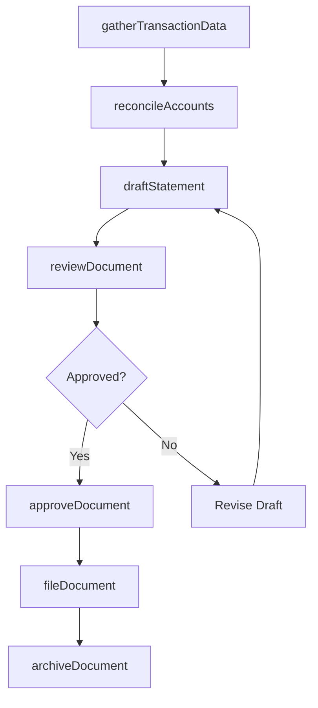
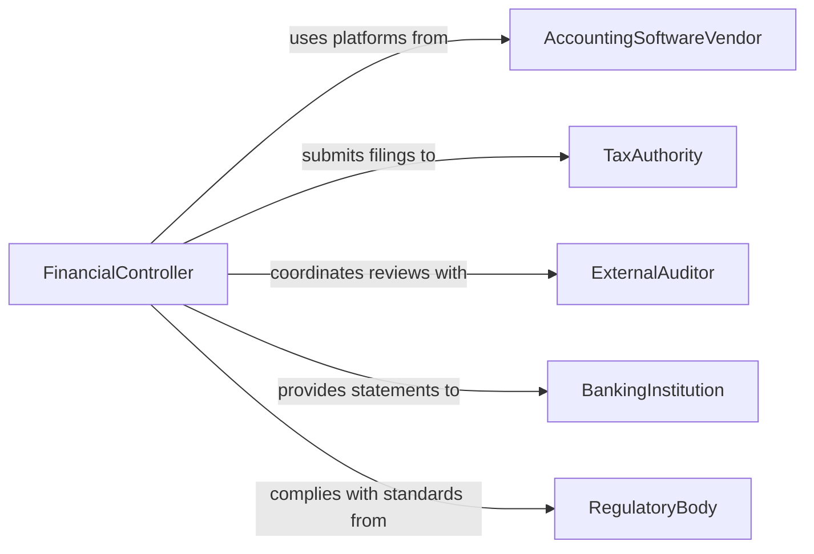

# Prepare Financial Documents

> Business-as-Code definition for financial document preparation and compilation. Models the lifecycle from data gathering through drafting, review, approval, and distribution of financial statements, tax filings, and regulatory submissions.

## Overview

Preparing financial documents involves compiling transactional data, applying accounting standards, and producing formal financial statements such as balance sheets, income statements, and cash flow reports. This definition exposes actions for document assembly and review, events for workflow tracking and compliance monitoring, and searches for document retrieval and audit trail access.

## Actors

| Actor | Description |
|-------|-------------|
| AccountingSoftwareVendor | Provides general ledger and reporting platforms |
| TaxAuthority | Receives and evaluates tax filings and financial disclosures |
| ExternalAuditor | Reviews financial documents for accuracy and compliance |
| BankingInstitution | Requires financial statements for lending and credit decisions |
| RegulatoryBody | Mandates specific reporting formats and filing deadlines |

## Roles

| Role | Description |
|------|-------------|
| StaffAccountant | Compiles transaction data and drafts financial statements |
| FinancialController | Reviews and approves financial documents before distribution |
| TaxSpecialist | Prepares tax returns and ensures regulatory compliance |
| AccountingManager | Coordinates document preparation schedules and assignments |

## Entities

| Entity | Description |
|--------|-------------|
| FinancialStatement | A formal report of financial position such as balance sheet or income statement |
| TrialBalance | A summary of all ledger account balances used to verify accuracy |
| TaxReturn | A document filed with tax authorities reporting income and obligations |
| JournalEntry | An individual accounting transaction recorded in the general ledger |
| SupportingSchedule | A detailed breakdown supporting a line item on a financial statement |
| FilingDeadline | A regulatory or internal due date for document submission |
| ReviewChecklist | A structured list of verification steps for document quality |

## Actions

| Action | Description |
|--------|-------------|
| gatherTransactionData | Collect and reconcile data from source systems for reporting |
| draftStatement | Create an initial version of a financial statement |
| reconcileAccounts | Verify that account balances match supporting documentation |
| reviewDocument | Examine a drafted financial document for accuracy and completeness |
| approveDocument | Formally sign off on a financial document for distribution |
| fileDocument | Submit a completed document to the appropriate authority or recipient |
| archiveDocument | Store a finalized document in the records management system |

## Events

| Event | Description |
|-------|-------------|
| dataGathered | Transaction data has been collected and reconciled |
| statementDrafted | An initial financial statement has been created |
| accountsReconciled | Account balances have been verified against supporting records |
| documentReviewed | A financial document has been examined and feedback provided |
| documentApproved | A financial document has been formally signed off |
| documentFiled | A completed document has been submitted to the recipient |
| deadlineApproaching | A filing deadline is within the configured warning period |

## Searches

| Search | Description |
|--------|-------------|
| findDocuments | List financial documents by type, period, or status |
| getFilingCalendar | Retrieve upcoming deadlines by authority or document type |
| getReconciliationStatus | Query account reconciliation progress by period |
| findPendingReviews | List documents awaiting review or approval |
| getAuditTrail | Retrieve the modification history for a specific document |

## Workflow



## Actor Relationships



## Usage

### Calling Actions

```typescript
import { prepareFinancialDocuments } from '@headlessly/prepare-financial-documents'

const financials = prepareFinancialDocuments()

// Gather Q4 transaction data
const data = await financials.gatherTransactionData({
  period: { start: '2025-10-01', end: '2025-12-31' },
  sources: ['general-ledger', 'accounts-payable', 'accounts-receivable']
})

// Draft the quarterly income statement
const statement = await financials.draftStatement({
  type: 'income-statement',
  period: 'Q4-2025',
  dataSourceId: data.id,
  template: 'gaap-standard'
})

// Submit for controller review
await financials.reviewDocument({
  documentId: statement.id,
  reviewer: 'financial-controller',
  checklist: 'quarterly-close'
})
```

### Event-Driven Automation

```typescript
// Alert on approaching deadlines
financials.deadlineApproaching(async ({ documentType, authority, dueDate, daysRemaining }) => {
  await notify({
    to: 'accounting-team',
    message: `${documentType} due to ${authority} in ${daysRemaining} days (${dueDate})`
  })
})

// Auto-archive after filing
financials.documentFiled(async ({ documentId, authority, filingDate }) => {
  await financials.archiveDocument({
    documentId,
    retentionYears: 7,
    tags: ['filed', authority, filingDate]
  })
})
```
