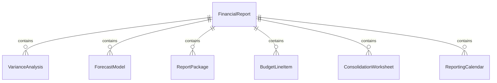
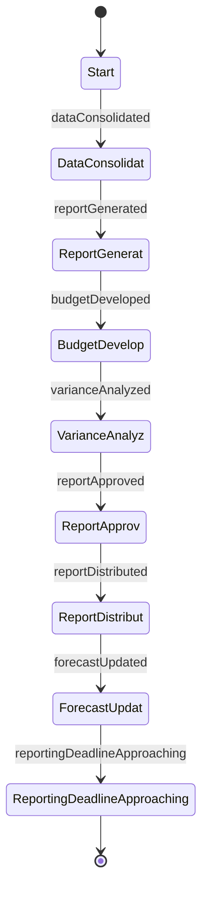
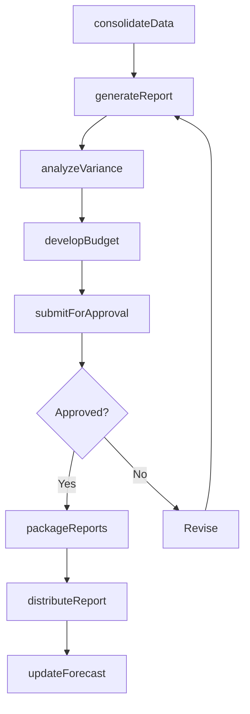
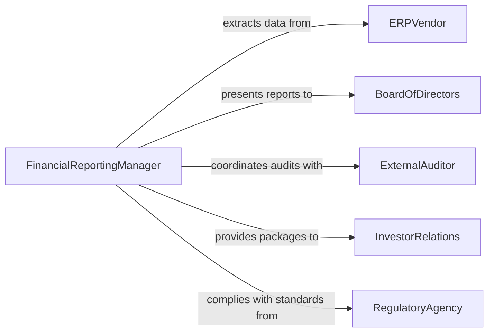

# Prepare Financial Documents, Reports, or Budgets

> Business-as-Code definition for comprehensive financial reporting and budget preparation. Models the end-to-end process from data consolidation through report generation, budget development, and stakeholder distribution.

## Overview

Preparing financial documents, reports, and budgets encompasses the full range of financial communication activities including management reports, annual budgets, variance analyses, and board-level financial packages. This definition exposes actions for report compilation and budget creation, events for approval workflow automation, and searches for historical comparison and trend analysis.

## Actors

| Actor | Description |
|-------|-------------|
| ERPVendor | Provides enterprise resource planning and financial reporting systems |
| BoardOfDirectors | Reviews and approves annual budgets and financial reports |
| ExternalAuditor | Validates financial reports for accuracy and regulatory compliance |
| InvestorRelations | Distributes financial reports to shareholders and analysts |
| RegulatoryAgency | Mandates reporting standards and filing requirements |
| BudgetingPlatform | Provides collaborative budget planning and forecasting tools |

## Roles

| Role | Description |
|------|-------------|
| FinancialReportingManager | Coordinates the preparation of all financial reports |
| BudgetAnalyst | Develops departmental and organizational budgets |
| FinancialPlanner | Creates long-range financial projections and capital plans |
| ManagementAccountant | Produces internal management reports and KPI dashboards |
| ComplianceOfficer | Ensures all reports meet regulatory formatting and content requirements |

## Entities

| Entity | Description |
|--------|-------------|
| FinancialReport | A compiled document presenting financial performance and position |
| AnnualBudget | A comprehensive financial plan covering all departments for a fiscal year |
| VarianceAnalysis | A comparison of budgeted amounts to actual results with explanations |
| ForecastModel | A projection of future financial performance based on assumptions |
| ReportPackage | A bundled set of financial documents prepared for a specific audience |
| BudgetLineItem | An individual revenue or expense category within a budget |
| ConsolidationWorksheet | A working document that combines subsidiary financial data |
| ReportingCalendar | A schedule of report due dates and distribution timelines |

## Actions

| Action | Description |
|--------|-------------|
| consolidateData | Merge financial data from multiple entities or departments |
| generateReport | Produce a formatted financial report from consolidated data |
| developBudget | Create a budget with revenue projections and expense allocations |
| analyzeVariance | Compare actual results to budget and identify significant deviations |
| packageReports | Bundle multiple reports into a single distribution package |
| submitForApproval | Route a report or budget through the approval workflow |
| distributeReport | Send finalized reports to designated stakeholders |
| updateForecast | Revise financial projections based on current performance data |

## Events

| Event | Description |
|-------|-------------|
| dataConsolidated | Financial data from all sources has been merged |
| reportGenerated | A financial report has been produced |
| budgetDeveloped | A new budget has been created and is ready for review |
| varianceAnalyzed | Variance analysis has been completed for the period |
| reportApproved | A financial report has received formal approval |
| reportDistributed | A finalized report has been sent to stakeholders |
| forecastUpdated | Financial projections have been revised |
| reportingDeadlineApproaching | A report due date is within the warning window |

## Searches

| Search | Description |
|--------|-------------|
| findReports | List financial reports by type, period, or approval status |
| getBudgets | Retrieve budgets by fiscal year, department, or version |
| getVariances | Query variance data by period, department, or materiality threshold |
| getReportingSchedule | List upcoming report deadlines and responsible parties |
| findDraftReports | Retrieve reports in progress or awaiting approval |

## Entity Relationships



## State Diagram



## Workflow



## Actor Relationships



## Usage

### Calling Actions

```typescript
import { prepareFinancialDocumentsReportsBudgets } from '@headlessly/prepare-financial-documents-reports-budgets'

const reporting = prepareFinancialDocumentsReportsBudgets()

// Consolidate Q4 data across all subsidiaries
const consolidated = await reporting.consolidateData({
  period: 'Q4-2025',
  entities: ['north-america', 'emea', 'apac'],
  eliminateIntercompany: true
})

// Generate the quarterly earnings report
const report = await reporting.generateReport({
  type: 'quarterly-earnings',
  dataSourceId: consolidated.id,
  format: 'sec-10q',
  comparativePeriods: ['Q4-2024', 'Q3-2025']
})

// Develop the FY2026 annual budget
const budget = await reporting.developBudget({
  fiscalYear: 2026,
  basedOn: 'FY2025-actuals',
  growthAssumption: 0.08,
  departments: ['engineering', 'sales', 'operations', 'marketing']
})
```

### Event-Driven Automation

```typescript
// Notify leadership when reports are approved
reporting.reportApproved(async ({ reportId, type, period, approver }) => {
  await notify({
    to: 'executive-team',
    message: `${type} report for ${period} approved by ${approver}`
  })
})

// Auto-distribute on approval
reporting.reportApproved(async ({ reportId, type }) => {
  const distribution = type === 'quarterly-earnings'
    ? ['board', 'investor-relations', 'sec-filing']
    : ['management-team']
  await reporting.distributeReport({ reportId, recipients: distribution })
})
```
