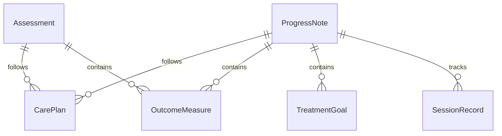
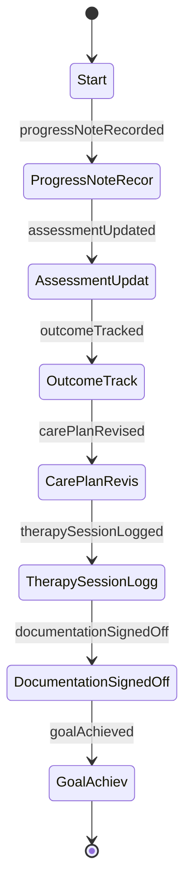
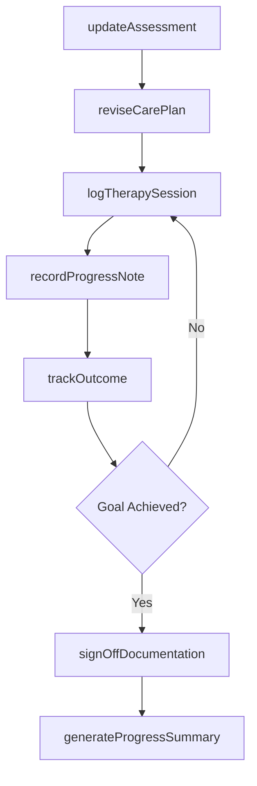
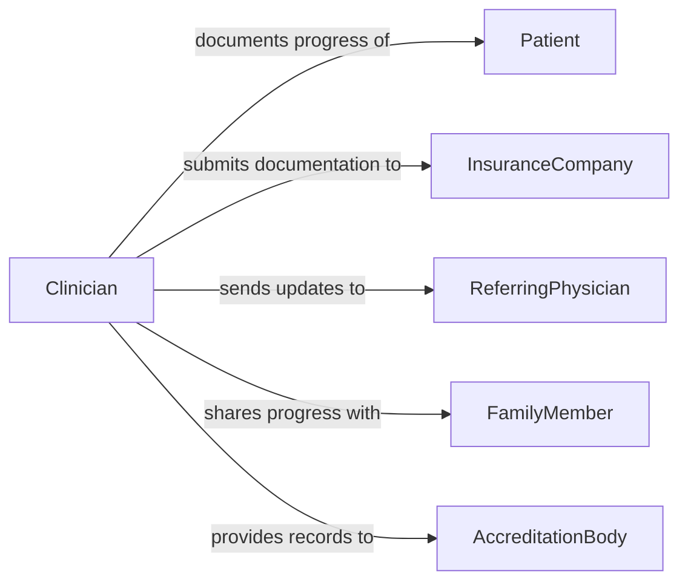

# Document Client Health Progress

> Business-as-Code definition for documenting client health and progress. Models the recording of patient assessments, treatment outcomes, therapy milestones, and care plan updates across healthcare and social service settings.

## Overview

Documenting client health and progress involves recording clinical assessments, therapy session notes, treatment outcomes, and functional status changes in a client's health record. This process supports continuity of care by providing all practitioners with current information about a client's condition and response to treatment. Accurate progress documentation is required for insurance reimbursement, regulatory compliance, and evidence-based care planning.

## Actors

| Actor | Description |
|-------|-------------|
| Patient | Individual whose health status and progress are being documented |
| InsuranceCompany | Payer requiring progress documentation for claims adjudication |
| ReferringPhysician | Provider who referred the client and requires progress updates |
| FamilyMember | Authorized individual involved in the client's care decisions |
| AccreditationBody | Organization auditing documentation for quality standards |

## Roles

| Role | Description |
|------|-------------|
| Clinician | Performs assessments and documents clinical findings |
| TherapyProvider | Records therapy session notes and tracks functional progress |
| CareCoordinator | Compiles progress updates and communicates across the care team |
| MedicalRecordsSpecialist | Ensures documentation completeness and proper filing |

## Entities

| Entity | Description |
|--------|-------------|
| ProgressNote | Narrative record of a client encounter and observed changes |
| Assessment | Structured evaluation of a client's current health status |
| CarePlan | Documented goals, interventions, and expected outcomes for treatment |
| OutcomeMeasure | Quantitative metric tracking improvement or decline |
| TreatmentGoal | Specific objective established for the client's care |
| SessionRecord | Documentation of a single therapy or counseling session |

## Actions

| Action | Description |
|--------|-------------|
| recordProgressNote | Document observations and findings from a client encounter |
| updateAssessment | Capture a new or revised evaluation of client health status |
| trackOutcome | Record a quantitative outcome measure for a treatment goal |
| reviseCarePlan | Update the care plan based on current progress |
| logTherapySession | Document the details and outcomes of a therapy session |
| signOffDocumentation | Clinician review and approval of recorded documentation |
| generateProgressSummary | Produce a summary report of client progress over a period |

## Events

| Event | Description |
|-------|-------------|
| progressNoteRecorded | A client encounter has been documented |
| assessmentUpdated | A new evaluation of client health status has been captured |
| outcomeTracked | A quantitative outcome measure has been recorded |
| carePlanRevised | The client's care plan has been updated |
| therapySessionLogged | A therapy session has been documented |
| documentationSignedOff | A clinician has reviewed and approved documentation |
| goalAchieved | A client has met a defined treatment goal |

## Searches

| Search | Description |
|--------|-------------|
| findProgressNotes | Locate progress notes by client, date, or clinician |
| getOutcomeTrends | Retrieve outcome measures over time for a specific goal |
| getCarePlanHistory | Find care plan revisions for a client |
| getPendingSignoffs | List documentation awaiting clinician review and approval |

## Entity Relationships



## State Diagram



## Workflow



## Actor Relationships



## Usage

### Calling Actions

```typescript
import { documentClientHealthProgress } from '@headlessly/document-client-health-progress'

const progress = documentClientHealthProgress()

// Record a progress note from a client visit
const note = await progress.recordProgressNote({
  clientId: 'PAT-20261022',
  clinicianId: 'DR-0445',
  date: '2026-02-04',
  subjective: 'Client reports improved mobility and reduced pain',
  objective: 'Range of motion increased to 120 degrees in left shoulder',
  assessment: 'Progressing well toward functional goals',
  plan: 'Continue physical therapy twice weekly'
})

// Track a quantitative outcome measure
await progress.trackOutcome({
  clientId: 'PAT-20261022',
  goalId: 'GOAL-003',
  measure: 'pain-scale',
  value: 3,
  previousValue: 6,
  date: '2026-02-04'
})

// Generate a progress summary for insurance
const summary = await progress.generateProgressSummary({
  clientId: 'PAT-20261022',
  period: { start: '2026-01-01', end: '2026-02-04' },
  includeOutcomes: true
})
```

### Event-Driven Automation

```typescript
// Notify care team when a treatment goal is achieved
progress.goalAchieved(async ({ clientId, goalId, goalDescription }) => {
  await notify({
    to: 'care-team',
    message: `Client ${clientId} achieved goal: ${goalDescription}`
  })
})

// Alert records specialist about documentation pending sign-off
progress.progressNoteRecorded(async ({ noteId, clinicianId }) => {
  await addToSignoffQueue({
    documentId: noteId,
    assignedTo: clinicianId,
    deadline: addHours(new Date(), 48)
  })
})
```
