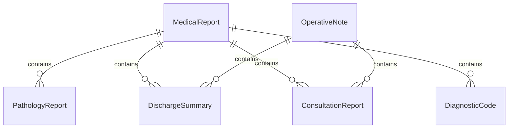
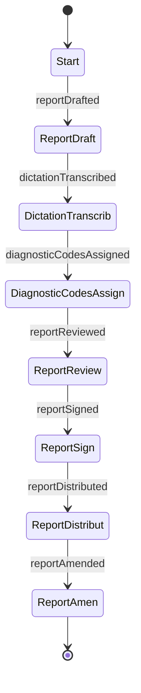
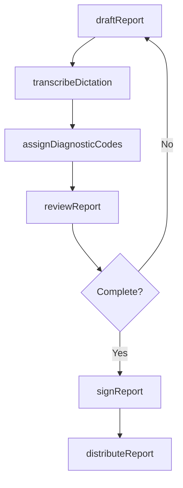
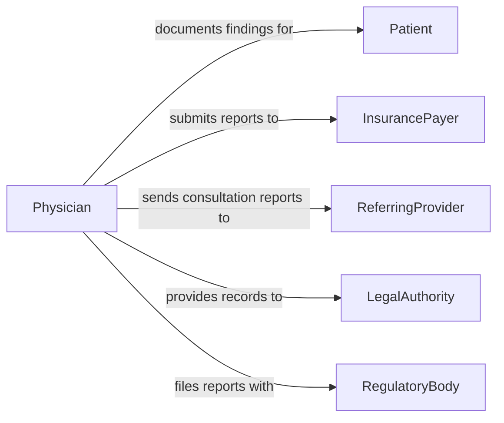

# Prepare Medical Reports Documents

> Business-as-Code definition for preparing medical reports and documents. Models the drafting, formatting, review, and distribution of clinical reports, operative notes, pathology findings, and other medical documentation.

## Overview

Preparing medical reports and documents involves compiling clinical findings, diagnostic results, surgical summaries, and treatment recommendations into structured medical documents. These reports are used for referrals, insurance pre-authorization, disability determinations, legal proceedings, and continuity of care between providers. The process requires adherence to medical documentation standards, proper coding, and confidentiality protections under health privacy regulations.

## Actors

| Actor | Description |
|-------|-------------|
| Patient | Individual whose medical information is the subject of the report |
| InsurancePayer | Organization requiring reports for claims and pre-authorization |
| ReferringProvider | Clinician requesting a consultation report or specialist findings |
| LegalAuthority | Court or attorney requesting medical records for legal proceedings |
| RegulatoryBody | Agency requiring standardized medical reporting |

## Roles

| Role | Description |
|------|-------------|
| Physician | Authors clinical findings and signs off on medical reports |
| MedicalTranscriptionist | Converts dictated notes into formatted medical documents |
| HealthInformationManager | Ensures reports meet coding and documentation standards |
| ClinicalDocumentationSpecialist | Reviews reports for completeness and regulatory compliance |

## Entities

| Entity | Description |
|--------|-------------|
| MedicalReport | Structured document summarizing clinical findings or procedures |
| OperativeNote | Detailed account of a surgical procedure and outcomes |
| PathologyReport | Laboratory findings from tissue or specimen analysis |
| DischargeSummary | Summary of a patient's hospital stay, treatments, and follow-up plan |
| ConsultationReport | Specialist findings and recommendations for a referring provider |
| DiagnosticCode | ICD or CPT code assigned to a diagnosis or procedure |

## Actions

| Action | Description |
|--------|-------------|
| draftReport | Create an initial medical report from clinical findings or dictation |
| transcribeDictation | Convert physician dictation into a formatted document |
| assignDiagnosticCodes | Apply ICD and CPT codes to diagnoses and procedures in the report |
| reviewReport | Verify report accuracy, completeness, and coding compliance |
| signReport | Physician approval and electronic signature of the final document |
| distributeReport | Send the completed report to requesting parties |
| amendReport | Add corrections or addenda to a previously finalized report |

## Events

| Event | Description |
|-------|-------------|
| reportDrafted | An initial medical report has been created |
| dictationTranscribed | A physician dictation has been converted to a formatted document |
| diagnosticCodesAssigned | ICD and CPT codes have been applied to the report |
| reportReviewed | The report has been verified for accuracy and compliance |
| reportSigned | The physician has approved and signed the final document |
| reportDistributed | The completed report has been sent to requesting parties |
| reportAmended | Corrections or addenda have been added to a finalized report |

## Searches

| Search | Description |
|--------|-------------|
| findMedicalReports | Locate reports by patient, type, physician, or date |
| getPendingReports | List reports awaiting transcription, review, or signature |
| getReportsByCode | Find reports associated with specific diagnostic or procedure codes |
| getDistributionHistory | Track where and when a report was sent |

## Entity Relationships



## State Diagram



## Workflow



## Actor Relationships



## Usage

### Calling Actions

```typescript
import { prepareMedicalReportsDocuments } from '@headlessly/prepare-medical-reports-documents'

const medReports = prepareMedicalReportsDocuments()

// Draft an operative note
const report = await medReports.draftReport({
  type: 'operative-note',
  patientId: 'PAT-30042',
  physicianId: 'DR-1187',
  procedure: 'Laparoscopic cholecystectomy',
  findings: 'Gallbladder with multiple calculi, no evidence of perforation',
  complications: 'none',
  date: '2026-02-03'
})

// Assign diagnostic codes
await medReports.assignDiagnosticCodes({
  reportId: report.id,
  codes: [
    { type: 'ICD-10', code: 'K80.20', description: 'Calculus of gallbladder without obstruction' },
    { type: 'CPT', code: '47562', description: 'Laparoscopic cholecystectomy' }
  ]
})

// Distribute the signed report
await medReports.distributeReport({
  reportId: report.id,
  recipients: [
    { type: 'referring-provider', id: 'DR-0892' },
    { type: 'insurance', id: 'INS-BCBS-4401' }
  ]
})
```

### Event-Driven Automation

```typescript
// Notify transcription queue when dictation is available
medReports.reportDrafted(async ({ reportId, type }) => {
  if (type === 'dictation-pending') {
    await addToTranscriptionQueue({ reportId })
  }
})

// Alert physician about unsigned reports nearing deadline
medReports.reportReviewed(async ({ reportId, physicianId }) => {
  await notify({
    to: physicianId,
    message: `Report ${reportId} is reviewed and awaiting your signature`
  })
})
```
