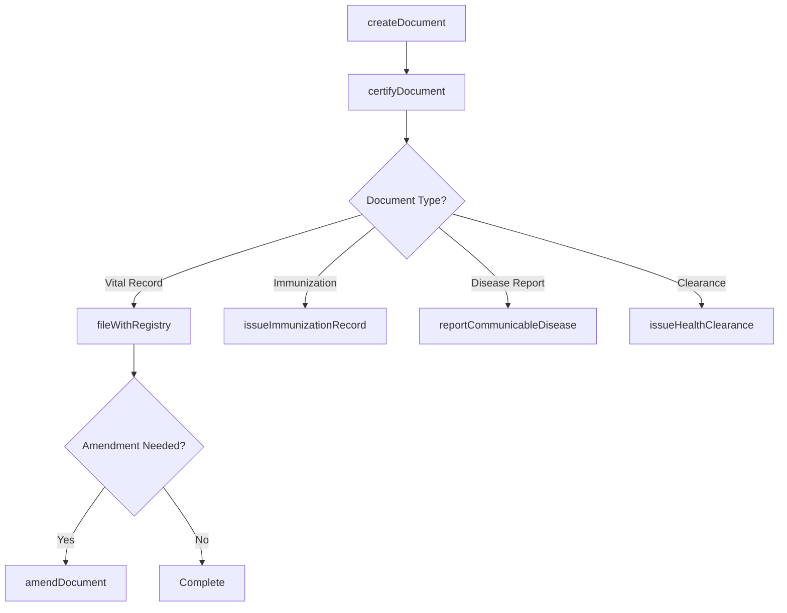
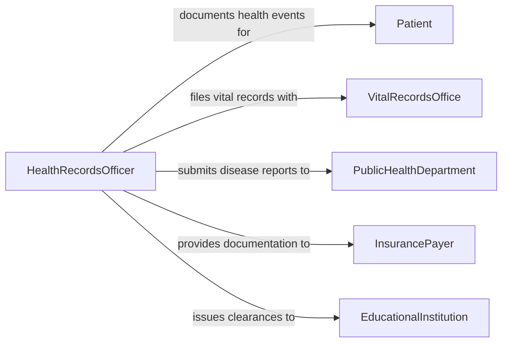

# Prepare Official Health Documents Records

> Business-as-Code definition for preparing official health documents and records. Models the creation, certification, and filing of legally required health documents such as birth certificates, death certificates, immunization records, and public health reports.

## Overview

Preparing official health documents and records involves creating legally mandated documents that certify health events, immunization status, vital statistics, and public health conditions. These documents carry official authority and must comply with jurisdictional requirements for format, content, authentication, and filing deadlines. They serve as foundational records for public health surveillance, vital statistics registries, insurance eligibility, and legal identity verification.

## Actors

| Actor | Description |
|-------|-------------|
| Patient | Individual whose health event or status is being documented |
| VitalRecordsOffice | Government agency maintaining birth, death, and marriage registries |
| PublicHealthDepartment | Agency collecting disease surveillance and immunization data |
| InsurancePayer | Organization requiring official documents for coverage determinations |
| EducationalInstitution | School or university requiring immunization or health clearance records |

## Roles

| Role | Description |
|------|-------------|
| CertifyingPhysician | Attests to clinical facts and signs official health documents |
| HealthRecordsOfficer | Prepares, formats, and files official health documents |
| Registrar | Processes and records vital statistics documents |
| PublicHealthNurse | Completes immunization records and communicable disease reports |

## Entities

| Entity | Description |
|--------|-------------|
| BirthCertificate | Official record certifying a live birth event |
| DeathCertificate | Official record certifying cause and circumstances of death |
| ImmunizationRecord | Documented history of vaccines administered to an individual |
| CommunicableDiseaseReport | Mandatory notification of a reportable disease to public health authorities |
| HealthClearance | Certificate attesting that an individual meets health requirements |
| VitalStatisticsRecord | Aggregated demographic and health event data for a jurisdiction |

## Actions

| Action | Description |
|--------|-------------|
| createDocument | Draft an official health document from clinical or vital data |
| certifyDocument | Apply physician or authorized official attestation and signature |
| fileWithRegistry | Submit the completed document to the appropriate vital records office |
| issueImmunizationRecord | Generate an official record of vaccines administered |
| reportCommunicableDisease | Submit a mandatory disease notification to public health authorities |
| issueHealthClearance | Create a certificate confirming an individual meets health standards |
| amendDocument | Correct errors on a previously filed official document |

## Events

| Event | Description |
|-------|-------------|
| documentCreated | An official health document has been drafted |
| documentCertified | A physician or official has attested and signed the document |
| documentFiled | The document has been submitted to the vital records office |
| immunizationRecordIssued | An official immunization record has been generated |
| communicableDiseaseReported | A mandatory disease notification has been submitted |
| healthClearanceIssued | A health clearance certificate has been created |
| documentAmended | A correction has been applied to a previously filed document |

## Searches

| Search | Description |
|--------|-------------|
| findDocuments | Locate official health documents by patient, type, or date |
| getImmunizationRecords | Retrieve vaccination history for an individual |
| getDiseaseReports | Find communicable disease reports by condition, date, or jurisdiction |
| getPendingFilings | List documents awaiting certification or registry submission |

## Workflow



## Actor Relationships



## Usage

### Calling Actions

```typescript
import { prepareOfficialHealthDocumentsRecords } from '@headlessly/prepare-official-health-documents-records'

const healthDocs = prepareOfficialHealthDocumentsRecords()

// Create a birth certificate
const birthCert = await healthDocs.createDocument({
  type: 'birth-certificate',
  patientId: 'NEWBORN-2026-0204',
  data: {
    dateOfBirth: '2026-02-04',
    placeOfBirth: 'Memorial General Hospital',
    motherName: 'Sarah Chen',
    fatherName: 'David Chen',
    attendingPhysician: 'DR-0553'
  }
})

// Certify the document
await healthDocs.certifyDocument({
  documentId: birthCert.id,
  certifierId: 'DR-0553',
  attestation: 'I hereby certify the above information is true and correct'
})

// File with the vital records office
await healthDocs.fileWithRegistry({
  documentId: birthCert.id,
  registry: 'state-vital-records',
  jurisdiction: 'CA'
})
```

### Event-Driven Automation

```typescript
// Auto-submit communicable disease reports upon certification
healthDocs.documentCertified(async ({ documentId, type }) => {
  if (type === 'communicable-disease-report') {
    await healthDocs.reportCommunicableDisease({ documentId })
  }
})

// Notify registrar of pending filings approaching deadline
healthDocs.documentCreated(async ({ documentId, type, createdAt }) => {
  const deadline = getFilingDeadline(type, createdAt)
  await scheduleReminder({
    to: 'registrar',
    message: `Document ${documentId} must be filed by ${deadline}`,
    remindAt: subtractDays(deadline, 2)
  })
})
```
