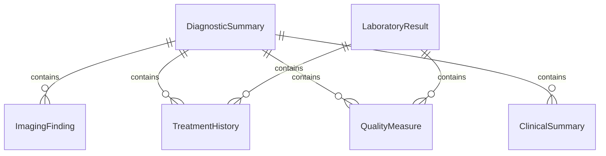
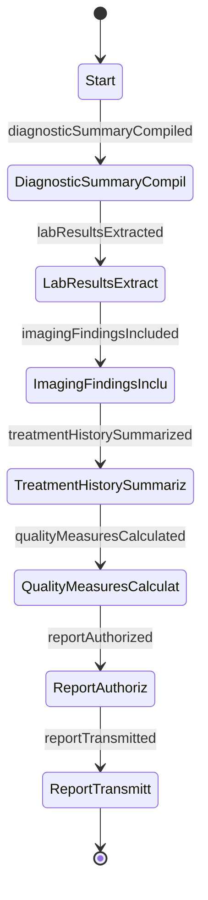
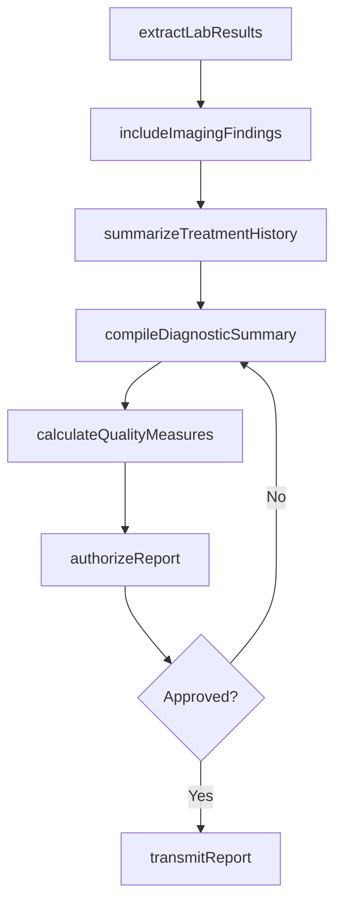
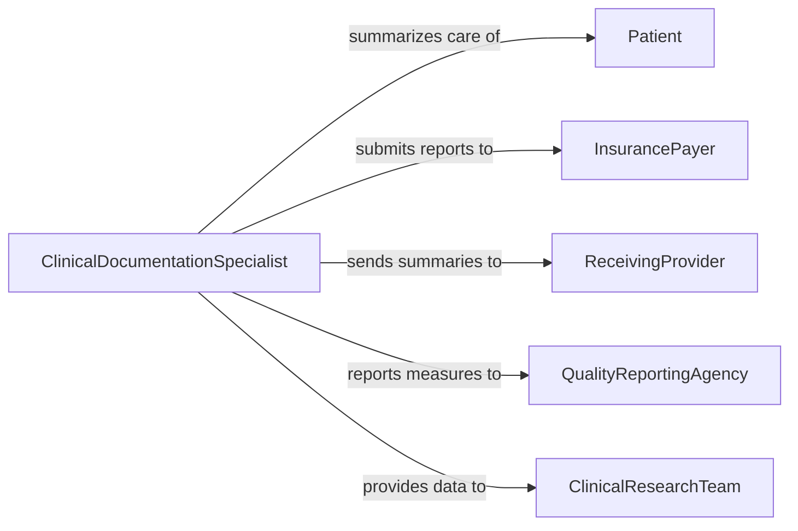

# Prepare Reports Summarizing Patient Diagnostic

> Business-as-Code definition for preparing reports that summarize patient diagnostic and care activities. Models the compilation of diagnostic test results, treatment histories, and clinical summaries into structured reports for care coordination, utilization review, and quality measurement.

## Overview

Preparing reports summarizing patient diagnostic or care activities involves aggregating laboratory results, imaging findings, procedure outcomes, medication histories, and clinical assessments into comprehensive summary documents. These reports support care transitions, utilization review by insurance payers, quality reporting programs, and clinical decision-making by multidisciplinary teams. The process requires accurate data extraction from electronic health records, proper clinical terminology, and adherence to health information exchange standards.

## Actors

| Actor | Description |
|-------|-------------|
| Patient | Individual whose diagnostic and care history is being summarized |
| InsurancePayer | Organization reviewing summaries for utilization management and claims |
| ReceivingProvider | Clinician or facility accepting care of a transferred patient |
| QualityReportingAgency | Body collecting clinical quality measures from healthcare organizations |
| ClinicalResearchTeam | Researchers using de-identified summaries for studies |

## Roles

| Role | Description |
|------|-------------|
| AttendingPhysician | Reviews and authorizes the diagnostic summary report |
| ClinicalDocumentationSpecialist | Compiles and formats diagnostic data into structured reports |
| UtilizationReviewNurse | Prepares summaries for insurance pre-authorization and concurrent review |
| QualityAnalyst | Extracts clinical measures from patient data for quality reporting |

## Entities

| Entity | Description |
|--------|-------------|
| DiagnosticSummary | Consolidated report of all diagnostic findings for a patient encounter |
| LaboratoryResult | Recorded outcome of a blood, urine, or tissue laboratory test |
| ImagingFinding | Documented interpretation of radiographic or imaging studies |
| TreatmentHistory | Chronological record of procedures, medications, and interventions |
| QualityMeasure | Standardized metric tracking clinical care effectiveness |
| ClinicalSummary | Narrative overview of a patient's condition, treatment, and outcomes |

## Actions

| Action | Description |
|--------|-------------|
| compileDiagnosticSummary | Aggregate diagnostic results into a consolidated summary |
| extractLabResults | Pull laboratory findings from the health record for inclusion |
| includeImagingFindings | Add radiology or imaging interpretations to the report |
| summarizeTreatmentHistory | Create a chronological overview of treatments and interventions |
| calculateQualityMeasures | Derive clinical quality metrics from the patient data |
| authorizeReport | Physician review and sign-off on the completed summary |
| transmitReport | Send the finalized report to requesting parties or registries |

## Events

| Event | Description |
|-------|-------------|
| diagnosticSummaryCompiled | Diagnostic results have been aggregated into a report |
| labResultsExtracted | Laboratory findings have been pulled for the summary |
| imagingFindingsIncluded | Imaging interpretations have been added to the report |
| treatmentHistorySummarized | A chronological treatment overview has been created |
| qualityMeasuresCalculated | Clinical quality metrics have been derived |
| reportAuthorized | The physician has reviewed and signed off on the summary |
| reportTransmitted | The finalized report has been sent to requesting parties |

## Searches

| Search | Description |
|--------|-------------|
| findDiagnosticSummaries | Locate summaries by patient, encounter, or date range |
| getLabResultsByEncounter | Retrieve laboratory results associated with a specific encounter |
| getPendingAuthorizations | List diagnostic summaries awaiting physician sign-off |
| getQualityMeasureTrends | Track quality metrics over time for a patient population |

## Entity Relationships



## State Diagram



## Workflow



## Actor Relationships



## Usage

### Calling Actions

```typescript
import { prepareReportsSummarizingPatientDiagnostic } from '@headlessly/prepare-reports-summarizing-patient-diagnostic'

const diagnosticReports = prepareReportsSummarizingPatientDiagnostic()

// Compile a diagnostic summary for a hospital discharge
const summary = await diagnosticReports.compileDiagnosticSummary({
  patientId: 'PAT-44210',
  encounterId: 'ENC-2026-0201',
  includeLabResults: true,
  includeImaging: true,
  includeTreatmentHistory: true
})

// Calculate quality measures for the encounter
await diagnosticReports.calculateQualityMeasures({
  summaryId: summary.id,
  measures: ['sepsis-bundle-compliance', 'antibiotic-timing', 'readmission-risk']
})

// Transmit the report to the receiving provider
await diagnosticReports.transmitReport({
  summaryId: summary.id,
  recipient: { type: 'provider', id: 'DR-0762', facility: 'Riverside Rehabilitation' },
  format: 'CDA-R2',
  secure: true
})
```

### Event-Driven Automation

```typescript
// Notify attending physician when summary is ready for authorization
diagnosticReports.diagnosticSummaryCompiled(async ({ summaryId, patientId }) => {
  await notify({
    to: 'attending-physician',
    message: `Diagnostic summary for patient ${patientId} is ready for review and sign-off`
  })
})

// Auto-transmit to insurance when authorized
diagnosticReports.reportAuthorized(async ({ summaryId, encounterId }) => {
  await diagnosticReports.transmitReport({
    summaryId,
    recipient: { type: 'insurance-payer', claimId: encounterId },
    format: 'X12-837'
  })
})
```
