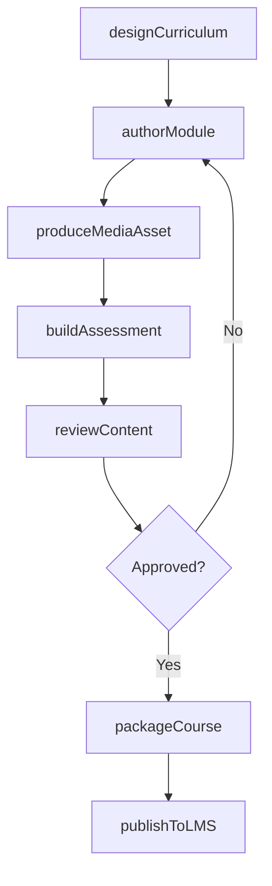
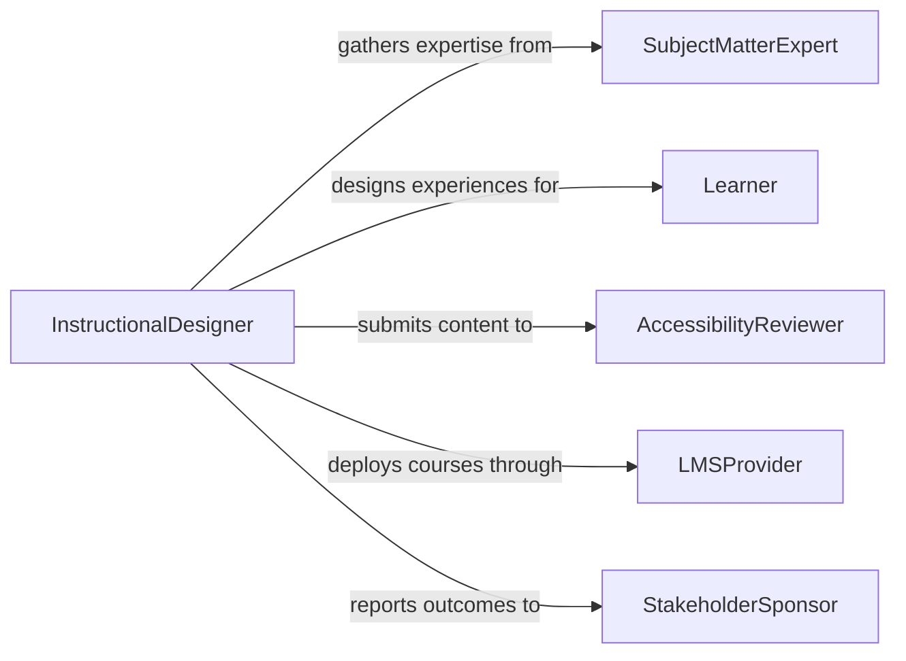

# Create Technology-based Learning Materials

> Business-as-Code definition for creating technology-based learning materials. Models the design, development, review, and publishing of e-learning courses, interactive modules, multimedia content, and digital assessments for educational and corporate training programs.

## Overview

Creating technology-based learning materials involves designing and developing digital instructional content such as e-learning modules, interactive simulations, video tutorials, and online assessments using learning management systems and authoring tools. This process spans needs analysis, instructional design, content authoring, multimedia production, accessibility compliance, and deployment to learning platforms. Effective digital learning materials support scalable workforce training, academic instruction, and professional development programs.

## Actors

| Actor | Description |
|-------|-------------|
| SubjectMatterExpert | Provides domain knowledge and validates content accuracy |
| Learner | End user who consumes the learning materials |
| AccessibilityReviewer | Evaluates materials for compliance with accessibility standards |
| LMSProvider | Learning management system hosting and delivering content |
| StakeholderSponsor | Organizational leader commissioning the training program |

## Roles

| Role | Description |
|------|-------------|
| InstructionalDesigner | Designs learning objectives, structure, and assessment strategies |
| ContentDeveloper | Authors and assembles digital learning content using authoring tools |
| MultimediaProducer | Creates video, audio, animation, and interactive media assets |
| LearningTechnologist | Configures and deploys content within the learning management system |

## Entities

| Entity | Description |
|--------|-------------|
| LearningModule | A self-contained unit of instruction covering a specific topic |
| Assessment | Quiz, test, or evaluation measuring learner comprehension |
| MediaAsset | Video, audio, image, or animation used within learning content |
| CoursePackage | Bundled set of modules conforming to SCORM or xAPI standards |
| LearningObjective | Specific knowledge or skill outcome a module is designed to achieve |
| StoryboardDocument | Design blueprint mapping content flow, interactions, and media |

## Actions

| Action | Description |
|--------|-------------|
| designCurriculum | Define learning objectives, module structure, and assessment strategy |
| authorModule | Create content for a single learning module using authoring tools |
| produceMediaAsset | Record, edit, or animate a multimedia component |
| buildAssessment | Create quizzes, knowledge checks, or practical evaluations |
| reviewContent | Submit materials for subject matter and accessibility review |
| packageCourse | Bundle modules and assessments into a deployable course package |
| publishToLMS | Deploy the completed course package to the learning management system |

## Events

| Event | Description |
|-------|-------------|
| curriculumDesigned | Learning objectives and module structure have been defined |
| moduleAuthored | Content for a learning module has been created |
| mediaAssetProduced | A multimedia component has been completed |
| assessmentBuilt | A quiz or evaluation has been created |
| contentReviewed | Materials have passed subject matter and accessibility review |
| coursePackaged | Modules and assessments have been bundled for deployment |
| coursePublished | The course package has been deployed to the LMS |

## Searches

| Search | Description |
|--------|-------------|
| findCourses | Locate courses by topic, audience, status, or publication date |
| getModulesByObjective | Retrieve modules aligned to specific learning objectives |
| getAssessmentResults | Find learner performance data by assessment or course |
| getPendingReviews | List content awaiting subject matter or accessibility review |

## Workflow



## Actor Relationships



## Usage

### Calling Actions

```typescript
import { createTechnologyBasedLearningMaterials } from '@headlessly/create-technology-based-learning-materials'

const learning = createTechnologyBasedLearningMaterials()

// Design a new training curriculum
const curriculum = await learning.designCurriculum({
  title: 'Cybersecurity Fundamentals',
  audience: 'all-employees',
  objectives: [
    'Identify common phishing techniques',
    'Apply password management best practices',
    'Report security incidents through proper channels'
  ],
  estimatedDuration: '2 hours'
})

// Author a module within the curriculum
const module = await learning.authorModule({
  curriculumId: curriculum.id,
  title: 'Recognizing Phishing Attacks',
  format: 'interactive-scenario',
  content: {
    sections: ['Introduction', 'Real-World Examples', 'Interactive Practice', 'Summary'],
    interactionType: 'branching-scenario'
  }
})

// Package and publish the completed course
const coursePackage = await learning.packageCourse({
  curriculumId: curriculum.id,
  standard: 'SCORM-2004',
  includeAssessments: true
})

await learning.publishToLMS({
  packageId: coursePackage.id,
  lmsTarget: 'corporate-lms',
  availableFrom: '2026-03-01',
  mandatory: true
})
```

### Event-Driven Automation

```typescript
// Notify stakeholders when a course is published
learning.coursePublished(async ({ curriculumId, title, lmsTarget }) => {
  await notify({
    to: 'training-stakeholders',
    message: `Course "${title}" has been published to ${lmsTarget}`
  })
})

// Auto-assign reviewers when content is authored
learning.moduleAuthored(async ({ moduleId, title }) => {
  await assignReview({
    contentId: moduleId,
    reviewers: ['sme-reviewer', 'accessibility-reviewer'],
    deadline: addDays(new Date(), 5)
  })
})
```
