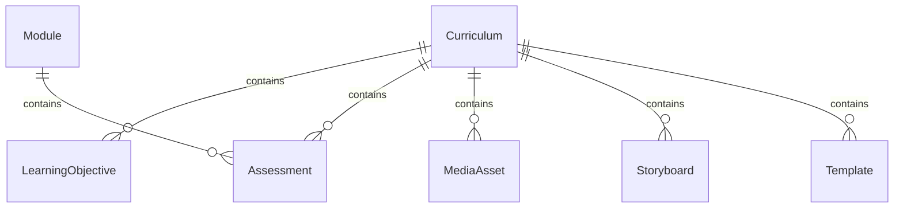
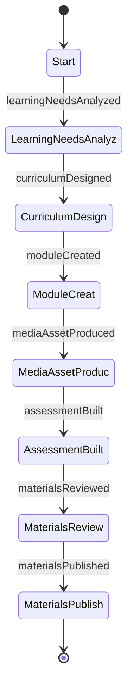
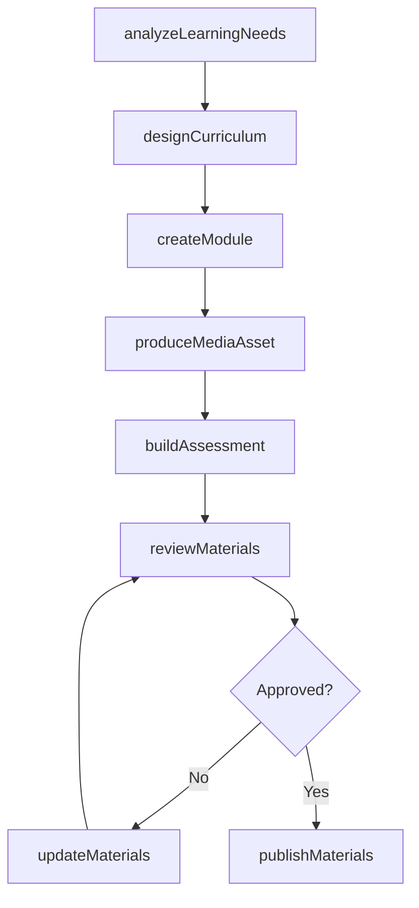
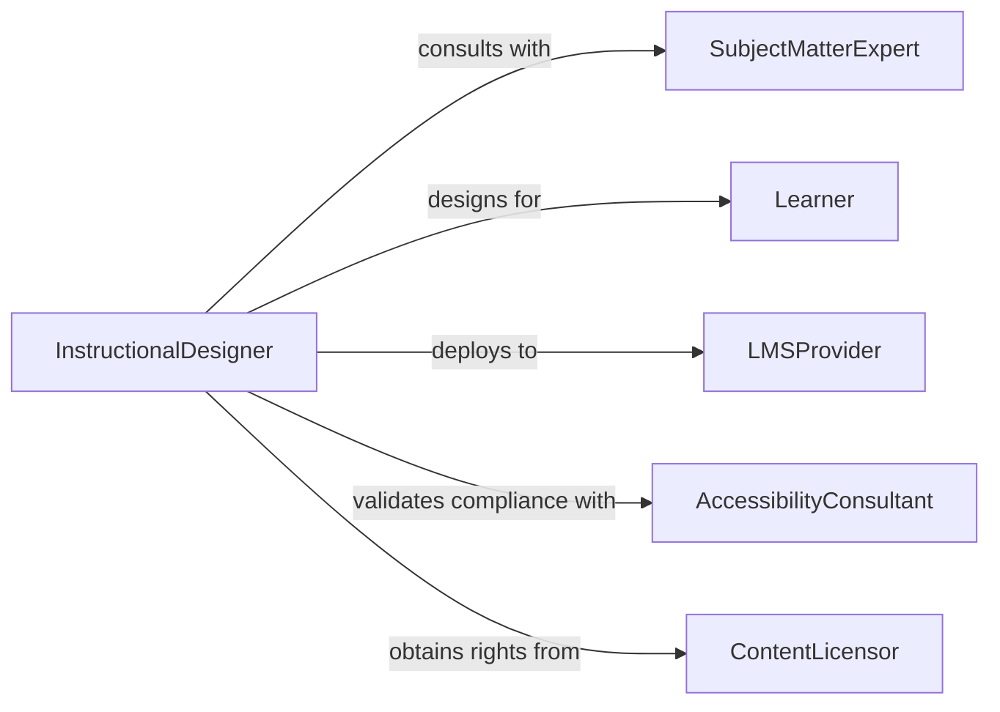

# Develop Instructional Materials

> Business-as-Code definition for instructional material development. Models the design, creation, and deployment of educational content used in organizational learning and knowledge transfer.

## Overview

Instructional material development involves designing curricula, authoring lesson content, producing multimedia assets, and packaging deliverables for learner consumption. This definition covers the full instructional design lifecycle from needs analysis through deployment and effectiveness measurement, enabling organizations to automate content creation workflows and track learning outcomes.

## Actors

| Actor | Description |
|-------|-------------|
| SubjectMatterExpert | Provides domain expertise and validates content accuracy |
| Learner | Consumes instructional materials and provides feedback |
| LMSProvider | Hosts and delivers digital learning content |
| AccessibilityConsultant | Ensures materials meet accessibility standards |
| ContentLicensor | Grants rights for third-party content inclusion |

## Roles

| Role | Description |
|------|-------------|
| InstructionalDesigner | Architects learning objectives and content structure |
| ContentDeveloper | Authors text, assessments, and interactive elements |
| MultimediaProducer | Creates video, audio, and animation assets |
| QualityReviewer | Validates instructional integrity and alignment with objectives |

## Entities

| Entity | Description |
|--------|-------------|
| Curriculum | A structured collection of learning modules and objectives |
| Module | A self-contained unit of instruction covering a specific topic |
| LearningObjective | A measurable outcome that instruction is designed to achieve |
| Assessment | A quiz, test, or evaluation instrument embedded in materials |
| MediaAsset | A video, audio clip, or interactive element used in instruction |
| Storyboard | A visual plan outlining the flow and content of a module |
| Template | A reusable layout for consistent material formatting |

## Actions

| Action | Description |
|--------|-------------|
| analyzeLearningNeeds | Assess the knowledge gaps and requirements of target learners |
| designCurriculum | Structure learning objectives, modules, and delivery sequence |
| createModule | Author content for a specific instructional module |
| produceMediaAsset | Develop multimedia elements for embedding in materials |
| buildAssessment | Create evaluation instruments to measure learning outcomes |
| reviewMaterials | Submit materials for subject matter and quality review |
| publishMaterials | Deploy completed materials to the learning management system |
| updateMaterials | Revise existing materials based on feedback or content changes |

## Events

| Event | Description |
|-------|-------------|
| learningNeedsAnalyzed | A needs analysis has been completed for the target audience |
| curriculumDesigned | The instructional structure and objectives have been defined |
| moduleCreated | A new instructional module has been authored |
| mediaAssetProduced | A multimedia element has been created and approved |
| assessmentBuilt | An evaluation instrument has been finalized |
| materialsReviewed | Instructional materials have passed quality review |
| materialsPublished | Materials have been deployed to the learning platform |

## Searches

| Search | Description |
|--------|-------------|
| findCurricula | List curricula by topic, audience, or status |
| getModules | Retrieve modules within a curriculum by sequence or topic |
| findAssessments | Locate assessments by type, difficulty, or learning objective |
| getMediaAssets | List multimedia assets by format, module, or creation date |
| searchByObjective | Find materials aligned to specific learning objectives |

## Entity Relationships



## State Diagram



## Workflow



## Actor Relationships



## Usage

### Calling Actions

```typescript
import { developInstructionalMaterials } from '@headlessly/develop-instructional-materials'

const materials = developInstructionalMaterials()

// Analyze learning needs
const analysis = await materials.analyzeLearningNeeds({
  audience: 'new-hire-engineers',
  domain: 'safety-procedures',
  currentProficiency: 'beginner'
})

// Design the curriculum
const curriculum = await materials.designCurriculum({
  title: 'Workplace Safety Fundamentals',
  objectives: analysis.gaps,
  duration: '8 hours',
  format: 'blended'
})

// Create a module
await materials.createModule({
  curriculumId: curriculum.id,
  title: 'Hazard Identification',
  content: 'Module content...',
  order: 1
})
```

### Event-Driven Automation

```typescript
// Auto-publish when all modules pass review
materials.materialsReviewed(async ({ curriculumId }) => {
  const modules = await materials.getModules({ curriculumId })
  const allApproved = modules.every(m => m.status === 'approved')
  if (allApproved) {
    await materials.publishMaterials({ curriculumId })
  }
})

// Notify SMEs when new content needs review
materials.moduleCreated(async ({ moduleId, topic }) => {
  await notify({
    to: 'subject-matter-experts',
    message: `New module on ${topic} ready for technical review`
  })
})
```
