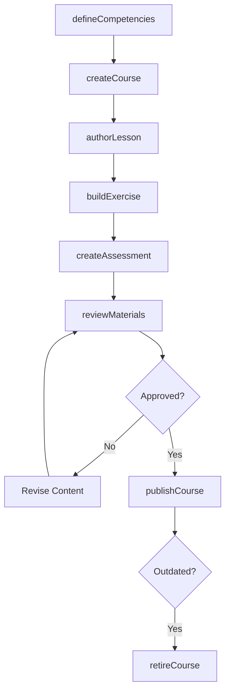
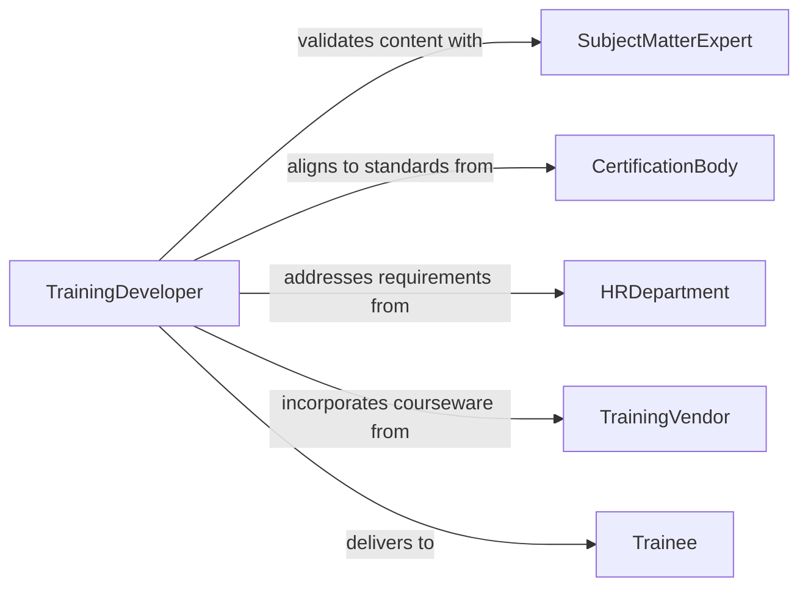

# Develop Training Materials

> Business-as-Code definition for training material development. Models the creation, management, and distribution of materials used in employee training and professional development programs.

## Overview

Training material development involves designing course content, creating exercises and assessments, producing supporting media, and packaging deliverables for instructor-led or self-paced training sessions. This definition enables organizations to standardize their training content pipeline, track material versions across programs, and measure training effectiveness through integrated assessment data.

## Actors

| Actor | Description |
|-------|-------------|
| TrainingVendor | Supplies third-party courseware or certified training content |
| SubjectMatterExpert | Validates technical accuracy and relevance of training content |
| Trainee | Participates in training and provides feedback on materials |
| CertificationBody | Sets standards that training materials must address |
| HRDepartment | Identifies training requirements and compliance mandates |

## Roles

| Role | Description |
|------|-------------|
| TrainingDeveloper | Designs and authors training course materials |
| TrainingManager | Oversees the training program and material production schedule |
| Facilitator | Delivers training sessions using the developed materials |
| AssessmentDesigner | Creates quizzes, practicals, and competency evaluations |

## Entities

| Entity | Description |
|--------|-------------|
| TrainingCourse | A structured program of instruction with defined outcomes |
| Lesson | A single instructional session within a training course |
| Exercise | A hands-on practice activity for skill reinforcement |
| Assessment | A formal evaluation of trainee knowledge or competency |
| SlideDecK | A presentation file used during instructor-led sessions |
| Handout | A supplementary reference document distributed to trainees |
| TrainingPlan | A schedule and resource allocation for training delivery |
| CompetencyFramework | A set of skills and knowledge areas the training targets |

## Actions

| Action | Description |
|--------|-------------|
| defineCompetencies | Identify the skills and knowledge the training must develop |
| createCourse | Initialize a new training course with objectives and structure |
| authorLesson | Write content for a specific lesson within the course |
| buildExercise | Design a hands-on practice activity for a lesson |
| createAssessment | Develop an evaluation instrument for measuring outcomes |
| reviewMaterials | Submit training content for expert review and approval |
| publishCourse | Release finalized materials for training delivery |
| retireCourse | Deprecate outdated training materials |

## Events

| Event | Description |
|-------|-------------|
| competenciesDefined | Target competencies for the training have been established |
| courseCreated | A new training course has been initialized |
| lessonAuthored | A lesson draft has been completed |
| exerciseBuilt | A practice exercise has been designed and tested |
| assessmentCreated | An evaluation instrument has been finalized |
| materialsReviewed | Training content has passed quality and accuracy review |
| coursePublished | Training materials have been released for delivery |
| courseRetired | Outdated training materials have been deprecated |

## Searches

| Search | Description |
|--------|-------------|
| findCourses | List training courses by topic, audience, or status |
| getLessons | Retrieve lessons within a course by sequence |
| findByCompetency | Locate training materials mapped to specific competencies |
| getAssessments | List assessments by course, type, or difficulty level |
| searchMaterials | Full-text search across all training content |

## Workflow



## Actor Relationships



## Usage

### Calling Actions

```typescript
import { developTrainingMaterials } from '@headlessly/develop-training-materials'

const training = developTrainingMaterials()

// Define competencies
const competencies = await training.defineCompetencies({
  domain: 'cybersecurity',
  roles: ['security-analyst', 'network-engineer'],
  level: 'intermediate'
})

// Create the course
const course = await training.createCourse({
  title: 'Incident Response Fundamentals',
  competencies: competencies.ids,
  duration: '16 hours',
  format: 'instructor-led'
})

// Author a lesson
await training.authorLesson({
  courseId: course.id,
  title: 'Threat Detection and Triage',
  content: 'Lesson content covering detection methodologies...',
  order: 3
})
```

### Event-Driven Automation

```typescript
// Notify facilitators when course is published
training.coursePublished(async ({ courseId, title }) => {
  await notify({
    to: 'training-facilitators',
    message: `New course "${title}" is ready for delivery`
  })
})

// Schedule review when competency standards change
training.competenciesDefined(async ({ domain, competencyIds }) => {
  const existingCourses = await training.findByCompetency({ competencyIds })
  for (const course of existingCourses) {
    await training.reviewMaterials({ courseId: course.id, reason: 'competency-update' })
  }
})
```
