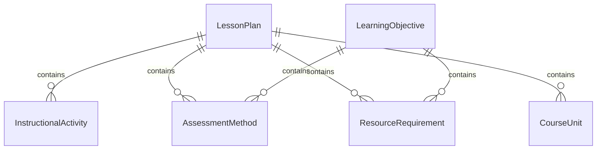
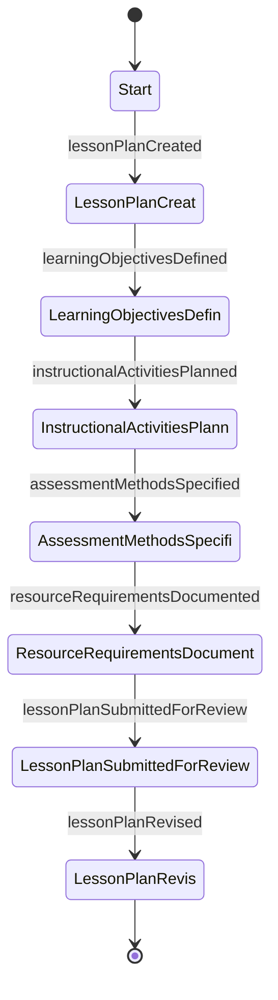
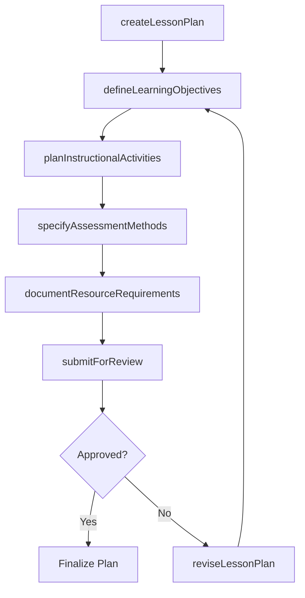
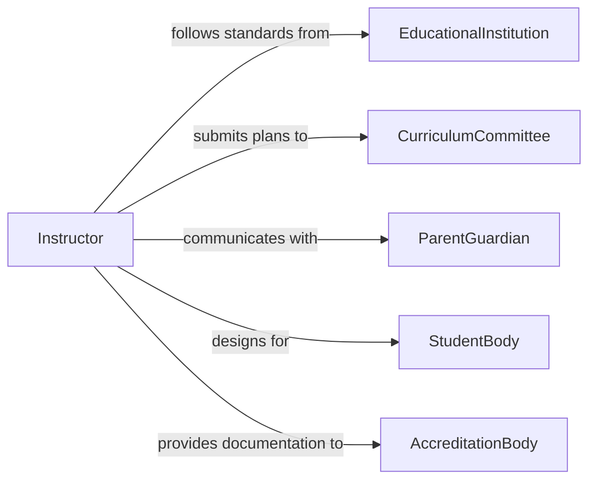

# Document Lesson Plans

> Business-as-Code definition for documenting lesson plans that structure instructional objectives, activities, assessments, and resource requirements.

## Overview

Documenting lesson plans involves creating structured records of instructional design including learning objectives, teaching activities, assessment methods, and required materials for educational sessions. This definition exposes actions for lesson plan creation and management, events for curriculum coordination automation, and searches for organizing instructional documentation across academic programs.

## Actors

| Actor | Description |
|-------|-------------|
| EducationalInstitution | Sets curriculum standards and instructional requirements |
| CurriculumCommittee | Reviews and approves lesson plan alignment with standards |
| ParentGuardian | Receives communication about instructional plans and expectations |
| StudentBody | Target learners for whom lesson plans are designed |
| AccreditationBody | Evaluates lesson plan documentation for program accreditation |

## Roles

| Role | Description |
|------|-------------|
| Instructor | Authors and documents lesson plans for course delivery |
| CurriculumCoordinator | Ensures lesson plans align across courses and grade levels |
| DepartmentChair | Reviews lesson plans for departmental consistency |
| InstructionalCoach | Provides guidance on lesson plan design and improvement |

## Entities

| Entity | Description |
|--------|-------------|
| LessonPlan | Structured document defining objectives, activities, and assessments |
| LearningObjective | Specific measurable outcome the lesson aims to achieve |
| InstructionalActivity | Planned teaching action or exercise within a lesson |
| AssessmentMethod | Technique for evaluating student understanding |
| ResourceRequirement | Materials, tools, or technology needed for lesson delivery |
| CourseUnit | Collection of related lesson plans forming a curriculum segment |

## Actions

| Action | Description |
|--------|-------------|
| createLessonPlan | Initialize a new lesson plan with core objectives and structure |
| defineLearningObjectives | Specify measurable outcomes for the lesson |
| planInstructionalActivities | Design teaching exercises and engagement strategies |
| specifyAssessmentMethods | Define how student learning will be evaluated |
| documentResourceRequirements | Record materials and tools needed for lesson delivery |
| submitForReview | Send lesson plan to curriculum review process |
| reviseLessonPlan | Update plan based on review feedback or classroom experience |

## Events

| Event | Description |
|-------|-------------|
| lessonPlanCreated | A new lesson plan has been initialized |
| learningObjectivesDefined | Measurable outcomes have been specified for the lesson |
| instructionalActivitiesPlanned | Teaching exercises have been designed |
| assessmentMethodsSpecified | Evaluation methods have been defined |
| resourceRequirementsDocumented | Materials and tools have been recorded |
| lessonPlanSubmittedForReview | Plan has entered the curriculum review process |
| lessonPlanRevised | Plan has been updated based on feedback |

## Searches

| Search | Description |
|--------|-------------|
| findLessonPlans | Retrieve lesson plans by course, unit, or instructor |
| findByLearningObjective | List plans targeting specific learning outcomes |
| findPendingReview | List lesson plans awaiting curriculum review |
| getResourceRequirements | Retrieve material needs for a set of lesson plans |

## Entity Relationships



## State Diagram



## Workflow



## Actor Relationships



## Usage

### Calling Actions

```typescript
import { documentLessonPlans } from '@headlessly/document-lesson-plans'

const lessons = documentLessonPlans()

// Create a new lesson plan
const plan = await lessons.createLessonPlan({
  courseId: 'BIO-201',
  unit: 'Cell Biology',
  title: 'Mitosis and Cell Division',
  gradeLevel: 'undergraduate',
  duration: 90
})

// Define learning objectives
await lessons.defineLearningObjectives({
  planId: plan.id,
  objectives: [
    'Describe the phases of mitosis in correct sequence',
    'Identify mitotic structures using microscopy',
    'Compare mitosis and meiosis processes'
  ]
})

// Plan instructional activities
await lessons.planInstructionalActivities({
  planId: plan.id,
  activities: [
    { type: 'lecture', duration: 30, topic: 'Phases of Mitosis' },
    { type: 'lab', duration: 45, topic: 'Microscopy Observation of Onion Root Tips' },
    { type: 'discussion', duration: 15, topic: 'Mitosis vs Meiosis Comparison' }
  ]
})
```

### Event-Driven Automation

```typescript
// Auto-check resource availability when requirements are documented
lessons.resourceRequirementsDocumented(async ({ planId, resources }) => {
  for (const resource of resources) {
    await checkAvailability({
      resourceType: resource.type,
      quantity: resource.quantity,
      date: resource.neededDate
    })
  }
})

// Notify curriculum coordinator when plan is submitted
lessons.lessonPlanSubmittedForReview(async ({ planId, courseId }) => {
  await notify({
    to: 'curriculum-coordinator',
    message: `Lesson plan for ${courseId} is ready for review`
  })
})
```
