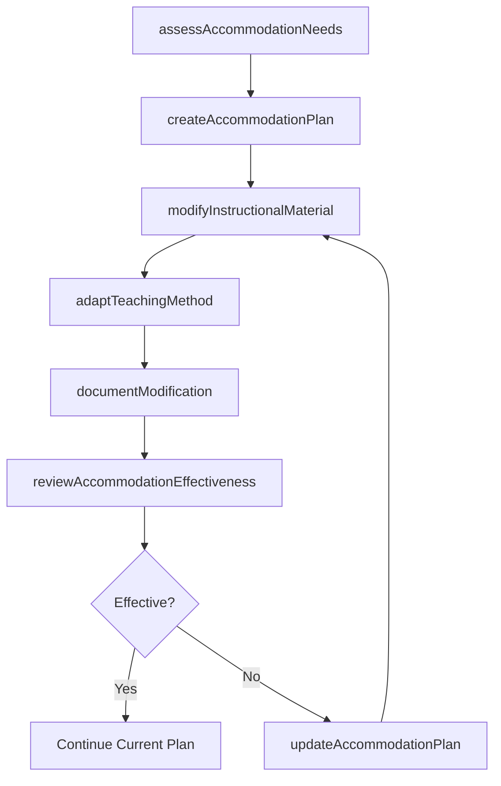
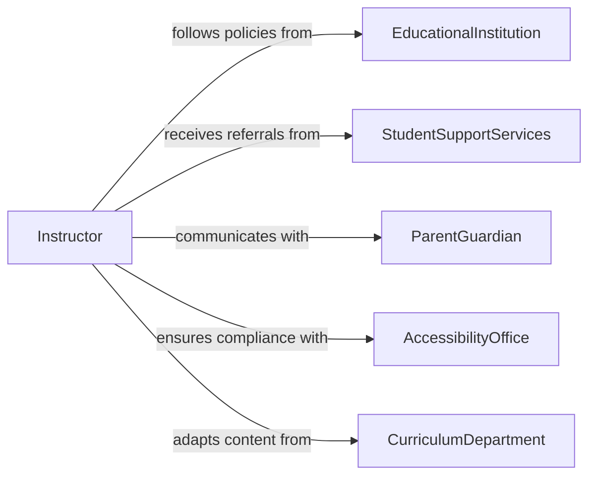

# Modify Teaching Methods Materials Accommodate

> Business-as-Code definition for modifying teaching methods and instructional materials to accommodate diverse student needs and learning requirements.

## Overview

Modifying teaching methods and materials to accommodate student needs involves adapting curriculum content, instructional approaches, and learning resources to address varied learning styles, abilities, and accessibility requirements. This definition exposes actions for assessment-driven material adaptation, events for accommodation tracking, and searches for identifying students requiring modified instruction.

## Actors

| Actor | Description |
|-------|-------------|
| EducationalInstitution | Provides policies and standards for instructional accommodations |
| StudentSupportServices | Identifies students requiring modified instruction |
| ParentGuardian | Communicates student needs and provides consent for modifications |
| AccessibilityOffice | Ensures materials meet accessibility compliance standards |
| CurriculumDepartment | Provides base curriculum materials for modification |

## Roles

| Role | Description |
|------|-------------|
| Instructor | Adapts teaching methods and delivers modified instruction |
| InstructionalDesigner | Redesigns materials to meet accommodation requirements |
| AccommodationCoordinator | Manages accommodation plans and compliance tracking |
| LearningSpecialist | Assesses student needs and recommends modifications |

## Entities

| Entity | Description |
|--------|-------------|
| AccommodationPlan | Documented set of modifications for a student or group |
| InstructionalMaterial | Teaching resource subject to modification |
| LearningAssessment | Evaluation of student needs driving modification decisions |
| ModificationRecord | Tracked change applied to a method or material |
| CurriculumStandard | Baseline learning objective that modified materials must satisfy |
| AccessibilityProfile | Student-specific requirements for material adaptation |

## Actions

| Action | Description |
|--------|-------------|
| assessAccommodationNeeds | Evaluate student requirements for instructional modifications |
| createAccommodationPlan | Define specific modifications for a student or group |
| modifyInstructionalMaterial | Adapt existing teaching materials to meet accommodation needs |
| adaptTeachingMethod | Adjust instructional delivery approach for specific learners |
| reviewAccommodationEffectiveness | Evaluate whether modifications are achieving desired outcomes |
| updateAccommodationPlan | Revise modifications based on effectiveness review |
| documentModification | Record changes made to methods or materials |

## Events

| Event | Description |
|-------|-------------|
| accommodationNeedsAssessed | Student accommodation requirements have been evaluated |
| accommodationPlanCreated | A new modification plan has been established |
| instructionalMaterialModified | Teaching materials have been adapted |
| teachingMethodAdapted | Instructional delivery approach has been adjusted |
| accommodationEffectivenessReviewed | Modification outcomes have been evaluated |
| accommodationPlanUpdated | Modification plan has been revised |
| modificationDocumented | Changes to methods or materials have been recorded |

## Searches

| Search | Description |
|--------|-------------|
| findAccommodationPlans | Retrieve accommodation plans by student, course, or status |
| findModifiedMaterials | List materials that have been adapted for accommodations |
| getAccommodationHistory | Retrieve modification history for a student |
| findPendingAccommodations | List students with unimplemented accommodation requirements |
| findEffectivenessReviews | Retrieve review results for accommodation plans |

## Workflow



## Actor Relationships



## Usage

### Calling Actions

```typescript
import { modifyTeachingMethodsMaterialsAccommodate } from '@headlessly/modify-teaching-methods-materials-accommodate'

const accommodations = modifyTeachingMethodsMaterialsAccommodate()

// Assess accommodation needs
const assessment = await accommodations.assessAccommodationNeeds({
  studentId: 'STU-2026-1847',
  courseId: 'ENG-101',
  assessmentType: 'learning-style-evaluation',
  identifiedNeeds: ['visual-impairment', 'extended-time']
})

// Create accommodation plan
const plan = await accommodations.createAccommodationPlan({
  studentId: 'STU-2026-1847',
  assessmentId: assessment.id,
  modifications: [
    { type: 'material-format', detail: 'large-print-and-audio' },
    { type: 'assessment-timing', detail: 'time-and-a-half' }
  ]
})

// Modify instructional material
await accommodations.modifyInstructionalMaterial({
  materialId: 'MAT-ENG101-CH03',
  planId: plan.id,
  adaptations: ['large-print', 'audio-narration', 'high-contrast']
})
```

### Event-Driven Automation

```typescript
// Auto-modify materials when plan is created
accommodations.accommodationPlanCreated(async ({ planId, modifications }) => {
  for (const mod of modifications) {
    if (mod.type === 'material-format') {
      await accommodations.modifyInstructionalMaterial({
        planId,
        adaptations: [mod.detail]
      })
    }
  }
})

// Schedule effectiveness review after implementation
accommodations.instructionalMaterialModified(async ({ planId, materialId }) => {
  await scheduleTask({
    action: 'reviewAccommodationEffectiveness',
    planId,
    scheduledDate: addWeeks(new Date(), 4)
  })
})
```
