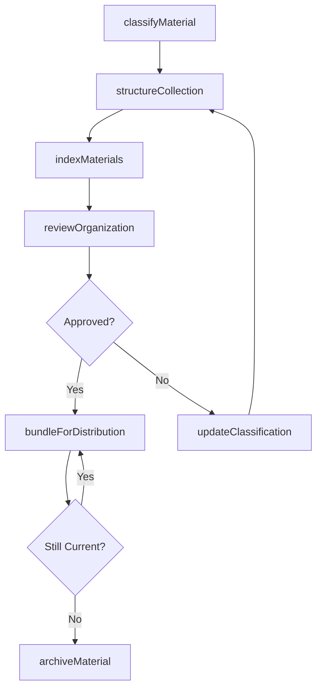
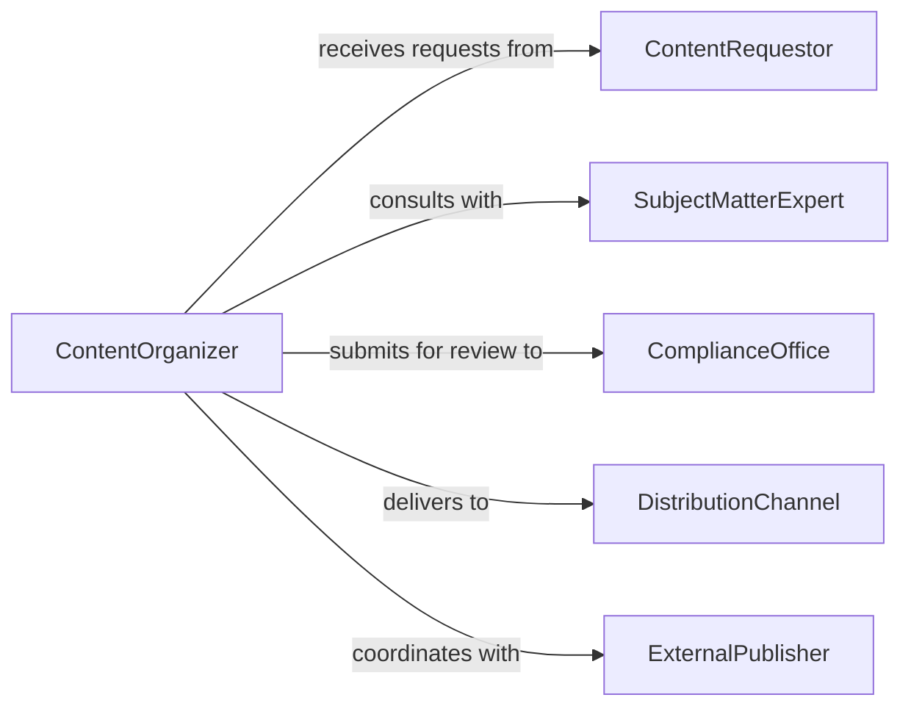

# Organize Informational Materials

> Business-as-Code definition for organizing informational materials into structured, accessible formats for distribution and consumption.

## Overview

Organizing informational materials involves structuring, categorizing, and arranging content assets such as documents, guides, reports, and reference materials for effective retrieval and distribution. This definition exposes actions for content organization workflows, events for publication pipeline automation, and searches for locating materials across content repositories.

## Actors

| Actor | Description |
|-------|-------------|
| ContentRequestor | Department or individual requesting organized materials |
| SubjectMatterExpert | Provides domain knowledge for content accuracy |
| ComplianceOffice | Ensures materials meet regulatory and policy requirements |
| DistributionChannel | Platform or medium through which materials are delivered |
| ExternalPublisher | Third-party entity handling print or digital publication |

## Roles

| Role | Description |
|------|-------------|
| ContentOrganizer | Structures and categorizes informational materials |
| InformationArchitect | Designs taxonomy and navigation for content collections |
| EditorReviewer | Reviews organized materials for accuracy and completeness |
| ContentLibrarian | Manages the repository of organized materials |

## Entities

| Entity | Description |
|--------|-------------|
| InformationalMaterial | A document, guide, or reference asset to be organized |
| ContentCollection | A grouped set of related materials |
| Taxonomy | Classification scheme for categorizing materials |
| ContentIndex | Searchable catalog of organized materials |
| DistributionPackage | Bundled set of materials prepared for delivery |
| VersionRecord | Tracked revision history of a material |

## Actions

| Action | Description |
|--------|-------------|
| classifyMaterial | Assign taxonomy categories and metadata to a material |
| structureCollection | Arrange materials into a logical content hierarchy |
| indexMaterials | Build searchable index entries for organized content |
| reviewOrganization | Verify materials are correctly categorized and complete |
| bundleForDistribution | Package organized materials for a target channel |
| archiveMaterial | Move outdated materials to long-term storage |
| updateClassification | Revise taxonomy assignments based on content changes |

## Events

| Event | Description |
|-------|-------------|
| materialClassified | A material has been assigned taxonomy categories |
| collectionStructured | Materials have been arranged into a content hierarchy |
| materialsIndexed | Searchable index entries have been generated |
| organizationReviewed | Material organization has been verified |
| distributionBundled | Materials have been packaged for delivery |
| materialArchived | Outdated material has been moved to archive |
| classificationUpdated | Taxonomy assignments have been revised |

## Searches

| Search | Description |
|--------|-------------|
| findMaterialsByCategory | Retrieve materials matching taxonomy categories |
| findCollections | List content collections by topic or audience |
| getMaterialVersions | Retrieve revision history for a specific material |
| findPendingReview | List materials awaiting organization review |

## Workflow



## Actor Relationships



## Usage

### Calling Actions

```typescript
import { organizeInformationalMaterials } from '@headlessly/organize-informational-materials'

const materials = organizeInformationalMaterials()

// Classify a new material
const classified = await materials.classifyMaterial({
  materialId: 'DOC-2026-0891',
  title: 'Employee Onboarding Handbook',
  categories: ['human-resources', 'onboarding', 'policy'],
  audience: 'new-hires',
  format: 'pdf'
})

// Structure a collection of related materials
await materials.structureCollection({
  collectionName: 'New Employee Resources',
  materialIds: ['DOC-2026-0891', 'DOC-2026-0892', 'DOC-2026-0893'],
  ordering: 'sequential'
})

// Bundle for distribution
await materials.bundleForDistribution({
  collectionId: 'new-employee-resources',
  channel: 'intranet-portal',
  format: 'html'
})
```

### Event-Driven Automation

```typescript
// Auto-index when materials are classified
materials.materialClassified(async ({ materialId, categories }) => {
  await materials.indexMaterials({ materialIds: [materialId] })
})

// Notify reviewers when collection is structured
materials.collectionStructured(async ({ collectionId, collectionName }) => {
  await notify({
    to: 'content-review-team',
    message: `Collection "${collectionName}" is ready for review`
  })
})
```
