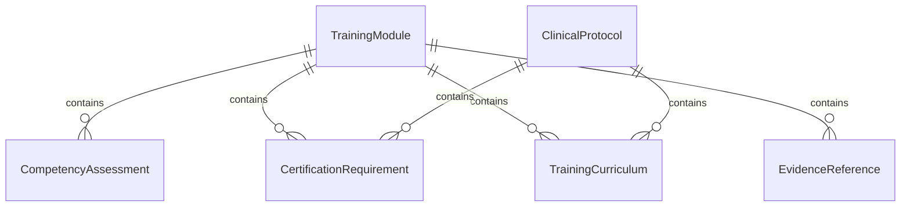
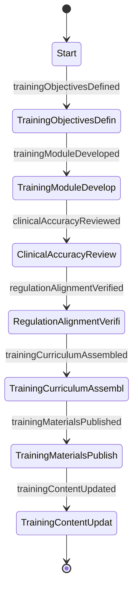
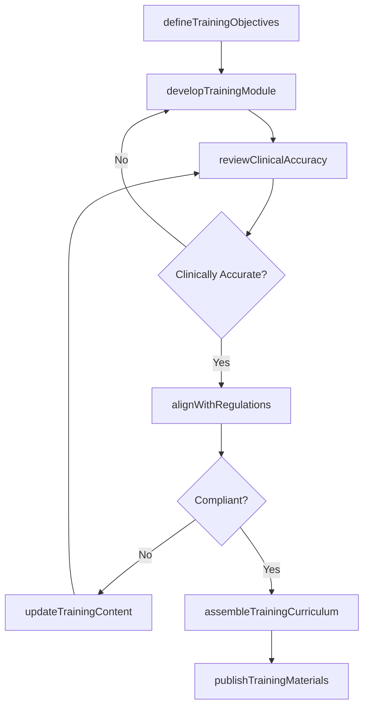
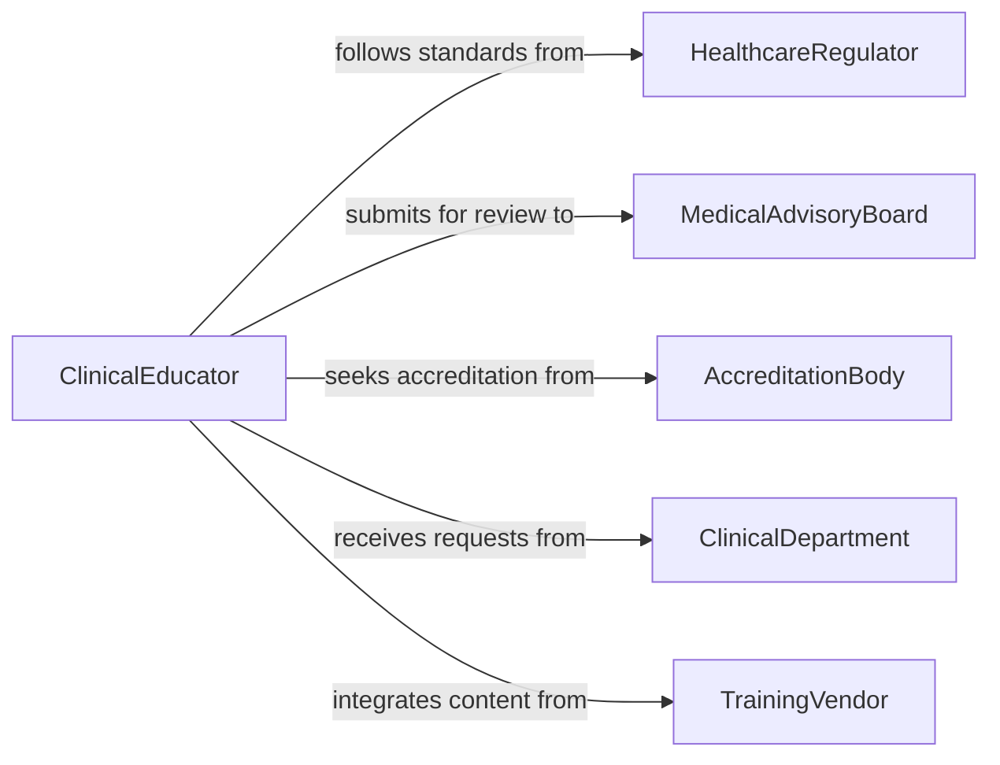

# Prepare Healthcare Training Materials

> Business-as-Code definition for preparing healthcare training materials covering clinical procedures, patient safety, compliance, and professional development.

## Overview

Preparing healthcare training materials involves developing, compiling, and formatting educational content for medical professionals, clinical staff, and healthcare administrators. This definition exposes actions for the training material development lifecycle, events for curriculum compliance automation, and searches for managing training resources across healthcare organizations.

## Actors

| Actor | Description |
|-------|-------------|
| HealthcareRegulator | Sets standards and mandates for clinical training requirements |
| MedicalAdvisoryBoard | Reviews clinical accuracy of training content |
| AccreditationBody | Certifies training programs meet continuing education standards |
| ClinicalDepartment | Requests training materials for specific medical disciplines |
| TrainingVendor | Provides supplemental training content or simulation tools |

## Roles

| Role | Description |
|------|-------------|
| ClinicalEducator | Develops and delivers healthcare training content |
| MedicalContentReviewer | Validates clinical accuracy and evidence-based content |
| TrainingCoordinator | Manages training material development schedules and distribution |
| ComplianceOfficer | Ensures training materials meet regulatory requirements |

## Entities

| Entity | Description |
|--------|-------------|
| TrainingModule | A self-contained unit of healthcare educational content |
| ClinicalProtocol | Standard procedure document referenced in training |
| CompetencyAssessment | Evaluation measuring learner understanding of material |
| CertificationRequirement | Regulatory mandate for specific training completion |
| TrainingCurriculum | Structured collection of modules for a role or discipline |
| EvidenceReference | Cited clinical study or guideline supporting training content |

## Actions

| Action | Description |
|--------|-------------|
| defineTrainingObjectives | Establish learning goals aligned with clinical standards |
| developTrainingModule | Author healthcare training content for a specific topic |
| reviewClinicalAccuracy | Validate medical content against current evidence and protocols |
| alignWithRegulations | Verify training materials meet regulatory compliance requirements |
| assembleTrainingCurriculum | Organize modules into a structured learning pathway |
| publishTrainingMaterials | Release materials for distribution to clinical staff |
| updateTrainingContent | Revise materials to reflect updated protocols or regulations |

## Events

| Event | Description |
|-------|-------------|
| trainingObjectivesDefined | Learning goals have been established for training |
| trainingModuleDeveloped | A new training module has been authored |
| clinicalAccuracyReviewed | Medical content has been validated by reviewers |
| regulationAlignmentVerified | Compliance with regulatory requirements confirmed |
| trainingCurriculumAssembled | Modules have been organized into a learning pathway |
| trainingMaterialsPublished | Materials have been released for distribution |
| trainingContentUpdated | Materials have been revised with updated information |

## Searches

| Search | Description |
|--------|-------------|
| findTrainingModules | Retrieve modules by topic, department, or certification area |
| findCurriculumByRole | List training pathways for a specific clinical role |
| getComplianceStatus | Check training material alignment with current regulations |
| findOutdatedMaterials | List materials requiring updates based on protocol changes |

## Entity Relationships



## State Diagram



## Workflow



## Actor Relationships



## Usage

### Calling Actions

```typescript
import { prepareHealthcareTrainingMaterials } from '@headlessly/prepare-healthcare-training-materials'

const training = prepareHealthcareTrainingMaterials()

// Define training objectives
const objectives = await training.defineTrainingObjectives({
  topic: 'Infection Control and Prevention',
  targetRole: 'registered-nurse',
  certificationArea: 'CIC',
  learningGoals: [
    'Identify common healthcare-associated infections',
    'Apply standard precaution protocols',
    'Document infection control incidents'
  ]
})

// Develop a training module
const module = await training.developTrainingModule({
  objectiveId: objectives.id,
  title: 'Hand Hygiene and PPE Compliance',
  format: 'interactive-presentation',
  estimatedDuration: 45,
  evidenceReferences: ['CDC-2025-HH-Guidelines', 'WHO-IPC-2024']
})

// Review clinical accuracy
await training.reviewClinicalAccuracy({
  moduleId: module.id,
  reviewerRole: 'infection-control-specialist'
})
```

### Event-Driven Automation

```typescript
// Auto-align with regulations after clinical review passes
training.clinicalAccuracyReviewed(async ({ moduleId, approved }) => {
  if (approved) {
    await training.alignWithRegulations({ moduleId })
  }
})

// Notify departments when curriculum is published
training.trainingMaterialsPublished(async ({ curriculumId, targetRoles }) => {
  for (const role of targetRoles) {
    await notify({
      to: `${role}-staff`,
      message: `New training materials are available for your role`
    })
  }
})
```
