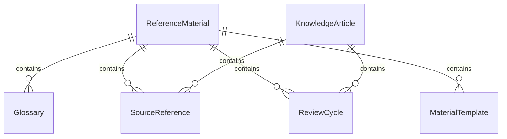
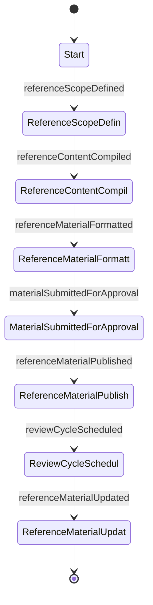
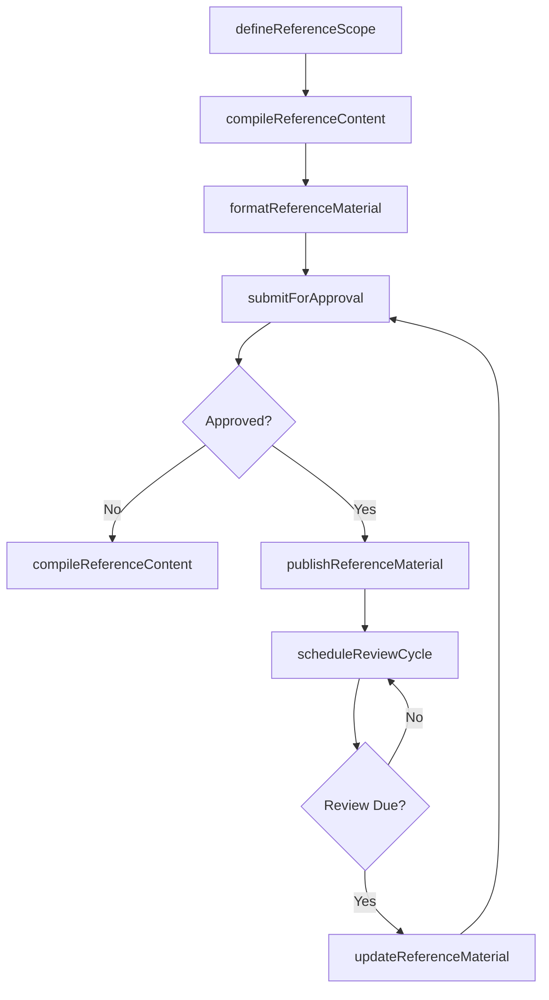
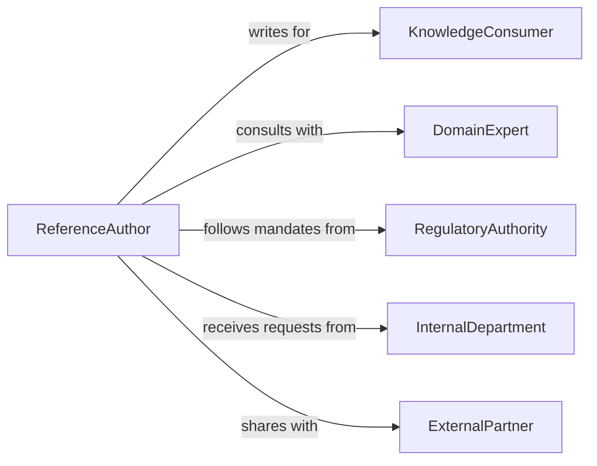

# Prepare Informational Reference Materials

> Business-as-Code definition for preparing informational and reference materials such as handbooks, manuals, glossaries, and knowledge base articles.

## Overview

Preparing informational or reference materials involves researching, compiling, and formatting documents intended to serve as authoritative sources of information for ongoing consultation. This definition exposes actions for the reference material creation lifecycle, events for content governance automation, and searches for managing reference assets across organizational knowledge bases.

## Actors

| Actor | Description |
|-------|-------------|
| KnowledgeConsumer | End user who consults reference materials for guidance |
| DomainExpert | Provides specialized knowledge for reference content |
| RegulatoryAuthority | Mandates compliance-related reference documentation |
| InternalDepartment | Requests reference materials for operational needs |
| ExternalPartner | Consumes shared reference materials for collaboration |

## Roles

| Role | Description |
|------|-------------|
| ReferenceAuthor | Researches and compiles reference content |
| TechnicalEditor | Ensures clarity, consistency, and accuracy of reference materials |
| KnowledgeManager | Governs the reference material repository and lifecycle |
| ContentApprover | Authorizes reference materials for official publication |

## Entities

| Entity | Description |
|--------|-------------|
| ReferenceMaterial | An authoritative document intended for ongoing consultation |
| KnowledgeArticle | A focused reference entry on a specific topic |
| Glossary | Collection of defined terms for a domain or organization |
| SourceReference | Cited external or internal source supporting content |
| ReviewCycle | Scheduled period for validating reference material currency |
| MaterialTemplate | Standardized format for consistent reference document creation |

## Actions

| Action | Description |
|--------|-------------|
| defineReferenceScope | Establish the topic, audience, and depth for new material |
| compileReferenceContent | Research and assemble content from authoritative sources |
| formatReferenceMaterial | Apply templates and standards to compiled content |
| submitForApproval | Send formatted material through the approval workflow |
| publishReferenceMaterial | Release approved material to the knowledge base |
| scheduleReviewCycle | Set periodic review dates for published materials |
| updateReferenceMaterial | Revise published material with current information |

## Events

| Event | Description |
|-------|-------------|
| referenceScopeDefined | Topic and audience for new material have been established |
| referenceContentCompiled | Content has been assembled from authoritative sources |
| referenceMaterialFormatted | Templates and standards have been applied to content |
| materialSubmittedForApproval | Material has entered the approval workflow |
| referenceMaterialPublished | Approved material has been released to the knowledge base |
| reviewCycleScheduled | Periodic review dates have been set for material |
| referenceMaterialUpdated | Published material has been revised |

## Searches

| Search | Description |
|--------|-------------|
| findReferenceMaterials | Retrieve reference documents by topic, audience, or type |
| findMaterialsDueForReview | List reference materials approaching their review date |
| getSourceReferences | Retrieve cited sources for a specific reference document |
| findMaterialsByDepartment | List reference materials owned by a specific department |

## Entity Relationships



## State Diagram



## Workflow



## Actor Relationships



## Usage

### Calling Actions

```typescript
import { prepareInformationalReferenceMaterials } from '@headlessly/prepare-informational-reference-materials'

const reference = prepareInformationalReferenceMaterials()

// Define scope for a new reference document
const scope = await reference.defineReferenceScope({
  title: 'Vendor Management Policy Handbook',
  audience: 'procurement-team',
  topics: ['vendor-selection', 'contract-terms', 'performance-evaluation'],
  depth: 'comprehensive'
})

// Compile reference content
const content = await reference.compileReferenceContent({
  scopeId: scope.id,
  sources: ['procurement-policy-v3', 'vendor-audit-guidelines', 'contract-templates'],
  format: 'handbook'
})

// Format and submit for approval
await reference.formatReferenceMaterial({ contentId: content.id, template: 'corporate-handbook' })
await reference.submitForApproval({ materialId: content.id, approver: 'procurement-director' })
```

### Event-Driven Automation

```typescript
// Auto-publish when approved
reference.materialSubmittedForApproval(async ({ materialId, approver }) => {
  await notify({
    to: approver,
    message: `Reference material ${materialId} requires your approval`
  })
})

// Schedule review cycle on publication
reference.referenceMaterialPublished(async ({ materialId }) => {
  await reference.scheduleReviewCycle({
    materialId,
    intervalMonths: 12,
    reviewer: 'knowledge-manager'
  })
})
```
