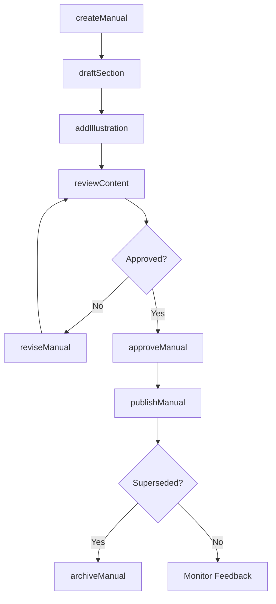
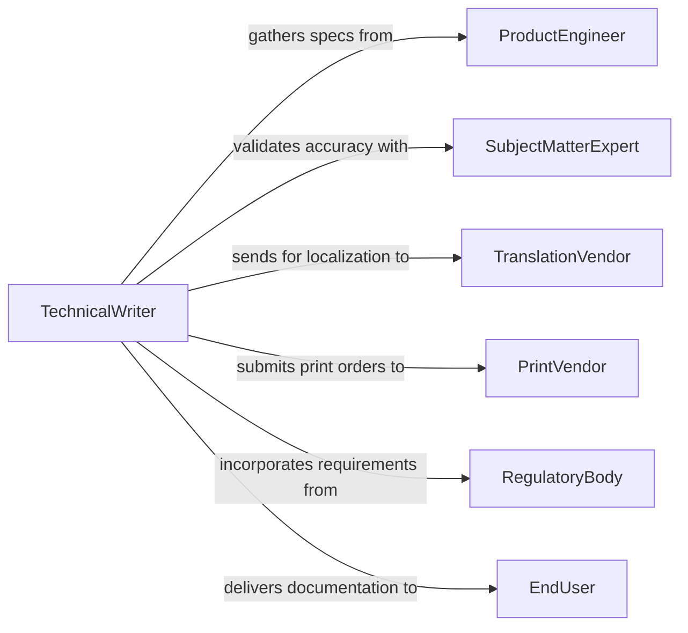

# Prepare Instruction Manuals

> Business-as-Code definition for instruction manual preparation. Models the complete lifecycle of creating, reviewing, and publishing technical manuals and user guides.

## Overview

Instruction manual preparation encompasses the authoring, formatting, reviewing, and distributing of technical documentation that guides end users through product operation, maintenance, and troubleshooting. This definition exposes actions for each phase of the documentation workflow, events for tracking progress and triggering reviews, and searches for retrieving manuals by product, version, or audience.

## Actors

| Actor | Description |
|-------|-------------|
| SubjectMatterExpert | Provides technical knowledge and validates accuracy of instructions |
| ProductEngineer | Supplies product specifications and functional details |
| EndUser | Consumes the finished manual and provides usability feedback |
| TranslationVendor | Localizes manuals for international markets |
| PrintVendor | Handles physical printing and binding of manuals |
| RegulatoryBody | Requires specific safety disclosures and compliance language |

## Roles

| Role | Description |
|------|-------------|
| TechnicalWriter | Authors and structures manual content |
| DocumentationManager | Oversees the manual production schedule and quality |
| Editor | Reviews content for clarity, grammar, and consistency |
| GraphicDesigner | Creates illustrations, diagrams, and layout templates |

## Entities

| Entity | Description |
|--------|-------------|
| Manual | A complete instruction document for a product or process |
| Section | A logical division within a manual covering a specific topic |
| Revision | A versioned update to an existing manual |
| Template | A reusable layout and style framework for manual creation |
| Illustration | A diagram, screenshot, or photo embedded in the manual |
| Glossary | A collection of defined terms used throughout the manual |
| SafetyWarning | A regulatory-required caution or hazard notice |

## Actions

| Action | Description |
|--------|-------------|
| createManual | Initialize a new instruction manual for a product or system |
| draftSection | Author content for a specific section of the manual |
| addIllustration | Attach a diagram or image to a manual section |
| reviewContent | Submit manual content for technical and editorial review |
| approveManual | Formally approve the manual for publication |
| publishManual | Release the manual to distribution channels |
| reviseManual | Create a new revision of an existing manual |
| archiveManual | Move a deprecated manual to long-term storage |

## Events

| Event | Description |
|-------|-------------|
| manualCreated | A new instruction manual has been initialized |
| sectionDrafted | A manual section draft has been completed |
| contentReviewed | Manual content has passed technical review |
| manualApproved | The manual has been formally approved for release |
| manualPublished | The manual has been distributed to end users |
| manualRevised | A new revision of the manual has been created |
| manualArchived | A deprecated manual has been moved to archive |

## Searches

| Search | Description |
|--------|-------------|
| findManuals | List manuals by product, version, or publication status |
| getRevisions | Retrieve the revision history for a specific manual |
| getSections | List sections within a manual by topic or order |
| findByRegulation | Locate manuals that reference specific regulatory standards |
| searchContent | Full-text search across manual content |

## Workflow



## Actor Relationships



## Usage

### Calling Actions

```typescript
import { prepareInstructionManuals } from '@headlessly/prepare-instruction-manuals'

const manuals = prepareInstructionManuals()

// Create a new product manual
const manual = await manuals.createManual({
  product: 'Industrial Pump Model X200',
  version: '3.1',
  audience: 'field-technician',
  language: 'en-US'
})

// Draft a section
await manuals.draftSection({
  manualId: manual.id,
  title: 'Installation Procedures',
  content: 'Step-by-step installation guide...',
  order: 2
})

// Publish after approval
await manuals.publishManual({
  manualId: manual.id,
  channels: ['web', 'print', 'pdf']
})
```

### Event-Driven Automation

```typescript
// Notify reviewers when a section is drafted
manuals.sectionDrafted(async ({ manualId, sectionId, author }) => {
  await notify({
    to: 'technical-review-team',
    message: `New section ready for review in manual ${manualId}`
  })
})

// Trigger localization when manual is approved
manuals.manualApproved(async ({ manualId, version }) => {
  await manuals.publishManual({
    manualId,
    channels: ['translation-queue']
  })
})
```
