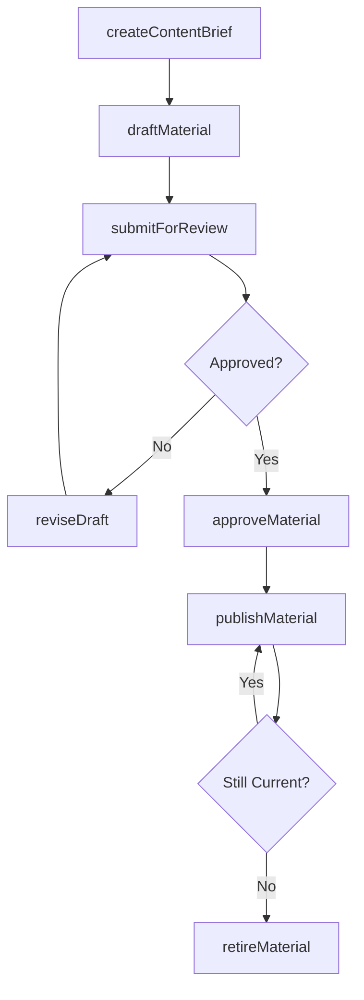
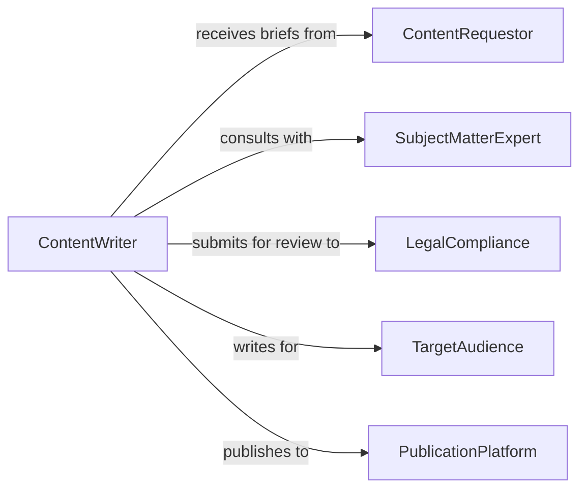

# Write Informational Material

> Business-as-Code definition for writing informational materials such as articles, guides, reports, and reference documents for organizational communication.

## Overview

Writing informational material involves composing, drafting, and finalizing written content intended to inform, instruct, or guide target audiences. This definition exposes actions for the content authoring lifecycle from brief through publication, events for editorial workflow automation, and searches for managing content across writing projects.

## Actors

| Actor | Description |
|-------|-------------|
| ContentRequestor | Stakeholder requesting informational material to be written |
| SubjectMatterExpert | Provides domain knowledge and technical accuracy review |
| LegalCompliance | Reviews written material for regulatory and legal compliance |
| TargetAudience | Intended consumers of the informational material |
| PublicationPlatform | System or channel where the material will be published |

## Roles

| Role | Description |
|------|-------------|
| ContentWriter | Authors and drafts informational material |
| Editor | Reviews, revises, and approves written content |
| ContentStrategist | Defines content objectives and audience targeting |
| FactChecker | Verifies accuracy of claims and data in written material |

## Entities

| Entity | Description |
|--------|-------------|
| ContentBrief | Specification defining the scope and purpose of material to write |
| Draft | Working version of informational material in progress |
| PublishedMaterial | Finalized and released informational content |
| EditorialComment | Feedback or revision request attached to a draft |
| StyleGuide | Standards governing tone, format, and conventions |
| ContentAsset | Supporting media such as images, charts, or data tables |

## Actions

| Action | Description |
|--------|-------------|
| createContentBrief | Define scope, audience, and objectives for new material |
| draftMaterial | Author initial version of informational content |
| submitForReview | Send draft to editorial review pipeline |
| reviseDraft | Apply editorial feedback and corrections to a draft |
| approveMaterial | Formally approve material for publication |
| publishMaterial | Release finalized material to the target platform |
| retireMaterial | Remove or archive outdated published content |

## Events

| Event | Description |
|-------|-------------|
| contentBriefCreated | A new content brief has been defined |
| materialDrafted | Initial draft of informational material is complete |
| draftSubmittedForReview | Draft has entered the editorial review pipeline |
| draftRevised | Editorial feedback has been applied to a draft |
| materialApproved | Material has been formally approved for publication |
| materialPublished | Material has been released to the target platform |
| materialRetired | Outdated material has been archived or removed |

## Searches

| Search | Description |
|--------|-------------|
| findDraftsByStatus | Retrieve drafts by editorial stage or review status |
| findPublishedMaterials | List published content by topic, audience, or date |
| getEditorialComments | Retrieve review comments for a specific draft |
| findContentBriefs | List content briefs by requestor, topic, or priority |

## Workflow



## Actor Relationships



## Usage

### Calling Actions

```typescript
import { writeInformationalMaterial } from '@headlessly/write-informational-material'

const writing = writeInformationalMaterial()

// Create a content brief
const brief = await writing.createContentBrief({
  title: 'Data Privacy Best Practices Guide',
  audience: 'all-employees',
  objective: 'Educate staff on data handling procedures',
  wordCount: 2500,
  deadline: '2026-03-15'
})

// Draft the material
const draft = await writing.draftMaterial({
  briefId: brief.id,
  content: 'Data privacy is a shared responsibility...',
  format: 'markdown',
  assets: ['privacy-flowchart.png', 'compliance-checklist.pdf']
})

// Submit for editorial review
await writing.submitForReview({
  draftId: draft.id,
  reviewers: ['editor-jones', 'legal-compliance']
})
```

### Event-Driven Automation

```typescript
// Notify writer when review feedback is available
writing.draftSubmittedForReview(async ({ draftId, reviewers }) => {
  await notify({
    to: reviewers,
    message: `Draft ${draftId} is ready for your review`
  })
})

// Auto-publish when material is approved
writing.materialApproved(async ({ materialId, briefId }) => {
  const brief = await writing.findContentBriefs({ briefId })
  await writing.publishMaterial({
    materialId,
    platform: brief.targetPlatform
  })
})
```
