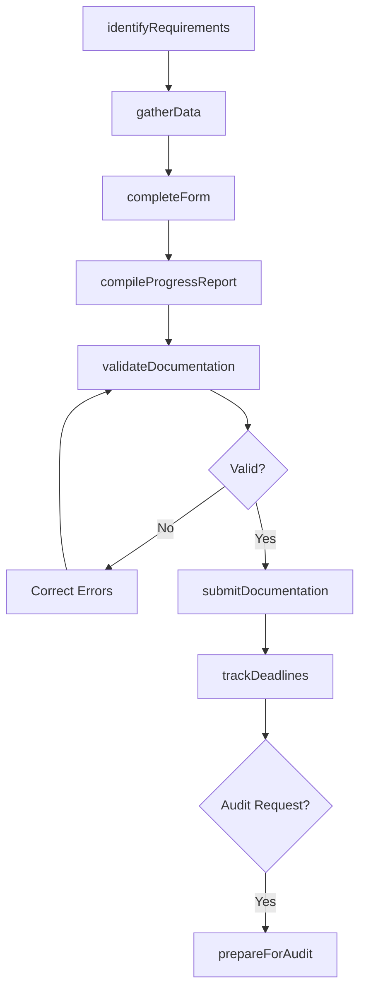
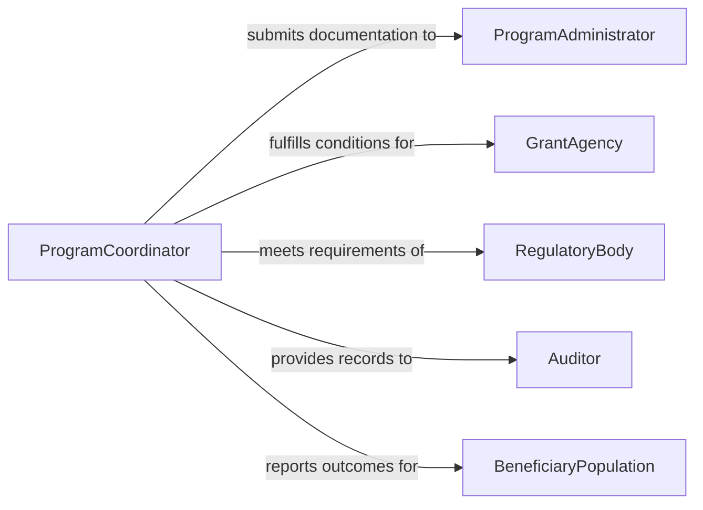

# Complete Documentation Required by Programs or Regulations

> Business-as-Code definition for completing mandatory program and regulatory documentation. Models the fulfillment of documentation requirements imposed by government programs, grant conditions, and regulatory frameworks.

## Overview

Completing documentation required by programs or regulations involves identifying mandatory reporting obligations, gathering required data, filling out prescribed forms, and submitting completed documentation within established deadlines. This definition covers grant program compliance documentation, government program participation records, regulatory filings, and program-specific reporting requirements, enabling organizations to systematically fulfill their documentation obligations across multiple programs and regulatory bodies.

## Actors

| Actor | Description |
|-------|-------------|
| ProgramAdministrator | The government or institutional body overseeing the program |
| GrantAgency | Provides funding and requires compliance documentation |
| RegulatoryBody | Mandates specific documentation for regulatory compliance |
| Auditor | Reviews completed documentation for accuracy and completeness |
| BeneficiaryPopulation | The individuals or communities served by the program |

## Roles

| Role | Description |
|------|-------------|
| ProgramCoordinator | Manages documentation requirements across programs |
| ComplianceSpecialist | Ensures all mandatory documentation is completed accurately |
| DataCollector | Gathers required data from operational sources |
| ReportingAnalyst | Compiles data into required formats and templates |

## Entities

| Entity | Description |
|--------|-------------|
| ProgramRequirement | A specific documentation obligation mandated by a program |
| ComplianceForm | A prescribed template that must be completed for a program |
| ProgressReport | A periodic update on program activities and outcomes |
| EligibilityRecord | Documentation proving qualification for program participation |
| AuditPackage | A collection of documents assembled for program audit |
| DeadlineTracker | A schedule of documentation due dates across programs |
| SubmissionConfirmation | A receipt acknowledging delivery of required documentation |
| DataCollection | A structured set of information gathered for a specific report |

## Actions

| Action | Description |
|--------|-------------|
| identifyRequirements | Determine which documentation a program or regulation mandates |
| gatherData | Collect information needed to complete required forms |
| completeForm | Fill out a prescribed form with verified data |
| compileProgressReport | Assemble periodic activity and outcome reports |
| validateDocumentation | Check completed documents against program requirements |
| submitDocumentation | Deliver completed forms to the appropriate program authority |
| trackDeadlines | Monitor upcoming documentation due dates |
| prepareForAudit | Assemble documents for program compliance review |

## Events

| Event | Description |
|-------|-------------|
| requirementsIdentified | Program documentation obligations have been determined |
| dataGathered | Required information has been collected |
| formCompleted | A mandatory form has been filled out |
| progressReportCompiled | A periodic program report has been assembled |
| documentationValidated | Completed documents have passed accuracy checks |
| documentationSubmitted | Required documentation has been delivered to the authority |
| deadlineApproaching | A documentation due date is within the alert threshold |
| auditPrepared | Documents have been assembled for compliance review |

## Searches

| Search | Description |
|--------|-------------|
| findRequirements | List documentation requirements by program or regulation |
| getPendingForms | Retrieve forms that have not yet been completed |
| findUpcomingDeadlines | Locate documentation due dates within a date range |
| getSubmissionHistory | Retrieve prior submissions for a specific program |
| findByProgram | List all documentation associated with a specific program |

## Workflow



## Actor Relationships



## Usage

### Calling Actions

```typescript
import { completeDocumentationRequiredProgramsRegulations } from '@headlessly/complete-documentation-required-programs-regulations'

const programs = completeDocumentationRequiredProgramsRegulations()

// Identify requirements for a federal grant
const requirements = await programs.identifyRequirements({
  program: 'HUD-CDBG',
  grantYear: 2026,
  organization: 'City of Springfield'
})

// Complete a required form
await programs.completeForm({
  formId: 'SF-425-Federal-Financial-Report',
  programId: 'HUD-CDBG',
  data: {
    reportingPeriod: 'Q1-2026',
    expenditures: 245000,
    matchingFunds: 61250
  }
})

// Submit documentation
await programs.submitDocumentation({
  programId: 'HUD-CDBG',
  forms: ['SF-425', 'progress-report-Q1'],
  method: 'grants-gov-portal'
})
```

### Event-Driven Automation

```typescript
// Alert team when deadlines approach
programs.deadlineApproaching(async ({ program, form, daysRemaining }) => {
  await notify({
    to: 'program-compliance',
    message: `${form} for ${program} due in ${daysRemaining} days`
  })
})

// Auto-validate when forms are completed
programs.formCompleted(async ({ formId, programId }) => {
  await programs.validateDocumentation({ formId, programId })
})
```
