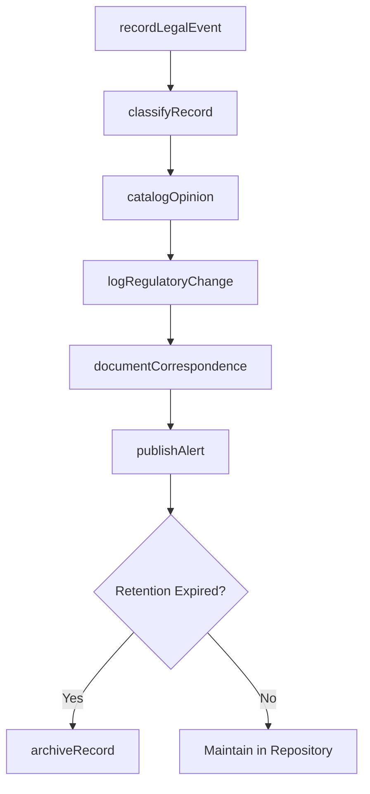
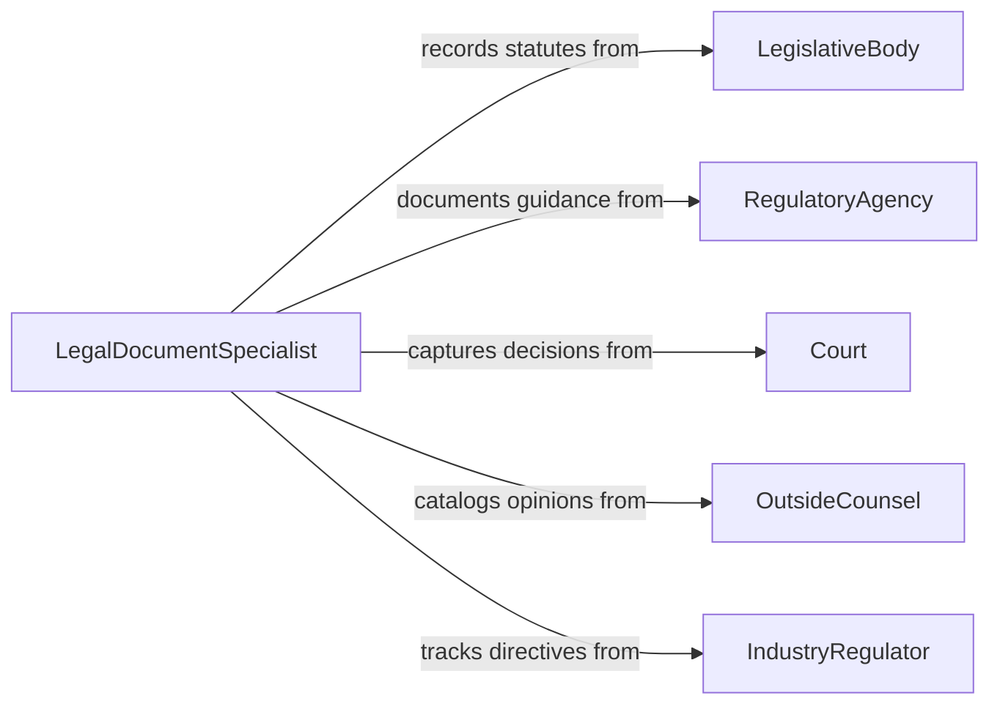

# Document Legal or Regulatory Information

> Business-as-Code definition for documenting legal and regulatory information. Models the systematic recording, cataloging, and preservation of legal and regulatory data for organizational reference and compliance.

## Overview

Documenting legal and regulatory information involves recording statutes, regulations, legal opinions, compliance determinations, and regulatory correspondence into structured repositories. This definition covers the capture of regulatory changes, the recording of legal proceedings and outcomes, and the maintenance of institutional legal knowledge, enabling organizations to build searchable archives of legal intelligence that inform future decisions.

## Actors

| Actor | Description |
|-------|-------------|
| LegislativeBody | Enacts laws and statutes that must be documented |
| RegulatoryAgency | Issues rules, guidance, and enforcement actions to record |
| Court | Produces decisions and orders requiring documentation |
| OutsideCounsel | Provides legal opinions and analysis to be recorded |
| IndustryRegulator | Issues sector-specific guidance and compliance directives |

## Roles

| Role | Description |
|------|-------------|
| LegalDocumentSpecialist | Records and catalogs legal and regulatory information |
| ComplianceRecordkeeper | Maintains organized records of regulatory compliance data |
| KnowledgeManager | Curates the organization's legal knowledge repository |
| RegulatoryTracker | Monitors and records changes in applicable regulations |

## Entities

| Entity | Description |
|--------|-------------|
| LegalRecord | A documented entry capturing legal information or events |
| RegulatoryChange | A recorded modification to an applicable law or regulation |
| ComplianceDetermination | A documented conclusion about compliance with a requirement |
| LegalOpinion | A recorded analysis or interpretation of a legal question |
| RegulatoryCorrespondence | Documented communications with regulatory authorities |
| KnowledgeEntry | A cataloged item in the legal knowledge repository |
| ChangeAlert | A notification record for a newly documented regulatory change |

## Actions

| Action | Description |
|--------|-------------|
| recordLegalEvent | Document a legal proceeding, decision, or action |
| logRegulatoryChange | Record a new or modified regulation in the tracking system |
| catalogOpinion | Add a legal opinion or analysis to the knowledge repository |
| documentCorrespondence | Record communications with regulatory authorities |
| classifyRecord | Assign categories and metadata to a legal record |
| publishAlert | Notify stakeholders of newly documented regulatory changes |
| archiveRecord | Move aged records to long-term storage |
| searchRepository | Query the legal knowledge base for relevant information |

## Events

| Event | Description |
|-------|-------------|
| legalEventRecorded | A legal proceeding or decision has been documented |
| regulatoryChangeLogged | A new or modified regulation has been recorded |
| opinionCataloged | A legal opinion has been added to the repository |
| correspondenceDocumented | A regulatory communication has been recorded |
| recordClassified | A legal record has been categorized and tagged |
| alertPublished | Stakeholders have been notified of a regulatory change |
| recordArchived | An aged record has been moved to long-term storage |

## Searches

| Search | Description |
|--------|-------------|
| findRecords | List legal records by type, date, or jurisdiction |
| getRegulatoryChanges | Retrieve documented regulatory changes by topic or period |
| searchOpinions | Find legal opinions by subject, author, or conclusion |
| getCorrespondence | Retrieve regulatory communications by agency or matter |
| findByClassification | Locate records by category or metadata tags |

## Workflow



## Actor Relationships



## Usage

### Calling Actions

```typescript
import { documentLegalRegulatoryInformation } from '@headlessly/document-legal-regulatory-information'

const legalDocs = documentLegalRegulatoryInformation()

// Log a regulatory change
await legalDocs.logRegulatoryChange({
  regulation: 'SEC Rule 10b-5',
  changeType: 'amendment',
  effectiveDate: '2026-07-01',
  summary: 'Updated insider trading disclosure requirements',
  jurisdiction: 'US-Federal'
})

// Record a legal event
await legalDocs.recordLegalEvent({
  type: 'court-decision',
  matter: 'Smith v. Corp ABC',
  court: 'US District Court SDNY',
  outcome: 'summary-judgment-granted',
  date: '2026-01-15'
})

// Publish alert to stakeholders
await legalDocs.publishAlert({
  topic: 'SEC insider trading rule amendment',
  affectedDepartments: ['compliance', 'trading', 'legal'],
  urgency: 'medium'
})
```

### Event-Driven Automation

```typescript
// Auto-classify when new records are created
legalDocs.legalEventRecorded(async ({ recordId, type }) => {
  await legalDocs.classifyRecord({
    recordId,
    autoClassify: true,
    source: type
  })
})

// Notify compliance team on regulatory changes
legalDocs.regulatoryChangeLogged(async ({ regulation, changeType }) => {
  await notify({
    to: 'compliance-team',
    message: `Regulatory change documented: ${regulation} (${changeType})`
  })
})
```
