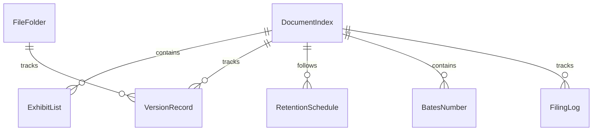
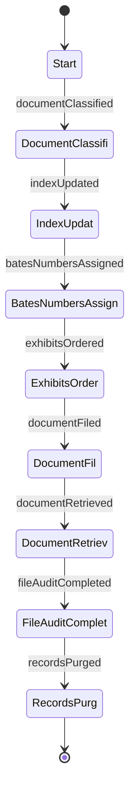
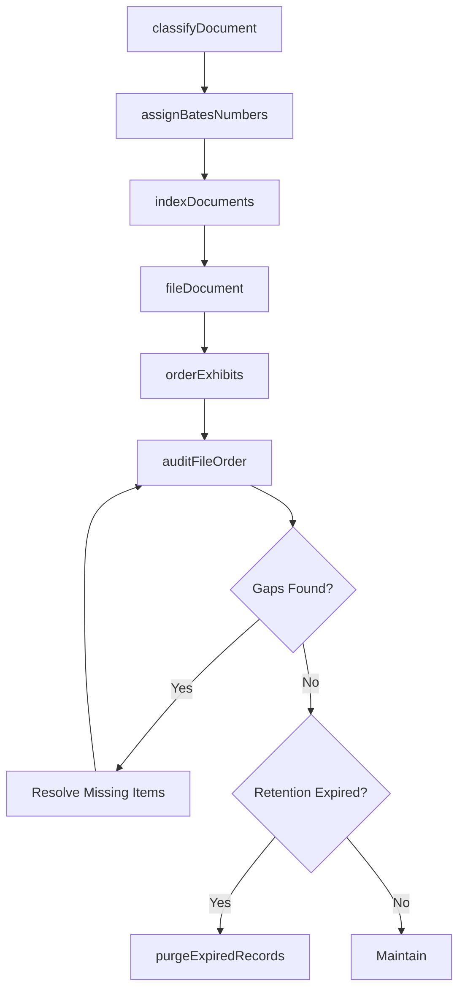
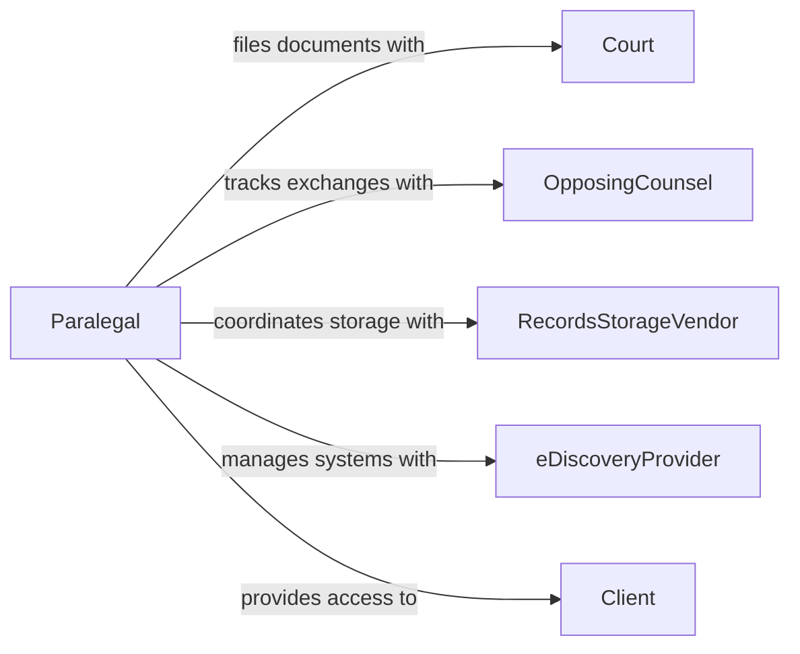

# Maintain the Order of Legal Documents

> Business-as-Code definition for legal document organization and ordering. Models the systematic filing, indexing, and retrieval of legal documents to ensure accessibility and proper sequencing.

## Overview

Maintaining the order of legal documents involves organizing, indexing, cataloging, and sequencing legal files to ensure that case materials, court filings, and regulatory records are readily accessible and properly arranged. This definition covers document classification, version control, physical and digital filing systems, and retention management, enabling legal teams to quickly locate documents and maintain compliance with court rules and record-keeping obligations.

## Actors

| Actor | Description |
|-------|-------------|
| Court | Requires documents to be filed in prescribed order and format |
| OpposingCounsel | Exchanges documents that must be tracked and organized |
| RecordsStorageVendor | Provides physical or offsite document storage services |
| eDiscoveryProvider | Manages electronic document processing and organization |
| Client | Requests access to organized case files and documentation |

## Roles

| Role | Description |
|------|-------------|
| LegalFileClerk | Physically and digitally organizes legal documents |
| Paralegal | Manages document indexes, exhibits, and filing sequences |
| RecordsManager | Oversees retention schedules and archive organization |
| LitigationSupport | Maintains electronic document management systems |

## Entities

| Entity | Description |
|--------|-------------|
| DocumentIndex | A catalog of all documents within a matter or case |
| FileFolder | A physical or digital container for grouped documents |
| ExhibitList | An ordered catalog of exhibits for a legal proceeding |
| VersionRecord | A log tracking document revisions and superseded versions |
| RetentionSchedule | A policy defining how long documents must be preserved |
| BatesNumber | A sequential identifier stamped on documents for tracking |
| FilingLog | A chronological record of documents filed with a court |

## Actions

| Action | Description |
|--------|-------------|
| classifyDocument | Assign a category and filing location to a legal document |
| indexDocuments | Create or update the document catalog for a matter |
| assignBatesNumbers | Apply sequential identifiers to documents for tracking |
| orderExhibits | Arrange exhibits in the sequence required for proceedings |
| fileDocument | Place a document in its designated location in the system |
| retrieveDocument | Locate and produce a specific document from the filing system |
| auditFileOrder | Verify that all documents are properly sequenced and cataloged |
| purgeExpiredRecords | Remove documents that have exceeded their retention period |

## Events

| Event | Description |
|-------|-------------|
| documentClassified | A document has been assigned a category and location |
| indexUpdated | The document catalog has been refreshed |
| batesNumbersAssigned | Sequential identifiers have been applied to documents |
| exhibitsOrdered | Exhibits have been arranged for proceedings |
| documentFiled | A document has been placed in its designated location |
| documentRetrieved | A document has been located and produced |
| fileAuditCompleted | A verification of document order has been performed |
| recordsPurged | Expired documents have been removed from the system |

## Searches

| Search | Description |
|--------|-------------|
| findDocuments | List documents by matter, category, or date |
| getExhibitList | Retrieve the ordered exhibit catalog for a proceeding |
| findByBatesNumber | Locate a document by its sequential identifier |
| getFilingHistory | Retrieve the chronological filing log for a matter |
| findMissingDocuments | Identify gaps in the document index |

## Entity Relationships



## State Diagram



## Workflow



## Actor Relationships



## Usage

### Calling Actions

```typescript
import { maintainOrderLegalDocuments } from '@headlessly/maintain-order-legal-documents'

const legalDocs = maintainOrderLegalDocuments()

// Classify and index incoming documents
const classified = await legalDocs.classifyDocument({
  documentId: 'DOC-2026-0451',
  matter: 'Smith v. Acme Corp',
  category: 'correspondence',
  subcategory: 'demand-letter'
})

await legalDocs.assignBatesNumbers({
  matterId: 'CASE-2026-112',
  documents: ['DOC-2026-0451', 'DOC-2026-0452'],
  startNumber: 1001
})

// Retrieve a specific document
const doc = await legalDocs.retrieveDocument({
  batesNumber: 'ACME-001001',
  format: 'pdf'
})
```

### Event-Driven Automation

```typescript
// Auto-index when new documents are classified
legalDocs.documentClassified(async ({ matterId }) => {
  await legalDocs.indexDocuments({ matterId })
})

// Alert records manager when retention expires
legalDocs.fileAuditCompleted(async ({ matterId, expiredCount }) => {
  if (expiredCount > 0) {
    await notify({
      to: 'records-management',
      message: `${expiredCount} documents in matter ${matterId} have exceeded retention`
    })
  }
})
```
