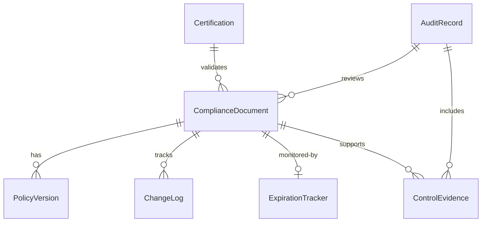
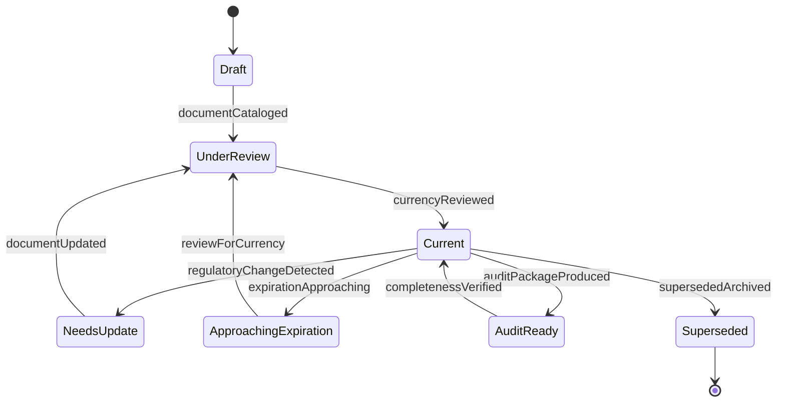
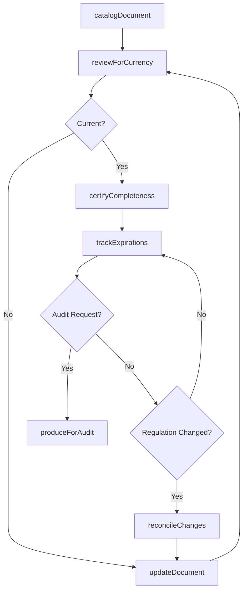
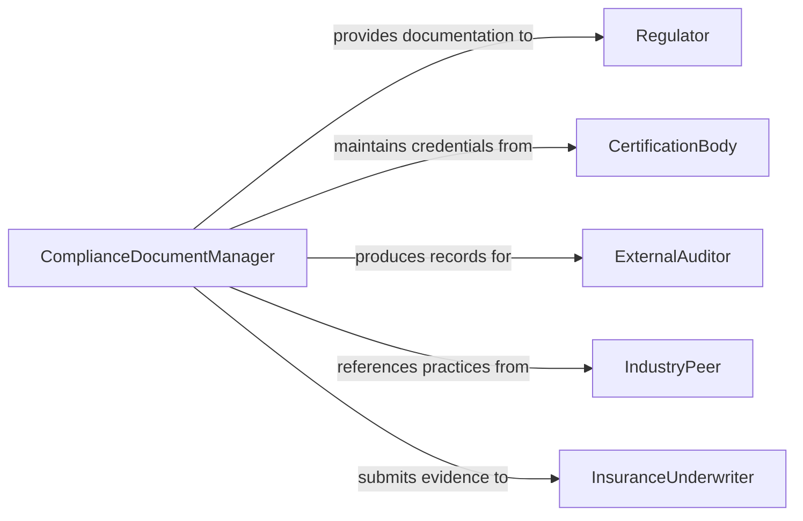

# Maintain Regulatory or Compliance Documentation

> Business-as-Code definition for ongoing regulatory and compliance documentation maintenance. Models the continuous management, updating, and organization of documents required to demonstrate regulatory adherence.

## Overview

Maintaining regulatory and compliance documentation involves keeping policies, procedures, certifications, audit records, and regulatory filings current and properly organized. This definition covers version control of compliance artifacts, periodic review cycles, expiration tracking, and audit-readiness verification, enabling organizations to sustain compliance posture and respond efficiently to regulatory inquiries or inspections.

## Actors

| Actor | Description |
|-------|-------------|
| Regulator | Conducts inspections and requests documentation during audits |
| CertificationBody | Issues and renews compliance certifications |
| ExternalAuditor | Independently assesses the adequacy of compliance documentation |
| IndustryPeer | Shares best practices for compliance documentation management |
| InsuranceUnderwriter | Reviews compliance documentation for risk assessment |

## Roles

| Role | Description |
|------|-------------|
| ComplianceDocumentManager | Maintains the compliance document repository and version control |
| ComplianceOfficer | Oversees the compliance program and ensures documentation accuracy |
| PolicyOwner | Responsible for the accuracy and currency of specific policies |
| InternalAuditor | Periodically reviews documentation for completeness and accuracy |

## Entities

| Entity | Description |
|--------|-------------|
| ComplianceDocument | A policy, procedure, or record maintained for regulatory purposes |
| PolicyVersion | A specific revision of a compliance policy or procedure |
| Certification | A formal credential attesting to regulatory compliance |
| AuditRecord | Documentation from internal or external compliance assessments |
| ExpirationTracker | A schedule of document and certification renewal dates |
| ChangeLog | A record of modifications made to compliance documents |
| ControlEvidence | Documentation proving that a specific control is operating effectively |

## Actions

| Action | Description |
|--------|-------------|
| catalogDocument | Register a new compliance document in the repository |
| updateDocument | Revise an existing document to reflect current requirements |
| reviewForCurrency | Assess whether documents still reflect current regulations |
| trackExpirations | Monitor certification and policy renewal deadlines |
| produceForAudit | Generate a documentation package for an audit or inspection |
| certifyCompleteness | Attest that all required documents are current and accessible |
| archiveSuperseded | Move outdated document versions to the archive |
| reconcileChanges | Align documentation with newly enacted regulatory changes |

## Events

| Event | Description |
|-------|-------------|
| documentCataloged | A new compliance document has been registered |
| documentUpdated | A compliance document has been revised |
| currencyReviewed | A periodic review of document accuracy has been completed |
| expirationApproaching | A document or certification is nearing its renewal date |
| auditPackageProduced | Documentation has been assembled for an audit |
| completenessVerified | All required compliance documents have been confirmed current |
| supersededArchived | An outdated document version has been moved to archive |
| regulatoryChangeDetected | A new or modified regulation requiring documentation updates |

## Searches

| Search | Description |
|--------|-------------|
| findDocuments | List compliance documents by type, regulation, or status |
| getVersionHistory | Retrieve the revision history for a specific document |
| findExpiring | Locate documents or certifications approaching renewal |
| getAuditRecords | Retrieve audit documentation by date, scope, or findings |
| findByRegulation | List all documents related to a specific regulatory requirement |

## Entity Relationships



## State Diagram



## Workflow



## Actor Relationships



## Usage

### Calling Actions

```typescript
import { maintainRegulatoryComplianceDocumentation } from '@headlessly/maintain-regulatory-compliance-documentation'

const compliance = maintainRegulatoryComplianceDocumentation()

// Catalog a new compliance document
await compliance.catalogDocument({
  title: 'Information Security Policy',
  regulation: 'SOC-2',
  type: 'policy',
  owner: 'ciso@acme-corp.com.ai',
  reviewCycle: '12 months'
})

// Review documents for currency
const review = await compliance.reviewForCurrency({
  regulation: 'SOC-2',
  scope: 'all-policies'
})

// Produce audit package
const auditPkg = await compliance.produceForAudit({
  auditor: 'Deloitte',
  scope: 'SOC-2-Type-II',
  period: { start: '2025-01-01', end: '2025-12-31' }
})
```

### Event-Driven Automation

```typescript
// Notify policy owners when review is due
compliance.expirationApproaching(async ({ documentId, owner, daysRemaining }) => {
  await notify({
    to: owner,
    message: `Compliance document review due in ${daysRemaining} days`
  })
})

// Trigger reconciliation when regulations change
compliance.regulatoryChangeDetected(async ({ regulation, changeType }) => {
  const affected = await compliance.findByRegulation({ regulation })
  for (const doc of affected) {
    await compliance.reconcileChanges({ documentId: doc.id, changeType })
  }
})
```
