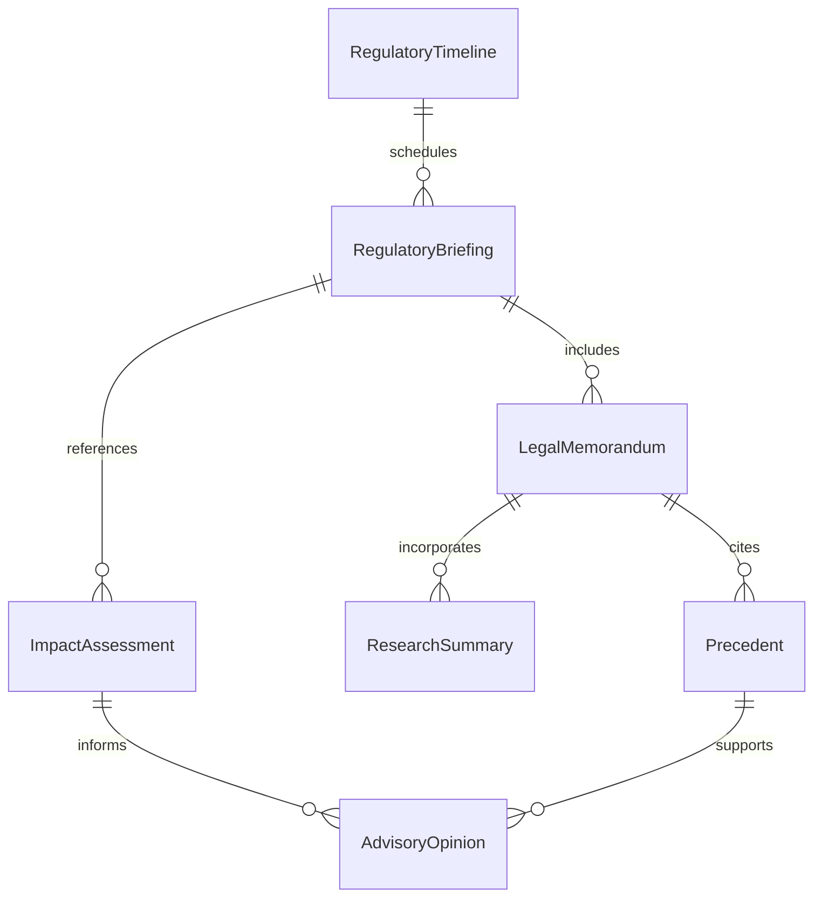
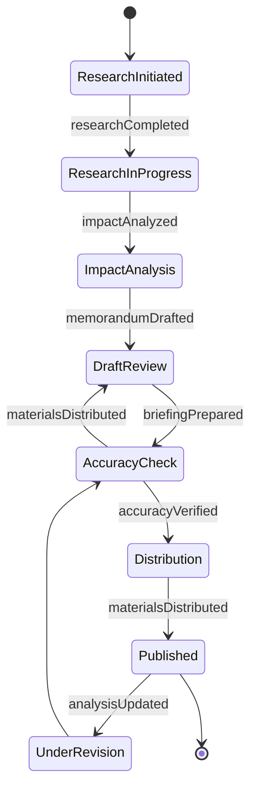
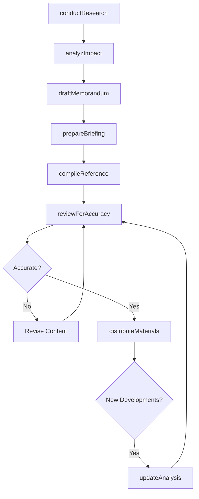
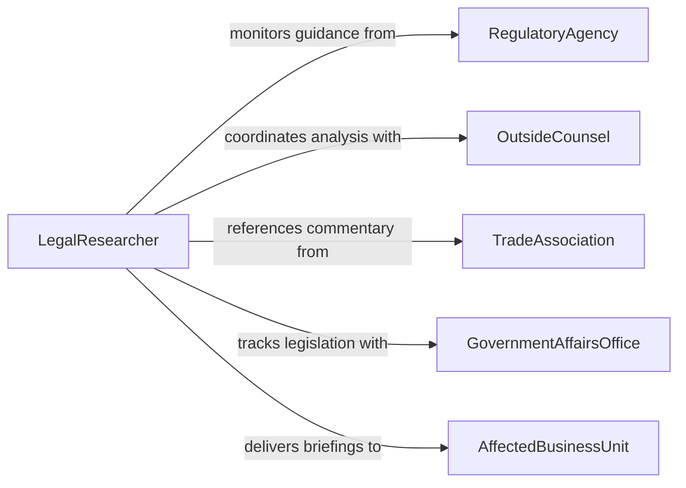

# Prepare Information or Documentation Related to Legal or Regulatory Matters

> Business-as-Code definition for legal and regulatory information documentation. Models the preparation of informational materials, summaries, and briefing documents that support legal and regulatory decision-making.

## Overview

Preparation of information and documentation for legal or regulatory matters involves researching applicable laws and regulations, summarizing findings, drafting briefing materials, and compiling reference documents that inform organizational decisions. This definition covers legal research summaries, regulatory impact analyses, compliance briefings, and advisory memoranda, enabling teams to provide timely, well-organized legal and regulatory intelligence to decision-makers.

## Actors

| Actor | Description |
|-------|-------------|
| RegulatoryAgency | Issues rules and guidance that require documented analysis |
| OutsideCounsel | Provides external legal opinions and research support |
| TradeAssociation | Publishes industry positions and regulatory commentary |
| GovernmentAffairsOffice | Monitors legislative developments affecting the organization |
| AffectedBusinessUnit | Requests legal or regulatory information for operational decisions |

## Roles

| Role | Description |
|------|-------------|
| LegalResearcher | Investigates laws, regulations, and precedents |
| RegulatoryAnalyst | Analyzes the impact of regulations on business operations |
| LegalWriter | Authors memoranda, briefs, and informational documents |
| ComplianceAdvisor | Translates regulatory requirements into actionable guidance |

## Entities

| Entity | Description |
|--------|-------------|
| LegalMemorandum | A written analysis of a legal question or issue |
| RegulatoryBriefing | A summary of regulatory developments and their implications |
| ResearchSummary | A compilation of findings from legal or regulatory research |
| ImpactAssessment | An analysis of how a regulation affects business operations |
| Precedent | A prior legal decision or ruling relevant to the current matter |
| AdvisoryOpinion | A formal recommendation on a legal or regulatory question |
| RegulatoryTimeline | A chronological schedule of regulatory milestones and deadlines |

## Actions

| Action | Description |
|--------|-------------|
| conductResearch | Investigate applicable laws, regulations, and precedents |
| analyzImpact | Assess the operational effects of a legal or regulatory change |
| draftMemorandum | Author a legal or regulatory analysis document |
| prepareBriefing | Create a summary of regulatory developments for stakeholders |
| compileReference | Assemble relevant statutes, rules, and guidance into a package |
| reviewForAccuracy | Validate research findings and document citations |
| distributeMaterials | Share prepared documents with relevant decision-makers |
| updateAnalysis | Revise existing documents to reflect new developments |

## Events

| Event | Description |
|-------|-------------|
| researchCompleted | Legal or regulatory research has been finalized |
| impactAnalyzed | The operational effects of a regulation have been assessed |
| memorandumDrafted | A legal analysis document has been authored |
| briefingPrepared | A regulatory development summary is ready for distribution |
| referenceCompiled | A reference package of relevant materials has been assembled |
| accuracyVerified | Document citations and findings have been validated |
| materialsDistributed | Prepared documents have been shared with stakeholders |
| analysisUpdated | An existing document has been revised for new developments |

## Searches

| Search | Description |
|--------|-------------|
| findMemorandums | List legal memoranda by topic, regulation, or date |
| getBriefings | Retrieve regulatory briefings by subject area or period |
| searchPrecedents | Find prior decisions or rulings relevant to a legal question |
| getImpactAssessments | List regulatory impact analyses by business unit or regulation |
| findByRegulation | Locate all documents related to a specific law or regulation |

## Entity Relationships



## State Diagram



## Workflow



## Actor Relationships



## Usage

### Calling Actions

```typescript
import { prepareInformationDocumentationRelatedLegal } from '@headlessly/prepare-information-documentation-related-legal'

const legalInfo = prepareInformationDocumentationRelatedLegal()

// Conduct research on a new regulation
const research = await legalInfo.conductResearch({
  topic: 'AI transparency requirements',
  jurisdiction: 'EU',
  regulations: ['EU-AI-Act'],
  scope: 'high-risk-ai-systems'
})

// Draft an analysis memo
const memo = await legalInfo.draftMemorandum({
  title: 'EU AI Act Impact on Product Development',
  researchId: research.id,
  audience: 'product-leadership',
  urgency: 'high'
})

// Prepare and distribute briefing
const briefing = await legalInfo.prepareBriefing({
  topic: 'Q1 2026 Regulatory Update',
  items: [memo.id],
  audience: 'executive-team'
})

await legalInfo.distributeMaterials({
  briefingId: briefing.id,
  recipients: ['ceo', 'cto', 'general-counsel']
})
```

### Event-Driven Automation

```typescript
// Auto-notify when new regulatory research is completed
legalInfo.researchCompleted(async ({ topic, jurisdiction }) => {
  await notify({
    to: 'legal-team',
    message: `Research on ${topic} (${jurisdiction}) is ready for analysis`
  })
})

// Trigger updates when regulations change
legalInfo.analysisUpdated(async ({ documentId, regulation }) => {
  await notify({
    to: 'compliance-team',
    message: `Legal analysis for ${regulation} has been updated - review recommended`
  })
})
```
