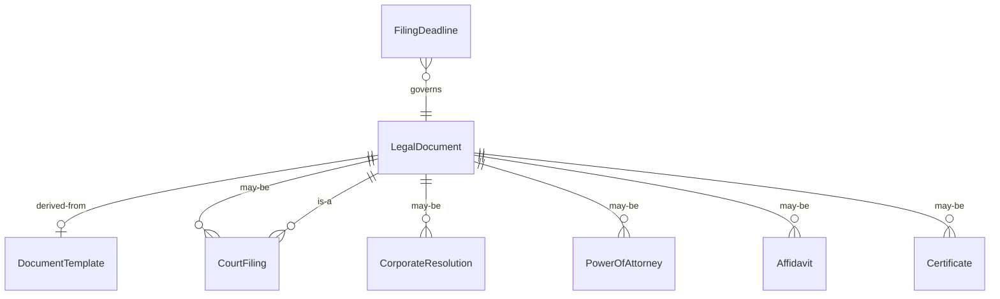
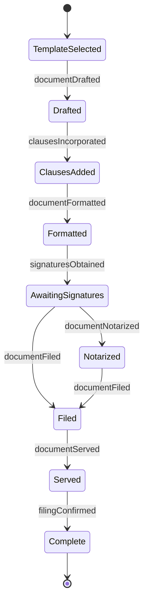
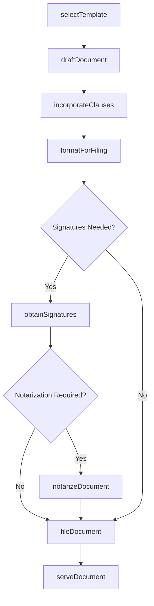
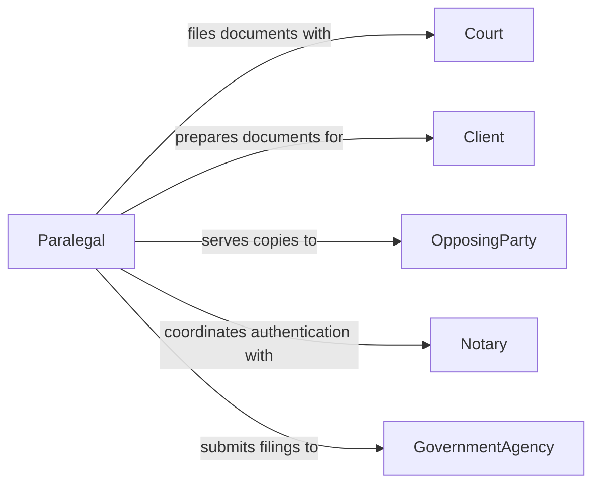

# Prepare Legal Documents

> Business-as-Code definition for legal document preparation. Models the drafting, formatting, reviewing, and filing of formal legal instruments such as contracts, agreements, court filings, and corporate documents.

## Overview

Legal document preparation involves selecting appropriate templates, drafting content, incorporating standard legal language, obtaining required reviews and approvals, and formatting documents for filing or execution. This definition covers the production of corporate governance documents, litigation filings, transactional agreements, and estate planning instruments, enabling legal teams to maintain consistent quality and meet jurisdictional formatting requirements.

## Actors

| Actor | Description |
|-------|-------------|
| Court | Receives and processes filed legal documents |
| Client | The party on whose behalf legal documents are prepared |
| OpposingParty | The counterparty in a legal matter who may review or respond |
| Notary | Authenticates signatures and administers oaths |
| GovernmentAgency | Receives corporate filings and registrations |
| WitnessParty | Attests to the execution of legal documents |

## Roles

| Role | Description |
|------|-------------|
| Attorney | Directs the legal substance and strategy of documents |
| Paralegal | Drafts, formats, and assembles legal documents |
| LegalSecretary | Manages document formatting, filing logistics, and deadlines |
| DocumentReviewer | Proofreads and verifies legal documents before filing |

## Entities

| Entity | Description |
|--------|-------------|
| LegalDocument | A formal instrument with legal force or effect |
| DocumentTemplate | A pre-approved framework for a specific legal document type |
| CourtFiling | A document submitted to a court as part of a legal proceeding |
| CorporateResolution | A formal decision document from a board of directors |
| PowerOfAttorney | A legal instrument granting authority to act on another's behalf |
| Affidavit | A sworn written statement used as evidence |
| Certificate | A formal attestation or verification document |
| FilingDeadline | A court or regulatory due date for document submission |

## Actions

| Action | Description |
|--------|-------------|
| selectTemplate | Choose the appropriate document template for the legal matter |
| draftDocument | Author the legal document with required substance and form |
| incorporateClauses | Insert standard or negotiated provisions into the document |
| formatForFiling | Apply jurisdictional formatting rules to the document |
| obtainSignatures | Collect required execution signatures from parties |
| notarizeDocument | Have the document authenticated by a notary public |
| fileDocument | Submit the completed document to the court or agency |
| serveDocument | Deliver a copy of the document to the opposing party |

## Events

| Event | Description |
|-------|-------------|
| documentDrafted | A legal document has been authored |
| clausesIncorporated | Required provisions have been inserted |
| documentFormatted | Jurisdictional formatting has been applied |
| signaturesObtained | All required signatures have been collected |
| documentNotarized | The document has been authenticated by a notary |
| documentFiled | The document has been submitted to the court or agency |
| documentServed | A copy has been delivered to the opposing party |
| filingConfirmed | The court or agency has acknowledged receipt |

## Searches

| Search | Description |
|--------|-------------|
| findDocuments | List legal documents by type, matter, or status |
| getTemplates | Retrieve available document templates by category |
| findPendingSignatures | Locate documents awaiting signature collection |
| getFilingDeadlines | List upcoming filing due dates by court or matter |
| searchByMatter | Find all documents associated with a specific legal matter |

## Entity Relationships



## State Diagram



## Workflow



## Actor Relationships



## Usage

### Calling Actions

```typescript
import { prepareLegalDocuments } from '@headlessly/prepare-legal-documents'

const legal = prepareLegalDocuments()

// Draft a power of attorney
const doc = await legal.draftDocument({
  template: 'durable-power-of-attorney',
  matter: 'Estate Planning - Johnson',
  parties: {
    principal: { name: 'Robert Johnson' },
    agent: { name: 'Sarah Johnson' }
  },
  jurisdiction: 'US-FL'
})

// Obtain signatures and notarize
await legal.obtainSignatures({
  documentId: doc.id,
  signers: ['robert.johnson@email.com', 'sarah.johnson@email.com']
})

await legal.notarizeDocument({
  documentId: doc.id,
  notaryType: 'remote-online'
})

// File with county clerk
await legal.fileDocument({
  documentId: doc.id,
  agency: 'Palm Beach County Clerk of Court',
  filingType: 'recorded-instrument'
})
```

### Event-Driven Automation

```typescript
// Auto-serve after filing confirmation
legal.filingConfirmed(async ({ documentId, filingType }) => {
  if (filingType === 'court-filing') {
    await legal.serveDocument({ documentId, method: 'certified-mail' })
  }
})

// Alert team on approaching deadlines
legal.documentDrafted(async ({ documentId, deadlines }) => {
  for (const deadline of deadlines) {
    await scheduleReminder({
      documentId,
      date: deadline.date,
      message: `Filing deadline for ${deadline.court}: ${deadline.description}`
    })
  }
})
```
