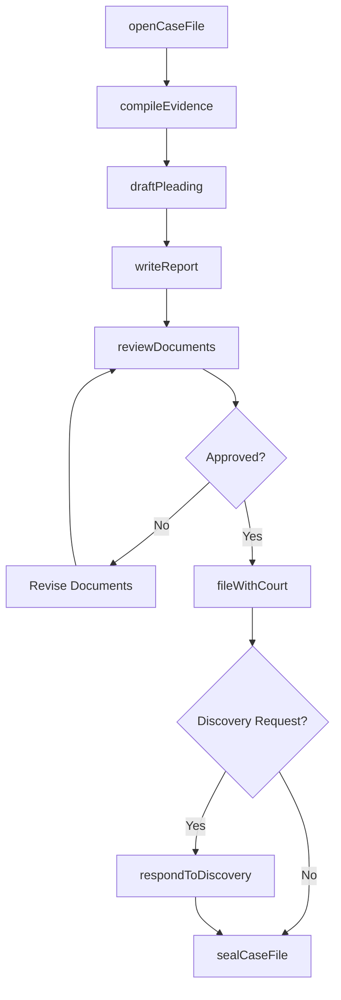
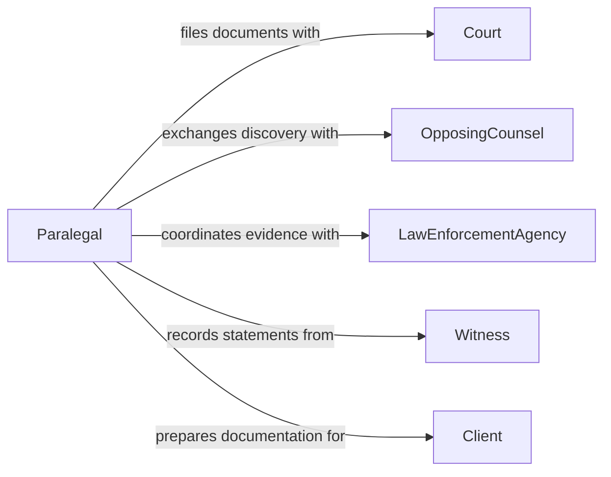

# Prepare Legal or Investigatory Documentation

> Business-as-Code definition for legal and investigatory documentation preparation. Models the creation, assembly, and management of documents used in legal proceedings, internal investigations, and law enforcement activities.

## Overview

Legal and investigatory documentation preparation involves drafting pleadings, compiling evidence packages, assembling case files, and generating investigation reports. This definition covers the full document lifecycle from initial case intake through court filing and archival, enabling legal teams and investigators to maintain chain-of-custody records, meet filing deadlines, and produce discovery-ready document sets.

## Actors

| Actor | Description |
|-------|-------------|
| Court | The judicial body that receives filed legal documents |
| OpposingCounsel | The adverse party's legal representatives in a proceeding |
| LawEnforcementAgency | Provides or requests investigatory documentation |
| Witness | Provides testimony or statements included in documentation |
| RegulatoryInvestigator | Conducts regulatory enforcement investigations |
| Client | The party represented in the legal or investigatory matter |

## Roles

| Role | Description |
|------|-------------|
| Paralegal | Drafts, organizes, and files legal documents |
| Attorney | Reviews documents for legal sufficiency and strategy |
| Investigator | Compiles evidence and writes investigation reports |
| CaseManager | Tracks deadlines, document versions, and case status |

## Entities

| Entity | Description |
|--------|-------------|
| CaseFile | A collection of all documents related to a legal matter |
| Pleading | A formal written statement filed with a court |
| EvidencePackage | A compiled set of exhibits and supporting evidence |
| InvestigationReport | A documented summary of investigatory findings |
| Deposition | A recorded out-of-court testimony |
| Subpoena | A legal order requiring production of documents or testimony |
| ChainOfCustody | A record tracking the handling of physical evidence |
| FilingReceipt | Confirmation of document acceptance by the court |

## Actions

| Action | Description |
|--------|-------------|
| openCaseFile | Initialize a new legal matter or investigation file |
| draftPleading | Author a legal document for court filing |
| compileEvidence | Assemble exhibits and supporting materials |
| writeReport | Document investigatory findings and conclusions |
| reviewDocuments | Conduct legal review of prepared documents |
| fileWithCourt | Submit legal documents to the appropriate court |
| respondToDiscovery | Produce documents in response to discovery requests |
| sealCaseFile | Close and archive a completed matter |

## Events

| Event | Description |
|-------|-------------|
| caseFileOpened | A new legal matter or investigation has been initiated |
| pleadingDrafted | A legal document has been prepared for filing |
| evidenceCompiled | Supporting materials have been assembled |
| reportWritten | An investigation report has been completed |
| documentsReviewed | Legal review of documents has been completed |
| documentsFiled | Documents have been accepted by the court |
| discoveryResponded | Discovery production has been completed |
| caseFileSealed | The matter has been closed and archived |

## Searches

| Search | Description |
|--------|-------------|
| findCases | List cases by type, status, or assigned attorney |
| getDocuments | Retrieve documents within a case file by type or date |
| findPendingFilings | Locate documents awaiting court filing |
| getDeadlines | List upcoming filing and response deadlines |
| searchEvidence | Find evidence items by category, source, or custodian |

## Workflow



## Actor Relationships



## Usage

### Calling Actions

```typescript
import { prepareLegalInvestigatoryDocumentation } from '@headlessly/prepare-legal-investigatory-documentation'

const legal = prepareLegalInvestigatoryDocumentation()

// Open a new case file
const caseFile = await legal.openCaseFile({
  type: 'civil-litigation',
  client: { name: 'Westfield Corp' },
  matter: 'breach-of-contract',
  jurisdiction: 'US-CA-Northern'
})

// Draft a complaint
await legal.draftPleading({
  caseId: caseFile.id,
  type: 'complaint',
  title: 'Complaint for Breach of Contract',
  content: 'Plaintiff alleges...'
})

// File with court
await legal.fileWithCourt({
  caseId: caseFile.id,
  court: 'US District Court Northern District of California',
  filingType: 'initial-complaint'
})
```

### Event-Driven Automation

```typescript
// Alert attorneys when filing deadlines approach
legal.caseFileOpened(async ({ caseId, deadlines }) => {
  for (const deadline of deadlines) {
    await scheduleReminder({
      caseId,
      date: deadline.date,
      message: `Filing deadline: ${deadline.description}`
    })
  }
})

// Notify team when discovery requests arrive
legal.discoveryResponded(async ({ caseId, requestingParty }) => {
  await notify({
    to: 'litigation-team',
    message: `Discovery production completed for case ${caseId}`
  })
})
```
