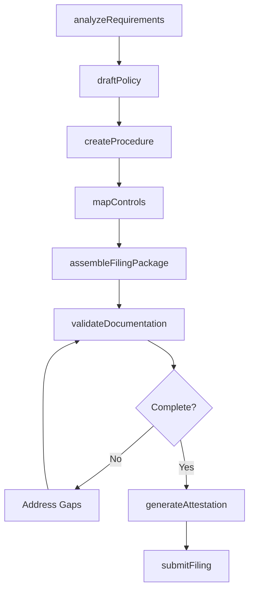
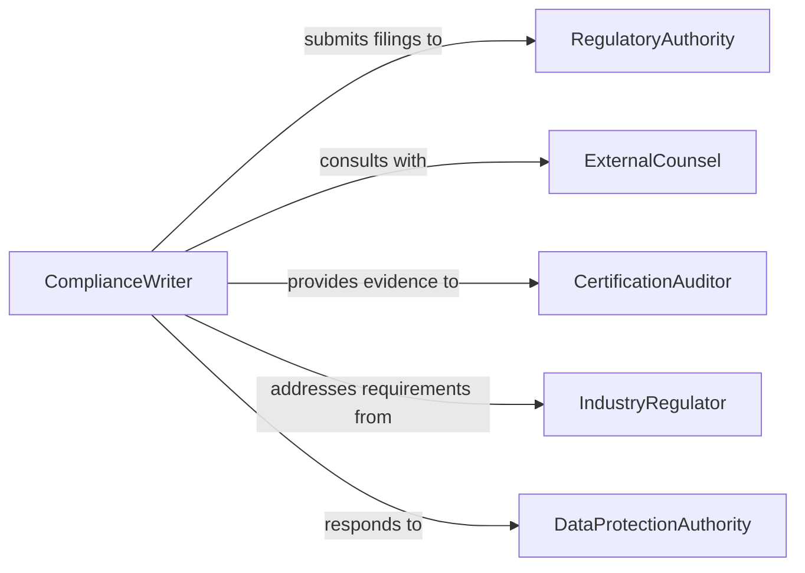

# Prepare Regulatory or Compliance Documentation

> Business-as-Code definition for regulatory and compliance document preparation. Models the creation of policies, filings, and attestations required to demonstrate organizational compliance with applicable laws and regulations.

## Overview

Regulatory and compliance documentation preparation involves drafting policies, creating compliance attestations, assembling filing packages, and generating evidence of regulatory adherence. This definition covers the initial creation of compliance artifacts for new regulations, the preparation of periodic filings, and the assembly of documentation packages for regulatory submissions, enabling organizations to meet their compliance obligations systematically.

## Actors

| Actor | Description |
|-------|-------------|
| RegulatoryAuthority | The government body that receives compliance filings |
| ExternalCounsel | Provides legal guidance on regulatory interpretation |
| CertificationAuditor | Assesses documentation during certification engagements |
| IndustryRegulator | Enforces sector-specific compliance requirements |
| DataProtectionAuthority | Oversees privacy and data protection compliance |
| AccreditationBody | Grants formal recognition of compliance status |

## Roles

| Role | Description |
|------|-------------|
| ComplianceWriter | Authors policies, procedures, and compliance documentation |
| RegulatoryAffairsSpecialist | Manages regulatory filing requirements and submissions |
| ComplianceOfficer | Directs the compliance program and approves documentation |
| PolicyAnalyst | Researches regulatory requirements and translates them into policy |

## Entities

| Entity | Description |
|--------|-------------|
| Policy | A formal statement of organizational rules and standards |
| Procedure | Step-by-step instructions implementing a compliance policy |
| FilingPackage | A set of documents assembled for regulatory submission |
| Attestation | A formal declaration of compliance signed by an authorized officer |
| ControlMatrix | A mapping of regulations to organizational controls |
| RegulatoryRequirement | A specific obligation imposed by law or regulation |
| ComplianceCalendar | A schedule of filing deadlines and review dates |
| EvidenceArtifact | Documentation proving implementation of a control |

## Actions

| Action | Description |
|--------|-------------|
| analyzeRequirements | Research and interpret applicable regulatory obligations |
| draftPolicy | Author a compliance policy addressing specific requirements |
| createProcedure | Write step-by-step operational procedures for compliance |
| assembleFilingPackage | Compile documents required for a regulatory submission |
| generateAttestation | Create a formal compliance declaration for executive signature |
| mapControls | Link regulatory requirements to organizational controls |
| submitFiling | Transmit the compliance package to the regulatory authority |
| validateDocumentation | Verify that all required documents are complete and accurate |

## Events

| Event | Description |
|-------|-------------|
| requirementsAnalyzed | Regulatory obligations have been researched and interpreted |
| policyDrafted | A new compliance policy has been authored |
| procedureCreated | An operational compliance procedure has been documented |
| filingPackageAssembled | All required documents have been compiled for submission |
| attestationGenerated | A compliance declaration has been prepared for signature |
| controlsMapped | Regulatory requirements have been linked to controls |
| filingSubmitted | The compliance package has been delivered to the authority |
| documentationValidated | All compliance documents have been verified complete |

## Searches

| Search | Description |
|--------|-------------|
| findPolicies | List compliance policies by regulation, status, or department |
| getFilings | Retrieve filing packages by authority, status, or period |
| findRequirements | Locate regulatory requirements by jurisdiction or topic |
| getControlMatrix | Retrieve the mapping of requirements to controls |
| findUpcomingFilings | List filing deadlines within a specified date range |

## Workflow



## Actor Relationships



## Usage

### Calling Actions

```typescript
import { prepareRegulatoryComplianceDocumentation } from '@headlessly/prepare-regulatory-compliance-documentation'

const regDocs = prepareRegulatoryComplianceDocumentation()

// Analyze regulatory requirements
const requirements = await regDocs.analyzeRequirements({
  regulation: 'GDPR',
  jurisdiction: 'EU',
  applicableArticles: ['Art. 30', 'Art. 35', 'Art. 37']
})

// Draft a data protection policy
const policy = await regDocs.draftPolicy({
  title: 'Data Protection and Privacy Policy',
  regulation: 'GDPR',
  requirements: requirements.ids,
  department: 'organization-wide'
})

// Assemble and submit filing
const filing = await regDocs.assembleFilingPackage({
  authority: 'EU-DPA',
  filingType: 'data-protection-impact-assessment',
  documents: [policy.id, 'processing-records', 'dpia-report']
})

await regDocs.submitFiling({ packageId: filing.id })
```

### Event-Driven Automation

```typescript
// Notify when new regulatory requirements are analyzed
regDocs.requirementsAnalyzed(async ({ regulation, requirementCount }) => {
  await notify({
    to: 'compliance-team',
    message: `${requirementCount} requirements identified for ${regulation} - policy drafting needed`
  })
})

// Auto-validate when filing package is assembled
regDocs.filingPackageAssembled(async ({ packageId }) => {
  await regDocs.validateDocumentation({ packageId })
})
```
