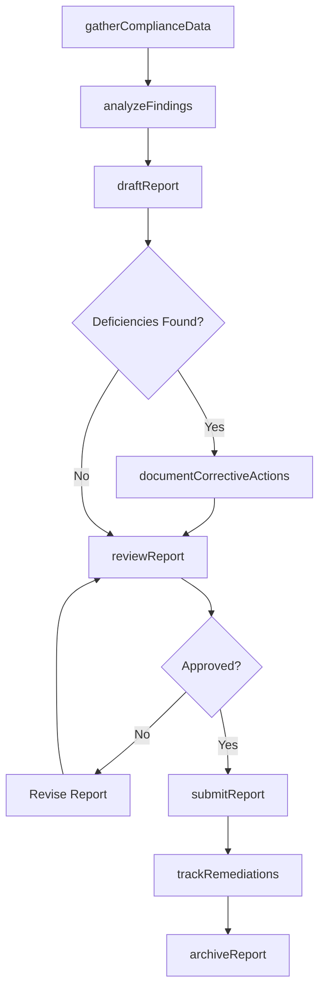
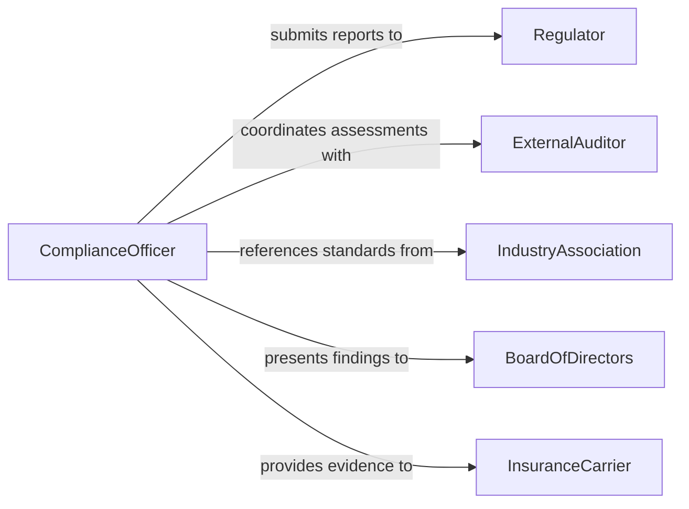

# Prepare Reports Related to Compliance Matters

> Business-as-Code definition for compliance report preparation. Models the generation, review, and submission of reports that document organizational adherence to regulatory requirements and internal policies.

## Overview

Compliance report preparation involves gathering data on regulatory adherence, analyzing findings against applicable standards, drafting formal reports, and submitting them to internal stakeholders or external regulators. This definition covers periodic compliance assessments, incident-based reporting, and audit response documentation, enabling organizations to maintain continuous visibility into their compliance posture and meet mandatory reporting obligations.

## Actors

| Actor | Description |
|-------|-------------|
| Regulator | The government agency that receives and reviews compliance reports |
| ExternalAuditor | Independently verifies compliance claims and documentation |
| IndustryAssociation | Publishes standards and best practices for compliance |
| BoardOfDirectors | Receives compliance status reports for governance oversight |
| InsuranceCarrier | Requires compliance evidence for coverage determinations |

## Roles

| Role | Description |
|------|-------------|
| ComplianceOfficer | Oversees compliance monitoring and report generation |
| ComplianceAnalyst | Collects data, analyzes findings, and drafts reports |
| InternalAuditor | Conducts independent assessments of compliance controls |
| RegulatoryAffairsManager | Manages submissions to regulatory bodies |

## Entities

| Entity | Description |
|--------|-------------|
| ComplianceReport | A formal document detailing adherence to regulations or policies |
| Finding | A specific observation of compliance or non-compliance |
| CorrectiveAction | A planned or completed remedy for a compliance deficiency |
| Regulation | A specific law, rule, or standard the organization must follow |
| AuditWorkpaper | Supporting documentation for compliance conclusions |
| SubmissionRecord | A log of report delivery to regulators or stakeholders |
| ComplianceMetric | A quantitative measure of regulatory adherence |

## Actions

| Action | Description |
|--------|-------------|
| gatherComplianceData | Collect evidence and metrics on regulatory adherence |
| analyzeFindings | Evaluate collected data against applicable standards |
| draftReport | Author the compliance report with findings and recommendations |
| documentCorrectiveActions | Record planned remedies for identified deficiencies |
| reviewReport | Submit the draft report for internal review and approval |
| submitReport | Deliver the finalized report to regulators or stakeholders |
| trackRemediations | Monitor progress on corrective actions |
| archiveReport | Store the completed report for retention |

## Events

| Event | Description |
|-------|-------------|
| dataGathered | Compliance evidence and metrics have been collected |
| findingsAnalyzed | Data has been evaluated against regulatory standards |
| reportDrafted | A compliance report draft has been completed |
| correctiveActionsDocumented | Remediation plans have been recorded |
| reportReviewed | The compliance report has passed internal review |
| reportSubmitted | The report has been delivered to the required parties |
| remediationCompleted | A corrective action has been fully implemented |

## Searches

| Search | Description |
|--------|-------------|
| findReports | List compliance reports by regulation, period, or status |
| getFindings | Retrieve findings by severity, category, or regulation |
| findOpenRemediations | Locate corrective actions that are still in progress |
| getSubmissionHistory | Retrieve the filing history for a specific report type |
| searchByRegulation | Find all reports related to a specific regulatory requirement |

## Workflow



## Actor Relationships



## Usage

### Calling Actions

```typescript
import { prepareReportsRelatedComplianceMatters } from '@headlessly/prepare-reports-related-compliance-matters'

const compliance = prepareReportsRelatedComplianceMatters()

// Gather compliance data for quarterly report
const data = await compliance.gatherComplianceData({
  regulation: 'HIPAA',
  period: { start: '2026-01-01', end: '2026-03-31' },
  departments: ['clinical-operations', 'information-technology']
})

// Analyze and draft
const findings = await compliance.analyzeFindings({ datasetId: data.id })
const report = await compliance.draftReport({
  title: 'Q1 2026 HIPAA Compliance Report',
  findings: findings.items,
  regulation: 'HIPAA'
})

// Submit to regulator
await compliance.submitReport({
  reportId: report.id,
  recipient: 'HHS-OCR',
  method: 'electronic-filing'
})
```

### Event-Driven Automation

```typescript
// Escalate high-severity findings
compliance.findingsAnalyzed(async ({ findings }) => {
  const critical = findings.filter(f => f.severity === 'critical')
  if (critical.length > 0) {
    await notify({
      to: 'compliance-leadership',
      message: `${critical.length} critical compliance findings require immediate attention`
    })
  }
})

// Track remediation deadlines
compliance.correctiveActionsDocumented(async ({ actions }) => {
  for (const action of actions) {
    await scheduleReminder({
      itemId: action.id,
      date: action.dueDate,
      message: `Corrective action "${action.title}" is due`
    })
  }
})
```
