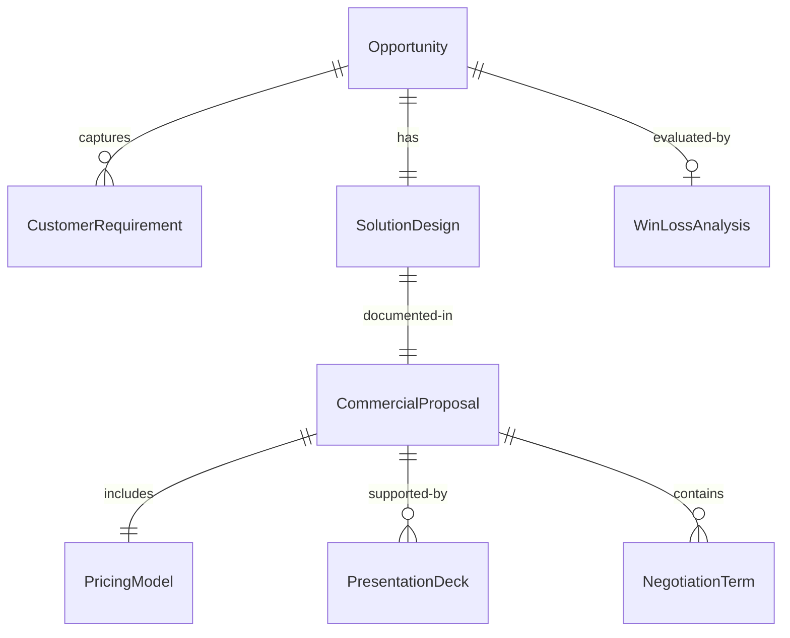
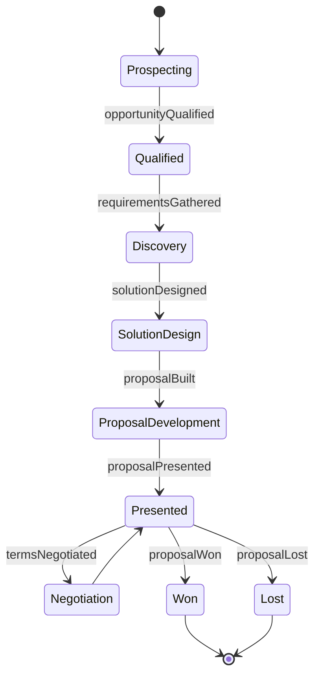
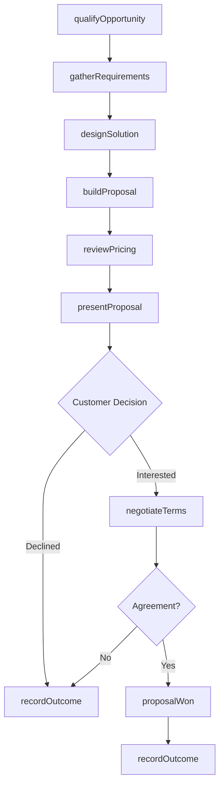
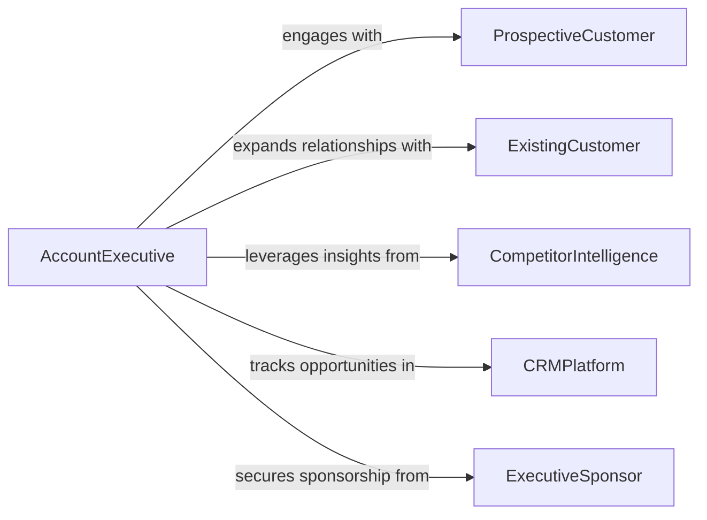

# Develop Proposals for Current or Prospective Customers

> Business-as-Code definition for customer-facing proposal development. Models the lifecycle from opportunity qualification through solution design, proposal creation, client presentation, and contract negotiation.

## Overview

Developing proposals for current or prospective customers involves understanding client needs, designing tailored solutions, creating compelling commercial documents, and presenting value propositions that win new business or expand existing relationships. This definition exposes actions for opportunity assessment and proposal creation, events for pipeline and approval tracking, and searches for proposal performance analytics and client history.

## Actors

| Actor | Description |
|-------|-------------|
| ProspectiveCustomer | A potential buyer evaluating the organization's products or services |
| ExistingCustomer | A current client considering additional services or contract renewal |
| CompetitorIntelligence | Provides analysis of competitive positioning and pricing |
| CRMPlatform | Manages customer relationship data and opportunity pipelines |
| ExecutiveSponsor | Senior leader who champions the deal and participates in presentations |

## Roles

| Role | Description |
|------|-------------|
| AccountExecutive | Manages the client relationship and drives the proposal process |
| SolutionsArchitect | Designs the technical or service solution tailored to client needs |
| ProposalCoordinator | Assembles proposal content and manages the production timeline |
| PricingAnalyst | Develops competitive pricing and discount structures |

## Entities

| Entity | Description |
|--------|-------------|
| Opportunity | A qualified sales opportunity linked to a prospective or existing customer |
| CustomerRequirement | A documented need or objective expressed by the customer |
| SolutionDesign | A tailored approach describing how the organization will meet customer needs |
| CommercialProposal | A formal document presenting the solution, pricing, and terms |
| PricingModel | A financial structure defining costs, margins, and discount tiers |
| PresentationDeck | A visual summary of the proposal for client meetings |
| NegotiationTerm | A contractual element subject to discussion between parties |
| WinLossAnalysis | A post-decision review of factors contributing to the outcome |

## Actions

| Action | Description |
|--------|-------------|
| qualifyOpportunity | Assess the customer need, budget, and likelihood of closing |
| gatherRequirements | Document the customer's objectives, constraints, and success criteria |
| designSolution | Create a tailored approach that addresses the customer's requirements |
| buildProposal | Assemble the commercial proposal with executive summary, solution, and pricing |
| reviewPricing | Validate pricing against margins, competitive benchmarks, and deal size |
| presentProposal | Deliver the proposal to the customer in a formal presentation |
| negotiateTerms | Work with the customer to finalize contractual and commercial terms |
| recordOutcome | Document the win or loss and capture lessons learned |

## Events

| Event | Description |
|-------|-------------|
| opportunityQualified | A sales opportunity has been assessed and deemed viable |
| requirementsGathered | Customer needs and objectives have been documented |
| solutionDesigned | A tailored approach has been created for the customer |
| proposalBuilt | The commercial proposal document has been assembled |
| proposalPresented | The proposal has been delivered to the customer |
| termsNegotiated | Commercial and contractual terms have been agreed upon |
| proposalWon | The customer has accepted the proposal and awarded the contract |
| proposalLost | The customer has selected a different vendor or declined |

## Searches

| Search | Description |
|--------|-------------|
| findProposals | List proposals by customer, stage, or date range |
| getWinRate | Calculate proposal success rates by segment, size, or team |
| getPipelineValue | Retrieve total value of proposals in progress by stage |
| findSimilarDeals | Locate past proposals for comparable customers or solutions |
| getCustomerHistory | Retrieve proposal and contract history for a specific account |

## Entity Relationships



## State Diagram



## Workflow



## Actor Relationships



## Usage

### Calling Actions

```typescript
import { developProposalsCurrentProspectiveCustomers } from '@headlessly/develop-proposals-current-prospective-customers'

const proposals = developProposalsCurrentProspectiveCustomers()

// Qualify a new opportunity
const opportunity = await proposals.qualifyOpportunity({
  customerName: 'Meridian Healthcare',
  contactEmail: 'procurement@meridian-health.com.ai',
  estimatedValue: 450000,
  expectedCloseDate: '2026-06-30',
  source: 'inbound-request'
})

// Design a solution for the customer
const solution = await proposals.designSolution({
  opportunityId: opportunity.id,
  requirements: ['ehr-integration', 'real-time-analytics', 'hipaa-compliance'],
  deliveryModel: 'managed-service',
  implementationWeeks: 12
})

// Build and present the proposal
const proposal = await proposals.buildProposal({
  opportunityId: opportunity.id,
  solutionId: solution.id,
  includeExecutiveSummary: true,
  pricingTier: 'enterprise',
  validUntil: '2026-05-31'
})
```

### Event-Driven Automation

```typescript
// Alert sales leadership on high-value wins
proposals.proposalWon(async ({ opportunityId, customerName, contractValue }) => {
  if (contractValue > 250000) {
    await notify({
      to: 'sales-leadership',
      message: `Deal won: ${customerName} - $${contractValue}`
    })
  }
})

// Trigger win/loss analysis on outcome
proposals.proposalLost(async ({ opportunityId, customerName, competitorSelected }) => {
  await proposals.recordOutcome({
    opportunityId,
    result: 'lost',
    competitor: competitorSelected,
    analysisRequired: true
  })
})
```
