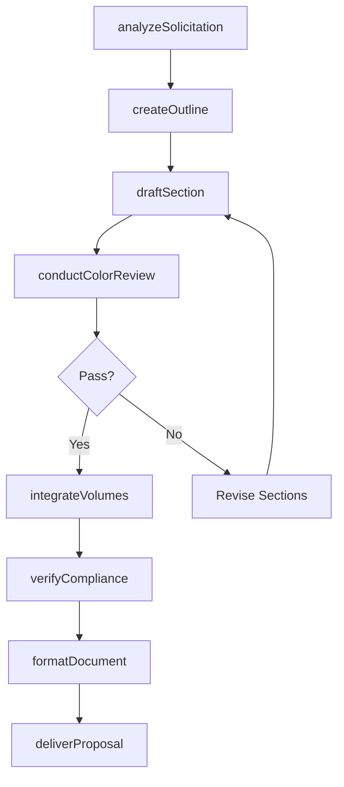
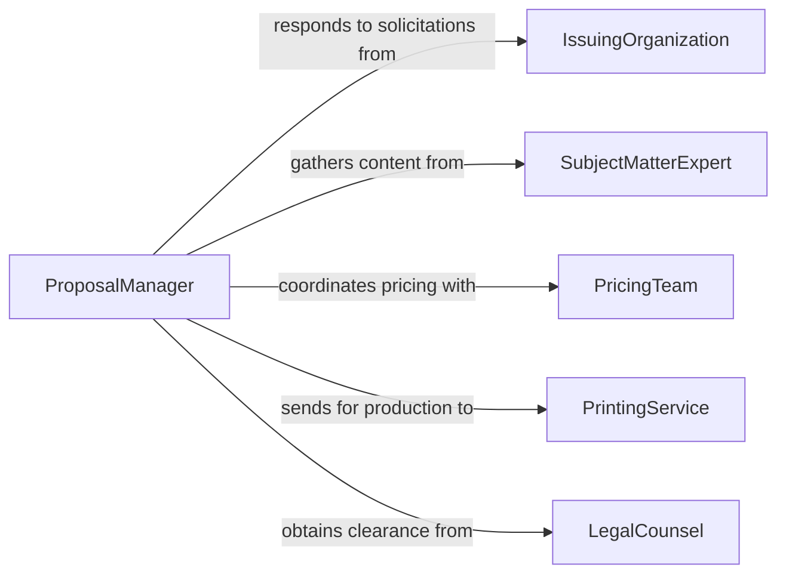

# Prepare Proposal Documents

> Business-as-Code definition for business proposal document preparation. Models the lifecycle from requirements analysis through content development, pricing, formatting, and delivery of proposals for contracts, projects, and services.

## Overview

Preparing proposal documents involves analyzing solicitation requirements, developing technical and management approaches, assembling pricing volumes, and producing polished deliverables that respond to requests for proposals, quotes, and information. This definition exposes actions for proposal assembly and compliance verification, events for deadline and review tracking, and searches for proposal metrics and template retrieval.

## Actors

| Actor | Description |
|-------|-------------|
| IssuingOrganization | The entity that published the solicitation requiring a proposal response |
| SubjectMatterExpert | Provides technical content and domain expertise for proposal sections |
| PricingTeam | Develops cost models and competitive pricing strategies |
| PrintingService | Produces physical copies and binds proposal volumes |
| LegalCounsel | Reviews terms, conditions, and contractual language |

## Roles

| Role | Description |
|------|-------------|
| ProposalManager | Coordinates the proposal development schedule and team assignments |
| ProposalWriter | Drafts and edits proposal sections to meet solicitation requirements |
| ComplianceReviewer | Verifies the proposal addresses all mandatory requirements |
| VolumeLeader | Owns a specific proposal volume such as technical, management, or cost |

## Entities

| Entity | Description |
|--------|-------------|
| Solicitation | A formal request from a buyer seeking proposals from qualified vendors |
| ComplianceMatrix | A mapping of solicitation requirements to proposal response locations |
| TechnicalVolume | The section of a proposal describing the approach and methodology |
| ManagementVolume | The section describing staffing, organization, and project management |
| CostVolume | The section containing pricing, cost breakdown, and financial terms |
| ProposalOutline | A structured plan defining sections, authors, and page allocations |
| BoilerplateLibrary | A collection of reusable past performance and capability descriptions |
| ReviewComment | Feedback from internal reviewers on draft proposal sections |

## Actions

| Action | Description |
|--------|-------------|
| analyzeSolicitation | Parse requirements and develop a compliance matrix |
| createOutline | Define the proposal structure, assignments, and schedule |
| draftSection | Write a specific section of the proposal |
| conductColorReview | Run a formal review cycle at a designated proposal maturity level |
| integrateVolumes | Combine all sections into a cohesive final document |
| verifyCompliance | Check the assembled proposal against all solicitation requirements |
| formatDocument | Apply branding, pagination, and production-ready formatting |
| deliverProposal | Submit the final proposal to the issuing organization |

## Events

| Event | Description |
|-------|-------------|
| solicitationAnalyzed | Requirements have been parsed and the compliance matrix created |
| outlineCreated | The proposal structure and assignments have been defined |
| sectionDrafted | A proposal section has been completed by the assigned author |
| colorReviewCompleted | A formal review cycle has been finished with documented feedback |
| volumesIntegrated | All proposal sections have been combined into the final document |
| complianceVerified | The proposal has been confirmed to address all requirements |
| proposalDelivered | The final proposal has been submitted to the buyer |
| submissionDeadlineApproaching | The proposal due date is within the warning window |

## Searches

| Search | Description |
|--------|-------------|
| findProposals | List proposals by client, status, or submission date |
| getComplianceStatus | Check requirement coverage for a specific proposal |
| findReviewComments | Retrieve reviewer feedback by section or review stage |
| getBoilerplates | Search reusable content by capability area or past performance |
| getProposalMetrics | Retrieve win rates, cycle times, and volume statistics |

## Workflow



## Actor Relationships



## Usage

### Calling Actions

```typescript
import { prepareProposalDocuments } from '@headlessly/prepare-proposal-documents'

const proposals = prepareProposalDocuments()

// Analyze an incoming RFP
const analysis = await proposals.analyzeSolicitation({
  solicitationId: 'RFP-2026-0042',
  documentUrl: 'https://sam.gov/rfp/2026-0042',
  dueDate: '2026-04-15T17:00:00Z'
})

// Create the proposal outline
const outline = await proposals.createOutline({
  solicitationId: analysis.solicitationId,
  volumes: ['technical', 'management', 'cost', 'past-performance'],
  pageLimit: 100,
  teamAssignments: [
    { section: 'technical-approach', author: 'engineering-lead', pages: 30 },
    { section: 'management-plan', author: 'pm-lead', pages: 20 }
  ]
})

// Run a pink team review
await proposals.conductColorReview({
  proposalId: outline.proposalId,
  reviewType: 'pink-team',
  reviewers: ['capture-manager', 'technical-director', 'contracts-lead']
})
```

### Event-Driven Automation

```typescript
// Alert on submission deadlines
proposals.submissionDeadlineApproaching(async ({ proposalId, client, deadline, daysRemaining }) => {
  await notify({
    to: 'proposal-team',
    message: `Proposal for ${client} due in ${daysRemaining} days (${deadline})`
  })
})

// Notify leadership on delivery
proposals.proposalDelivered(async ({ proposalId, client, submissionMethod }) => {
  await notify({
    to: 'business-development',
    message: `Proposal ${proposalId} delivered to ${client} via ${submissionMethod}`
  })
})
```
