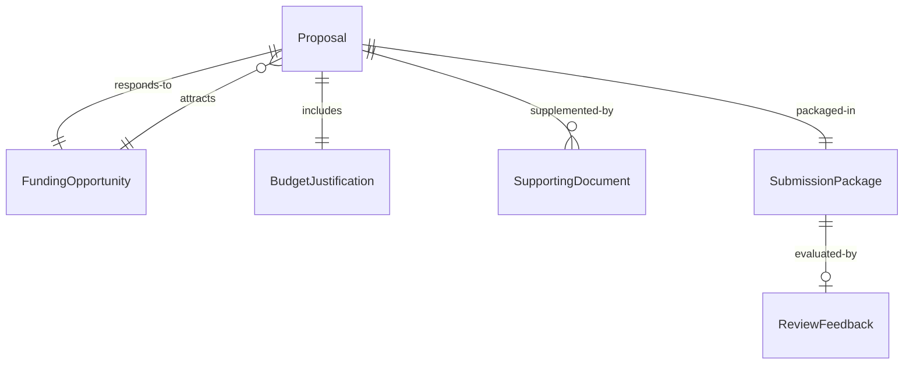
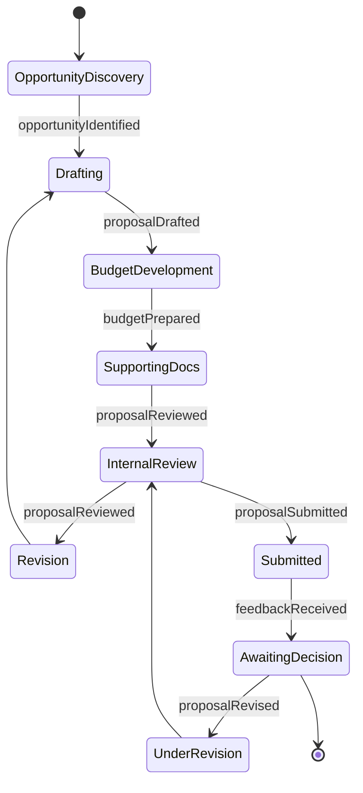
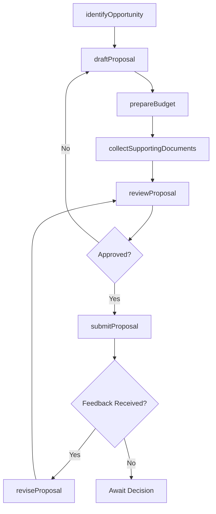
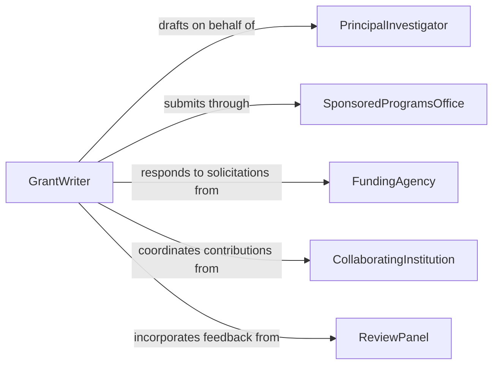

# Prepare Proposal Documents Grant Applications

> Business-as-Code definition for preparing proposal documents and grant applications. Models the end-to-end process of identifying funding opportunities, drafting proposals, and managing submissions.

## Overview

Preparing proposal documents and grant applications involves researching funding sources, drafting narrative and budget sections, coordinating with stakeholders for supporting materials, and submitting completed applications within established deadlines. This definition exposes actions for each stage of the proposal lifecycle, events for deadline tracking and status changes, and searches for opportunity and submission management.

## Actors

| Actor | Description |
|-------|-------------|
| FundingAgency | The organization that issues grant opportunities and awards funding |
| PrincipalInvestigator | The lead researcher or project director driving the proposal |
| CollaboratingInstitution | Partner organizations contributing to the proposed project |
| ReviewPanel | External evaluators who assess and score submitted proposals |
| SponsoredProgramsOffice | Institutional office that reviews and authorizes submissions |

## Roles

| Role | Description |
|------|-------------|
| GrantWriter | Drafts proposal narratives, budgets, and supporting documentation |
| ProposalCoordinator | Manages timelines, collects materials, and ensures completeness |
| BudgetAnalyst | Develops and validates the financial plan for the proposal |
| ComplianceReviewer | Verifies adherence to funder guidelines and institutional policies |

## Entities

| Entity | Description |
|--------|-------------|
| Proposal | The complete submission document package for a funding opportunity |
| FundingOpportunity | A published grant solicitation or request for proposals |
| BudgetJustification | Detailed financial plan with line-item explanations |
| SupportingDocument | Letters of support, biosketches, or institutional certifications |
| SubmissionPackage | The finalized and compiled set of documents ready for submission |
| ReviewFeedback | Scores and comments returned by the funding agency |

## Actions

| Action | Description |
|--------|-------------|
| identifyOpportunity | Locate and evaluate relevant funding opportunities |
| draftProposal | Create the initial narrative and technical sections |
| prepareBudget | Develop the financial plan and budget justification |
| collectSupportingDocuments | Gather letters of support, certifications, and appendices |
| reviewProposal | Conduct internal review for quality and compliance |
| submitProposal | Finalize and transmit the proposal to the funding agency |
| reviseProposal | Update the proposal based on reviewer feedback |

## Events

| Event | Description |
|-------|-------------|
| opportunityIdentified | A relevant funding opportunity has been flagged for pursuit |
| proposalDrafted | The initial proposal narrative has been completed |
| budgetPrepared | The financial plan and justification have been finalized |
| proposalReviewed | Internal review of the proposal has been completed |
| proposalSubmitted | The proposal has been transmitted to the funding agency |
| feedbackReceived | Reviewer scores and comments have been returned |
| proposalRevised | The proposal has been updated based on feedback |

## Searches

| Search | Description |
|--------|-------------|
| findOpportunities | Search funding opportunities by agency, topic, or deadline |
| getProposalsByStatus | Retrieve proposals filtered by draft, submitted, or awarded status |
| getUpcomingDeadlines | List proposals with approaching submission deadlines |
| getReviewFeedback | Retrieve reviewer scores and comments for a submitted proposal |

## Entity Relationships



## State Diagram



## Workflow



## Actor Relationships



## Usage

### Calling Actions

```typescript
import { prepareProposalDocumentsGrantApplications } from '@headlessly/prepare-proposal-documents-grant-applications'

const proposals = prepareProposalDocumentsGrantApplications()

// Identify a funding opportunity
const opportunity = await proposals.identifyOpportunity({
  agency: 'National Science Foundation',
  topic: 'Climate Resilience',
  deadlineAfter: '2026-06-01'
})

// Draft a proposal
const proposal = await proposals.draftProposal({
  opportunityId: opportunity.id,
  title: 'Community-Based Climate Adaptation Framework',
  principalInvestigator: 'PI-2045',
  narrative: 'This project proposes a scalable framework for...'
})

// Prepare the budget
await proposals.prepareBudget({
  proposalId: proposal.id,
  totalAmount: 750000,
  duration: { years: 3 },
  lineItems: [
    { category: 'Personnel', amount: 400000 },
    { category: 'Equipment', amount: 150000 },
    { category: 'Travel', amount: 50000 },
    { category: 'Indirect Costs', amount: 150000 }
  ]
})
```

### Event-Driven Automation

```typescript
// Notify team of approaching deadlines
proposals.opportunityIdentified(async ({ opportunityId, deadline }) => {
  const daysUntil = daysUntilDate(deadline)
  if (daysUntil <= 30) {
    await notify({
      to: 'grants-team',
      message: `Funding opportunity ${opportunityId} deadline in ${daysUntil} days`
    })
  }
})

// Trigger revision workflow on feedback
proposals.feedbackReceived(async ({ proposalId, scores, comments }) => {
  if (scores.overall < 80) {
    await proposals.reviseProposal({
      proposalId,
      revisionNotes: comments.join('; ')
    })
  }
})
```
