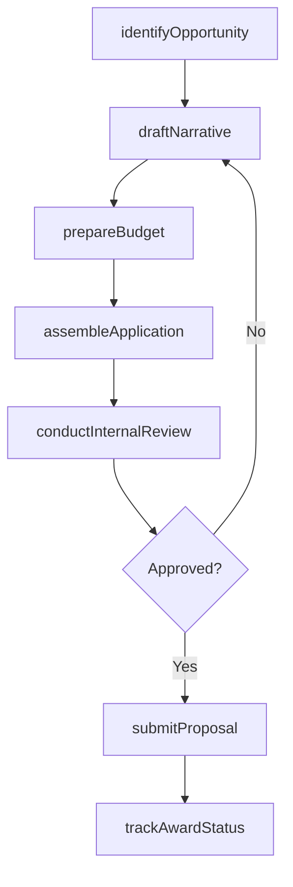
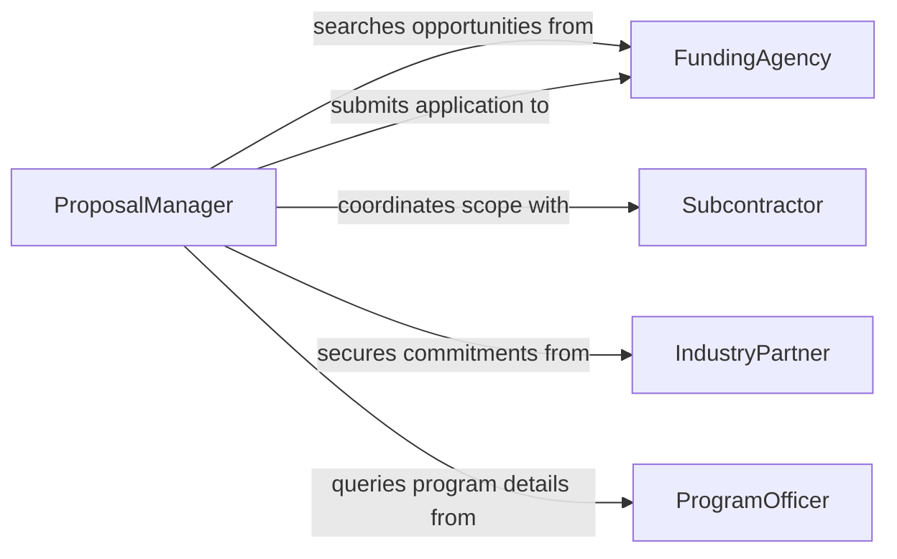

# Prepare Proposals Grant Applications Obtain

> Business-as-Code definition for preparing proposals and grant applications to secure project funding. Models the end-to-end process from opportunity identification through submission and award tracking.

## Overview

Preparing proposals and grant applications to obtain project funding involves researching funding opportunities, developing compelling narratives, assembling budgets, and coordinating multi-stakeholder submissions. This definition covers the full lifecycle from identifying eligible grants and RFPs through drafting technical and financial components, internal review cycles, and final submission to funding agencies or sponsors.

## Actors

| Actor | Description |
|-------|-------------|
| FundingAgency | Government body or foundation issuing grants and funding opportunities |
| ProgramOfficer | Agency representative who manages grant programs and answers applicant queries |
| Subcontractor | External partner contributing to the proposed project scope |
| IndustryPartner | Private-sector collaborator providing matching funds or in-kind support |
| PeerReviewer | External expert evaluating proposal merit for the funding agency |

## Roles

| Role | Description |
|------|-------------|
| ProposalManager | Coordinates the overall proposal development process and submission timeline |
| PrincipalInvestigator | Leads the technical narrative and serves as primary point of contact |
| BudgetAnalyst | Develops cost estimates, budget justifications, and financial compliance |
| GrantsAdministrator | Ensures institutional compliance with funder requirements and regulations |

## Entities

| Entity | Description |
|--------|-------------|
| Proposal | A formal document requesting funding for a specific project |
| GrantOpportunity | A published funding announcement with eligibility criteria and deadlines |
| Budget | Itemized financial plan detailing personnel, equipment, and indirect costs |
| Narrative | The technical or programmatic description of proposed work |
| Submission | The final packaged application delivered to the funding agency |
| AwardNotice | Official communication indicating funding approval or denial |

## Actions

| Action | Description |
|--------|-------------|
| identifyOpportunity | Search for and evaluate eligible funding announcements |
| draftNarrative | Write the technical or programmatic sections of the proposal |
| prepareBudget | Develop itemized cost estimates and budget justifications |
| assembleApplication | Compile all required documents, forms, and appendices |
| conductInternalReview | Route the draft through institutional review and approval |
| submitProposal | Transmit the completed application to the funding agency |
| trackAwardStatus | Monitor the status of submitted proposals through decision |

## Events

| Event | Description |
|-------|-------------|
| opportunityIdentified | A relevant funding opportunity has been matched to organizational capabilities |
| narrativeDrafted | The technical narrative section has been completed |
| budgetPrepared | The financial plan and justification have been finalized |
| applicationAssembled | All proposal components have been compiled into submission format |
| internalReviewCompleted | Institutional review has approved the proposal for submission |
| proposalSubmitted | The application has been transmitted to the funding agency |
| awardDecisionReceived | The funding agency has communicated an award or rejection |

## Searches

| Search | Description |
|--------|-------------|
| findOpportunities | List funding announcements by agency, topic area, or deadline |
| getProposals | Retrieve proposals by status, principal investigator, or submission date |
| getAwardHistory | Look up past awards by funder, amount, or project area |

## Workflow



## Actor Relationships



## Usage

### Calling Actions

```typescript
import { prepareProposalsGrantApplicationsObtain } from '@headlessly/prepare-proposals-grant-applications-obtain'

const proposals = prepareProposalsGrantApplicationsObtain()

// Identify a relevant funding opportunity
const opportunity = await proposals.identifyOpportunity({
  agency: 'National Science Foundation',
  topicArea: 'Advanced Manufacturing',
  deadline: { after: '2026-03-01' }
})

// Draft the technical narrative
await proposals.draftNarrative({
  opportunityId: opportunity.id,
  principalInvestigator: 'Dr. Sarah Chen',
  sections: ['projectDescription', 'methodology', 'expectedOutcomes']
})

// Prepare the budget
await proposals.prepareBudget({
  opportunityId: opportunity.id,
  personnel: [{ role: 'PI', months: 3, rate: 15000 }],
  equipment: [{ item: 'Electron Microscope', cost: 250000 }],
  indirectRate: 0.52
})
```

### Event-Driven Automation

```typescript
// Notify team when internal review is complete
proposals.internalReviewCompleted(async ({ proposalId, status }) => {
  if (status === 'approved') {
    await notify({
      to: 'grants-office',
      message: `Proposal ${proposalId} cleared for submission`
    })
  }
})

// Track award decisions
proposals.awardDecisionReceived(async ({ proposalId, decision, amount }) => {
  if (decision === 'funded') {
    await notify({
      to: 'principal-investigator',
      message: `Proposal ${proposalId} awarded $${amount.toLocaleString()}`
    })
  }
})
```
