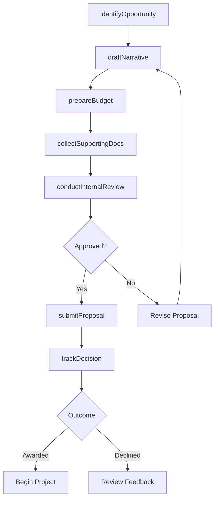
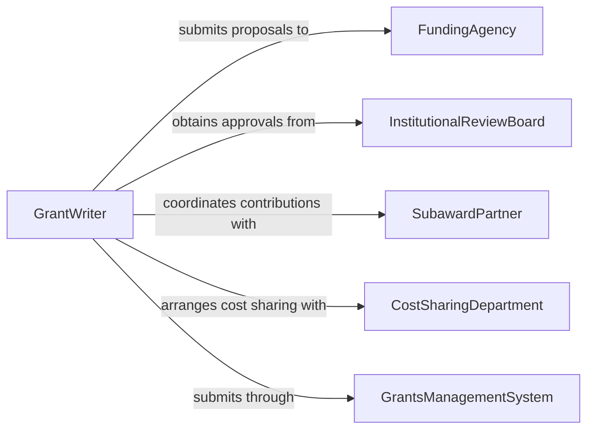

# Write Grant Proposals

> Business-as-Code definition for grant proposal writing and submission. Models the lifecycle from funding opportunity identification through narrative development, budget preparation, review, and submission to granting agencies.

## Overview

Writing grant proposals involves researching funding opportunities, developing compelling project narratives, preparing detailed budgets, and assembling required supporting documentation for submission to federal agencies, foundations, and corporate funders. This definition exposes actions for proposal development and submission, events for deadline and review tracking, and searches for funding opportunity discovery and proposal history.

## Actors

| Actor | Description |
|-------|-------------|
| FundingAgency | Government body or foundation that awards grant funding |
| InstitutionalReviewBoard | Approves research protocols involving human or animal subjects |
| SubawardPartner | Collaborating organization contributing to the proposed project |
| CostSharingDepartment | Internal unit providing matching funds or in-kind contributions |
| GrantsManagementSystem | Electronic platform for proposal submission and tracking |

## Roles

| Role | Description |
|------|-------------|
| GrantWriter | Develops proposal narratives and compiles submission packages |
| PrincipalInvestigator | Leads the proposed project and provides technical direction |
| BudgetSpecialist | Prepares detailed cost estimates and budget justifications |
| SponsoredProgramsOfficer | Reviews proposals for institutional compliance before submission |

## Entities

| Entity | Description |
|--------|-------------|
| FundingOpportunity | An announcement from a funder soliciting grant applications |
| ProposalNarrative | The written description of project objectives, methods, and significance |
| ProposalBudget | A detailed financial plan for the proposed project |
| BudgetJustification | A written explanation supporting each budget line item |
| LetterOfSupport | A document from a partner or stakeholder endorsing the project |
| ComplianceCertification | Institutional attestations required by the funder |
| SubmissionPackage | The complete assembled proposal ready for submission |
| ReviewCriteria | The evaluation standards used by the funder to score proposals |

## Actions

| Action | Description |
|--------|-------------|
| identifyOpportunity | Research and select a funding opportunity matching project goals |
| draftNarrative | Write the project description, significance, and methodology |
| prepareBudget | Develop a detailed cost plan with justification for each item |
| collectSupportingDocs | Gather letters of support, biosketches, and compliance forms |
| conductInternalReview | Route the proposal through institutional review before submission |
| submitProposal | Transmit the completed proposal package to the funding agency |
| trackDecision | Monitor the proposal status through the funder's review process |

## Events

| Event | Description |
|-------|-------------|
| opportunityIdentified | A suitable funding opportunity has been selected |
| narrativeDrafted | The project narrative has been written |
| budgetPrepared | The proposal budget and justification are complete |
| internalReviewCompleted | Institutional review has been finished with feedback |
| proposalSubmitted | The proposal package has been transmitted to the funder |
| proposalAwarded | The funding agency has approved the grant application |
| proposalDeclined | The funding agency has not selected the proposal |
| deadlineApproaching | A submission deadline is within the configured warning period |

## Searches

| Search | Description |
|--------|-------------|
| findOpportunities | Search funding opportunities by agency, topic, or deadline |
| getProposals | List proposals by status, funder, or principal investigator |
| getDeadlines | Retrieve upcoming submission deadlines by agency or program |
| findAwardedGrants | List successfully funded proposals by period or department |
| getProposalHistory | Retrieve all versions and reviews for a specific proposal |

## Workflow



## Actor Relationships



## Usage

### Calling Actions

```typescript
import { writeGrantProposals } from '@headlessly/write-grant-proposals'

const grants = writeGrantProposals()

// Identify a matching funding opportunity
const opportunity = await grants.identifyOpportunity({
  keywords: ['climate resilience', 'urban infrastructure'],
  agencies: ['nsf', 'epa', 'doe'],
  minAmount: 250000,
  deadlineAfter: '2026-06-01'
})

// Draft the project narrative
const narrative = await grants.draftNarrative({
  opportunityId: opportunity.id,
  sections: ['project-summary', 'significance', 'approach', 'broader-impacts'],
  principalInvestigator: 'dr-martinez',
  maxPages: 15
})

// Prepare the budget
await grants.prepareBudget({
  opportunityId: opportunity.id,
  projectDuration: 36,
  personnel: [
    { role: 'PI', effort: 0.25, annualSalary: 145000 },
    { role: 'Postdoc', effort: 1.0, annualSalary: 60000 }
  ],
  indirectCostRate: 0.55
})
```

### Event-Driven Automation

```typescript
// Alert team on approaching deadlines
grants.deadlineApproaching(async ({ opportunityId, agency, deadline, daysRemaining }) => {
  await notify({
    to: 'sponsored-programs',
    message: `Grant proposal for ${agency} due in ${daysRemaining} days (${deadline})`
  })
})

// Notify PI on award decision
grants.proposalAwarded(async ({ proposalId, agency, amount, projectStart }) => {
  await notify({
    to: 'principal-investigator',
    message: `Congratulations! ${agency} awarded $${amount} starting ${projectStart}`
  })
})
```
