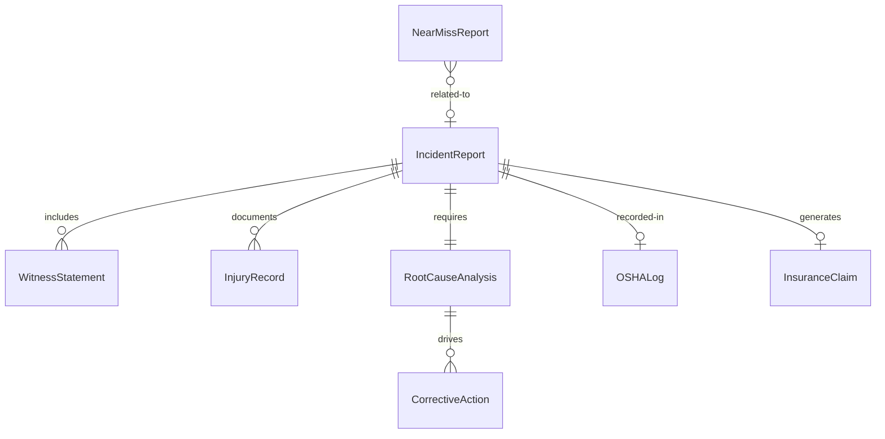
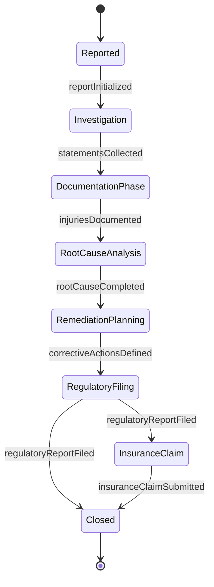
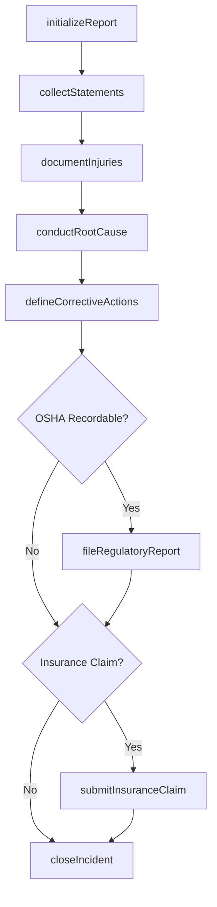
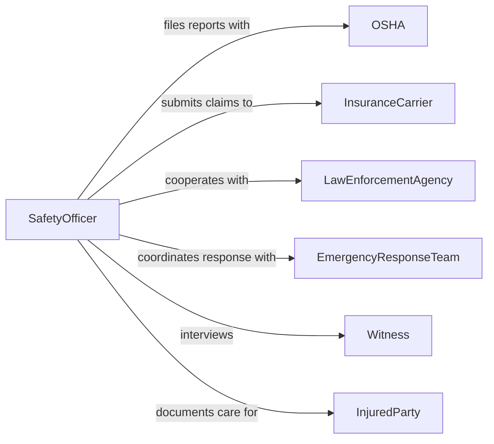

# Prepare Accident or Incident Reports

> Business-as-Code definition for accident and incident report preparation. Models the documentation, investigation, and reporting of workplace accidents, safety incidents, and near-miss events.

## Overview

Accident and incident report preparation involves documenting the circumstances of an event, collecting witness statements, recording injuries and damages, determining contributing factors, and filing reports with regulatory agencies and internal stakeholders. This definition covers OSHA recordable incidents, workers compensation claims, environmental releases, and near-miss documentation, enabling organizations to maintain compliant safety records and drive continuous improvement in workplace safety.

## Actors

| Actor | Description |
|-------|-------------|
| OSHA | Federal agency requiring workplace injury and illness reporting |
| InsuranceCarrier | Processes workers compensation claims and reviews incident data |
| LawEnforcementAgency | Investigates accidents involving criminal liability |
| EmergencyResponseTeam | Provides initial response and scene documentation |
| InjuredParty | The individual harmed in the incident |
| Witness | Provides firsthand account of the incident circumstances |

## Roles

| Role | Description |
|------|-------------|
| SafetyOfficer | Leads incident investigations and prepares formal reports |
| IncidentReporter | Documents initial details at the time of the event |
| InvestigationLead | Conducts root cause analysis and compiles findings |
| ComplianceCoordinator | Ensures reports are filed with required regulatory agencies |

## Entities

| Entity | Description |
|--------|-------------|
| IncidentReport | A formal record of an accident or safety event |
| WitnessStatement | A recorded account from a person who observed the incident |
| InjuryRecord | Documentation of physical harm sustained in the incident |
| RootCauseAnalysis | An investigation into the underlying causes of the incident |
| CorrectiveAction | A planned or completed measure to prevent recurrence |
| OSHALog | The regulatory record of workplace injuries and illnesses |
| NearMissReport | Documentation of an event that could have caused harm |
| InsuranceClaim | A formal request for compensation related to the incident |

## Actions

| Action | Description |
|--------|-------------|
| initializeReport | Create a new incident report with initial details |
| collectStatements | Gather witness accounts and physical evidence |
| documentInjuries | Record the nature and severity of injuries sustained |
| conductRootCause | Perform an investigation to identify contributing factors |
| defineCorrectiveActions | Specify measures to prevent incident recurrence |
| fileRegulatoryReport | Submit required reports to OSHA or other agencies |
| submitInsuranceClaim | File a workers compensation or liability claim |
| closeIncident | Finalize the report and verify corrective actions |

## Events

| Event | Description |
|-------|-------------|
| reportInitialized | A new incident report has been created |
| statementsCollected | Witness accounts have been gathered |
| injuriesDocumented | Injury details have been recorded |
| rootCauseCompleted | The investigation has identified contributing factors |
| correctiveActionsDefined | Preventive measures have been specified |
| regulatoryReportFiled | Required agency reports have been submitted |
| insuranceClaimSubmitted | A compensation claim has been filed |
| incidentClosed | The report has been finalized and actions verified |

## Searches

| Search | Description |
|--------|-------------|
| findIncidents | List incidents by type, severity, or date range |
| getCorrectiveActions | Retrieve preventive measures by status or incident |
| findOpenInvestigations | Locate incidents with pending root cause analysis |
| getOSHALog | Retrieve the regulatory log of recordable incidents |
| findNearMisses | List near-miss events by department or hazard type |

## Entity Relationships



## State Diagram



## Workflow



## Actor Relationships



## Usage

### Calling Actions

```typescript
import { prepareAccidentIncidentReports } from '@headlessly/prepare-accident-incident-reports'

const incidents = prepareAccidentIncidentReports()

// Initialize a report
const report = await incidents.initializeReport({
  type: 'workplace-injury',
  dateTime: '2026-02-04T14:30:00Z',
  location: 'Warehouse B - Loading Dock 3',
  description: 'Employee struck by forklift while crossing loading area',
  severity: 'serious'
})

// Document injuries and collect statements
await incidents.documentInjuries({
  reportId: report.id,
  injuries: [{ bodyPart: 'left-leg', type: 'fracture', treatment: 'emergency-room' }]
})

await incidents.collectStatements({
  reportId: report.id,
  witnesses: ['EMP-001', 'EMP-002', 'EMP-003']
})

// File regulatory report
await incidents.fileRegulatoryReport({
  reportId: report.id,
  agency: 'OSHA',
  formType: 'Form-301',
  filedWithin: '24-hours'
})
```

### Event-Driven Automation

```typescript
// Alert safety leadership on serious incidents
incidents.reportInitialized(async ({ reportId, severity }) => {
  if (severity === 'serious' || severity === 'fatal') {
    await notify({
      to: 'safety-leadership',
      message: `Serious incident reported - immediate investigation required`
    })
  }
})

// Track corrective action completion
incidents.correctiveActionsDefined(async ({ actions }) => {
  for (const action of actions) {
    await scheduleReminder({
      itemId: action.id,
      date: action.dueDate,
      message: `Corrective action "${action.description}" is due`
    })
  }
})
```
