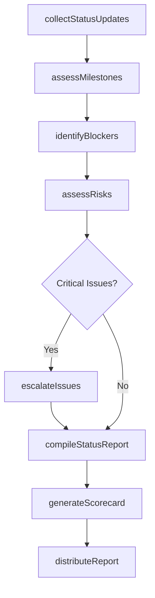
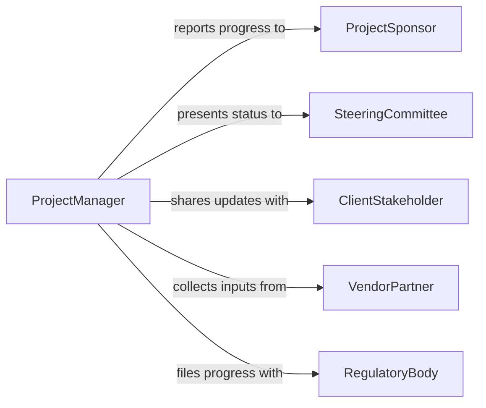

# Prepare Operational Progress or Status Reports

> Business-as-Code definition for operational progress and status report preparation. Models the tracking, compilation, and communication of project and operational status updates to stakeholders.

## Overview

Operational progress and status report preparation involves tracking milestones, measuring completion against plans, documenting blockers and risks, and communicating current status to management and stakeholders. This definition covers project status updates, program progress reports, initiative scorecards, and milestone tracking summaries, enabling organizations to maintain transparency on operational progress and surface issues requiring management attention.

## Actors

| Actor | Description |
|-------|-------------|
| ProjectSponsor | Receives progress updates and makes funding or scope decisions |
| SteeringCommittee | Reviews program-level status for governance oversight |
| ClientStakeholder | Receives progress reports as part of contracted deliverables |
| VendorPartner | Provides status updates on outsourced work streams |
| RegulatoryBody | May require periodic progress filings for regulated activities |

## Roles

| Role | Description |
|------|-------------|
| ProjectManager | Tracks progress and prepares status reports for projects |
| ProgramCoordinator | Aggregates status across multiple workstreams |
| StatusReporter | Collects updates from team leads and compiles reports |
| ExecutiveAssistant | Formats and distributes reports to leadership |

## Entities

| Entity | Description |
|--------|-------------|
| StatusReport | A periodic document summarizing current operational progress |
| Milestone | A significant checkpoint or deliverable in an operational plan |
| ProgressMetric | A quantitative measure of advancement toward objectives |
| Blocker | An issue preventing progress on a task or deliverable |
| RiskItem | A potential threat to schedule, budget, or quality |
| ActionItem | A specific task assigned to resolve an issue or advance progress |
| Scorecard | A visual summary of performance against key objectives |

## Actions

| Action | Description |
|--------|-------------|
| collectStatusUpdates | Gather progress data from team leads and systems |
| assessMilestones | Evaluate completion status of planned milestones |
| identifyBlockers | Document issues preventing progress on deliverables |
| assessRisks | Evaluate potential threats to operational objectives |
| compileStatusReport | Assemble collected data into a formatted status document |
| generateScorecard | Create a visual summary of progress against objectives |
| distributeReport | Deliver the status report to designated stakeholders |
| escalateIssues | Flag critical blockers or risks for management attention |

## Events

| Event | Description |
|-------|-------------|
| statusUpdatesCollected | Progress data has been gathered from all sources |
| milestonesAssessed | Milestone completion status has been evaluated |
| blockersIdentified | Issues preventing progress have been documented |
| risksAssessed | Potential threats have been evaluated and rated |
| statusReportCompiled | The progress report has been assembled |
| scorecardGenerated | A visual performance summary has been created |
| reportDistributed | The status report has been delivered to stakeholders |
| issueEscalated | A critical blocker or risk has been flagged to management |

## Searches

| Search | Description |
|--------|-------------|
| findStatusReports | List status reports by project, program, or period |
| getMilestones | Retrieve milestones by status, due date, or project |
| findBlockers | Locate active blockers by project or severity |
| getRisks | List risk items by probability, impact, or project |
| getActionItems | Retrieve action items by assignee, status, or due date |

## Workflow



## Actor Relationships



## Usage

### Calling Actions

```typescript
import { prepareOperationalProgressStatusReports } from '@headlessly/prepare-operational-progress-status-reports'

const status = prepareOperationalProgressStatusReports()

// Collect updates from all workstreams
const updates = await status.collectStatusUpdates({
  program: 'ERP-Migration-2026',
  workstreams: ['data-migration', 'integration', 'training', 'testing'],
  period: 'Week 5 - 2026'
})

// Assess milestones and compile
const milestones = await status.assessMilestones({
  programId: updates.programId,
  plannedMilestones: ['data-mapping-complete', 'uat-start', 'go-live-readiness']
})

const report = await status.compileStatusReport({
  programId: updates.programId,
  milestones: milestones.results,
  period: 'Week 5 - 2026'
})

await status.distributeReport({
  reportId: report.id,
  recipients: ['steering-committee', 'project-sponsor', 'pmo-director']
})
```

### Event-Driven Automation

```typescript
// Auto-escalate critical blockers
status.blockersIdentified(async ({ blockers }) => {
  const critical = blockers.filter(b => b.severity === 'critical')
  if (critical.length > 0) {
    await status.escalateIssues({
      items: critical,
      escalateTo: 'program-director'
    })
  }
})

// Generate scorecard when status is compiled
status.statusReportCompiled(async ({ reportId, programId }) => {
  await status.generateScorecard({ reportId, programId })
})
```
