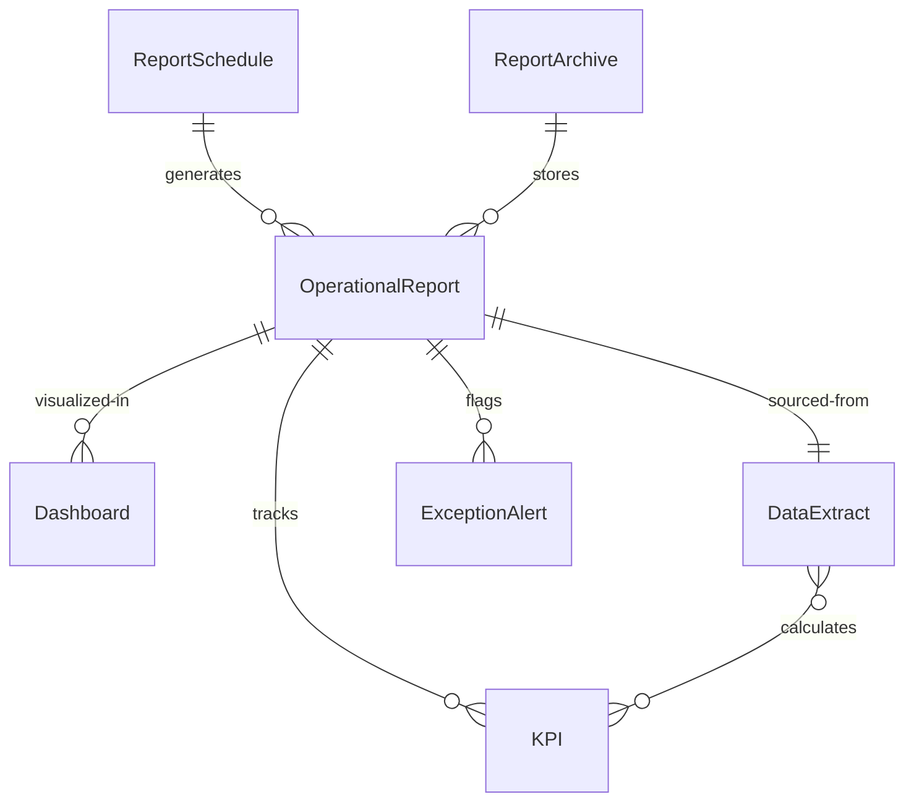
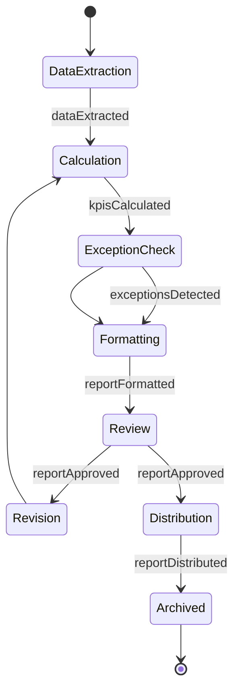
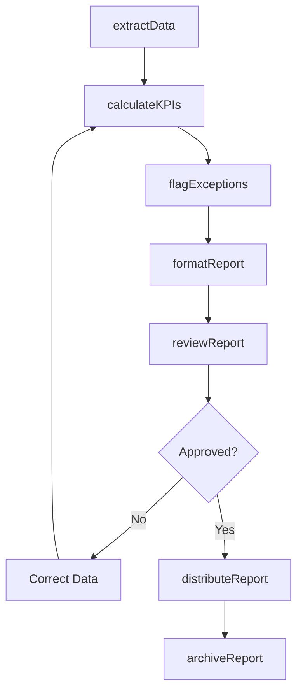
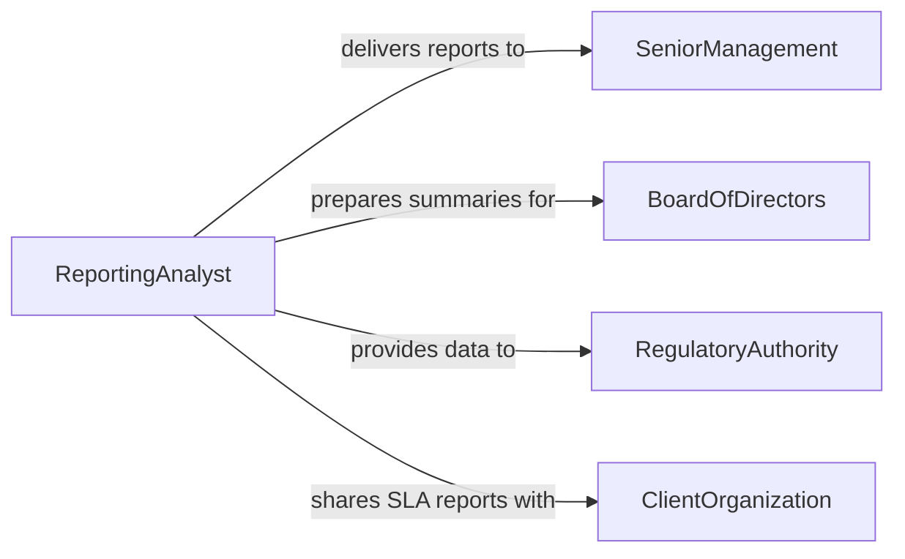

# Prepare Operational Reports

> Business-as-Code definition for operational report preparation. Models the systematic generation and distribution of reports that summarize business operations, production output, and service delivery metrics.

## Overview

Operational report preparation involves extracting data from business systems, calculating key performance indicators, formatting findings into standardized report layouts, and distributing them on scheduled or ad hoc bases. This definition covers daily production summaries, weekly operations dashboards, monthly performance reviews, and exception-based reports, enabling organizations to maintain visibility into operational effectiveness and support data-driven management decisions.

## Actors

| Actor | Description |
|-------|-------------|
| SeniorManagement | Consumes operational reports for strategic planning |
| BoardOfDirectors | Receives high-level operational summaries for governance |
| RegulatoryAuthority | May require operational data for compliance reporting |
| ClientOrganization | Receives service-level reports as part of contracted deliverables |

## Roles

| Role | Description |
|------|-------------|
| ReportingAnalyst | Extracts, analyzes, and formats operational data into reports |
| OperationsDirector | Reviews and approves operational reports before distribution |
| BusinessIntelligenceSpecialist | Designs report templates and automated data pipelines |
| QualityAssuranceReviewer | Validates report accuracy and data integrity |

## Entities

| Entity | Description |
|--------|-------------|
| OperationalReport | A formatted document summarizing operational performance |
| KPI | A key performance indicator tracked in the report |
| Dashboard | A visual display of real-time or periodic operational metrics |
| ReportSchedule | A defined cadence for automated report generation |
| DataExtract | A structured dataset pulled from operational systems |
| ExceptionAlert | A flagged metric that falls outside acceptable thresholds |
| ReportArchive | A repository of historical operational reports |

## Actions

| Action | Description |
|--------|-------------|
| extractData | Pull operational metrics from source systems |
| calculateKPIs | Compute key performance indicators from raw data |
| formatReport | Apply the report template and layout to compiled data |
| flagExceptions | Identify metrics that fall outside defined thresholds |
| reviewReport | Submit the report for accuracy verification and approval |
| distributeReport | Deliver the approved report to designated recipients |
| scheduleGeneration | Configure automated report production on a defined cadence |
| archiveReport | Store the completed report in the historical repository |

## Events

| Event | Description |
|-------|-------------|
| dataExtracted | Operational data has been pulled from source systems |
| kpisCalculated | Key performance indicators have been computed |
| reportFormatted | The report layout and content have been finalized |
| exceptionsDetected | Metrics outside acceptable thresholds have been flagged |
| reportApproved | The report has passed accuracy review |
| reportDistributed | The report has been delivered to recipients |
| reportArchived | The report has been stored in the historical repository |

## Searches

| Search | Description |
|--------|-------------|
| findReports | List operational reports by type, period, or department |
| getKPIs | Retrieve specific KPI values across reporting periods |
| findExceptions | Locate reports containing flagged metric exceptions |
| getReportSchedule | Retrieve the configured generation cadence for reports |
| searchArchive | Query historical reports by keyword, period, or metric |

## Entity Relationships



## State Diagram



## Workflow



## Actor Relationships



## Usage

### Calling Actions

```typescript
import { prepareOperationalReports } from '@headlessly/prepare-operational-reports'

const reports = prepareOperationalReports()

// Extract data and calculate KPIs
const data = await reports.extractData({
  sources: ['erp-system', 'crm-platform', 'warehouse-management'],
  period: { start: '2026-02-01', end: '2026-02-04' }
})

const kpis = await reports.calculateKPIs({
  datasetId: data.id,
  metrics: ['order-fulfillment-rate', 'average-cycle-time', 'defect-rate']
})

// Format and distribute
const report = await reports.formatReport({
  template: 'weekly-operations-dashboard',
  kpis: kpis.values,
  period: 'Week 5 - 2026'
})

await reports.distributeReport({
  reportId: report.id,
  recipients: ['ops-leadership', 'executive-team']
})
```

### Event-Driven Automation

```typescript
// Alert on metric exceptions
reports.exceptionsDetected(async ({ reportId, exceptions }) => {
  for (const exception of exceptions) {
    await notify({
      to: 'operations-team',
      message: `KPI "${exception.metric}" at ${exception.value} (threshold: ${exception.threshold})`
    })
  }
})

// Auto-archive on distribution
reports.reportDistributed(async ({ reportId, period }) => {
  await reports.archiveReport({ reportId, retentionMonths: 36 })
})
```
