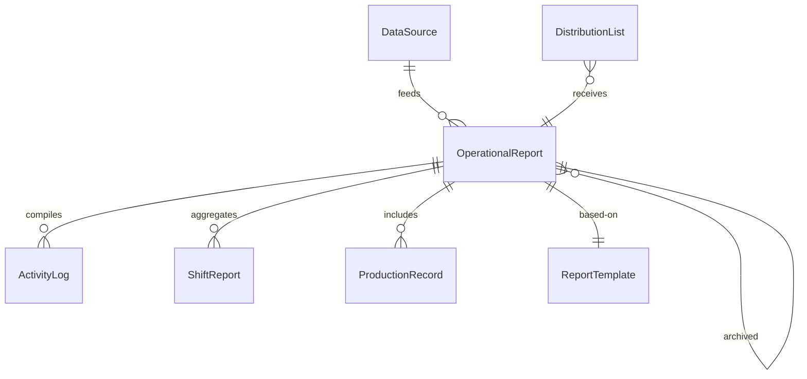
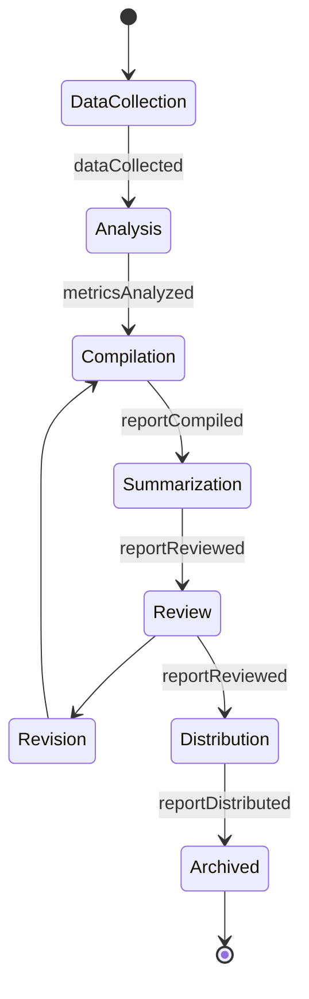
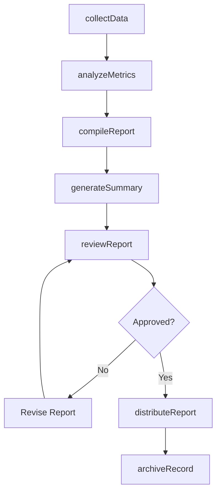
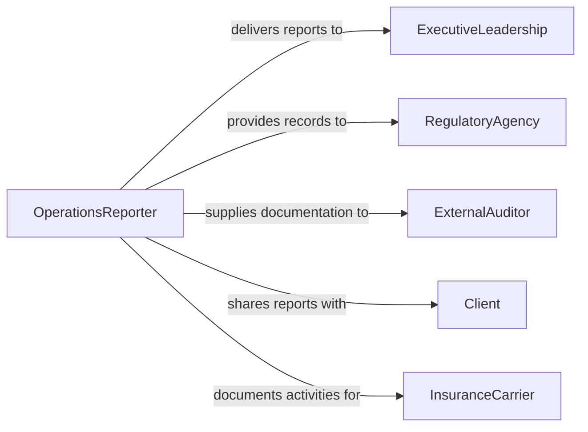

# Prepare Operational Reports or Records

> Business-as-Code definition for operational report and record preparation. Models the collection, compilation, and distribution of reports and records that document organizational operations and activities.

## Overview

Operational report and record preparation involves gathering operational data, compiling it into structured formats, generating periodic and ad hoc reports, and distributing findings to stakeholders. This definition covers daily activity logs, production records, shift reports, and operational summaries, enabling organizations to maintain a comprehensive record of their activities and provide decision-makers with timely operational intelligence.

## Actors

| Actor | Description |
|-------|-------------|
| ExecutiveLeadership | Receives operational reports for strategic decision-making |
| RegulatoryAgency | May require operational records for compliance verification |
| ExternalAuditor | Reviews operational records during audit engagements |
| Client | Receives operational reports as part of service delivery |
| InsuranceCarrier | Requires operational records for claims or underwriting |

## Roles

| Role | Description |
|------|-------------|
| OperationsReporter | Collects data and authors operational reports |
| OperationsManager | Reviews and approves reports before distribution |
| DataAnalyst | Analyzes operational data and identifies trends |
| RecordKeeper | Maintains the archive of operational records |

## Entities

| Entity | Description |
|--------|-------------|
| OperationalReport | A structured document summarizing operational activities |
| ActivityLog | A chronological record of operational events and actions |
| ShiftReport | A summary of activities during a specific work shift |
| ProductionRecord | A documented account of production output and metrics |
| ReportTemplate | A standardized format for recurring operational reports |
| DataSource | A system or process that generates operational data |
| DistributionList | A defined set of recipients for report delivery |

## Actions

| Action | Description |
|--------|-------------|
| collectData | Gather operational metrics and activity data from sources |
| compileReport | Assemble collected data into a structured report format |
| analyzeMetrics | Evaluate operational data to identify trends and anomalies |
| reviewReport | Submit the compiled report for management review |
| distributeReport | Deliver the approved report to designated recipients |
| logActivity | Record a specific operational event or action |
| archiveRecord | Store completed reports and records for retention |
| generateSummary | Create an executive summary from detailed operational data |

## Events

| Event | Description |
|-------|-------------|
| dataCollected | Operational data has been gathered from sources |
| reportCompiled | An operational report has been assembled |
| metricsAnalyzed | Operational data analysis has been completed |
| reportReviewed | A report has passed management review |
| reportDistributed | An approved report has been delivered to recipients |
| activityLogged | A specific operational event has been recorded |
| recordArchived | A report or record has been stored for retention |

## Searches

| Search | Description |
|--------|-------------|
| findReports | List operational reports by type, period, or status |
| getActivityLogs | Retrieve activity logs by date range or department |
| findByMetric | Locate reports containing specific operational metrics |
| getDistributionHistory | Retrieve delivery records for a specific report |
| searchRecords | Full-text search across operational records |

## Entity Relationships



## State Diagram



## Workflow



## Actor Relationships



## Usage

### Calling Actions

```typescript
import { prepareOperationalReportsRecords } from '@headlessly/prepare-operational-reports-records'

const ops = prepareOperationalReportsRecords()

// Collect daily operational data
const data = await ops.collectData({
  sources: ['production-system', 'quality-database', 'maintenance-log'],
  period: '2026-02-04',
  department: 'manufacturing'
})

// Compile and distribute
const report = await ops.compileReport({
  template: 'daily-operations-summary',
  data: data.id,
  title: 'Manufacturing Daily Report - Feb 4, 2026'
})

await ops.distributeReport({
  reportId: report.id,
  recipients: ['plant-manager', 'vp-operations', 'quality-director']
})
```

### Event-Driven Automation

```typescript
// Auto-compile scheduled reports
ops.dataCollected(async ({ sourceId, period, department }) => {
  await ops.compileReport({
    template: `${department}-daily-summary`,
    data: sourceId,
    title: `${department} Daily Report - ${period}`
  })
})

// Alert on metric anomalies during analysis
ops.metricsAnalyzed(async ({ anomalies }) => {
  if (anomalies.length > 0) {
    await notify({
      to: 'operations-leadership',
      message: `${anomalies.length} operational anomalies detected - review required`
    })
  }
})
```
