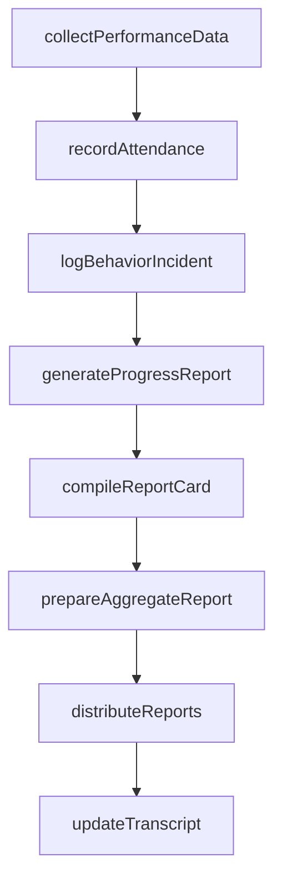

# Prepare Reports Detailing Student Activities or Performance

> Business-as-Code definition for student activity and performance reporting. Models the collection, analysis, and distribution of reports that document student progress, participation, and academic outcomes.

## Overview

Preparing reports on student activities and performance involves collecting academic and behavioral data, analyzing progress against standards, generating individual and aggregate reports, and distributing findings to parents, administrators, and oversight bodies. This definition covers report cards, progress reports, attendance summaries, and behavioral documentation, enabling educational institutions to maintain comprehensive student records and comply with reporting mandates.

## Actors

| Actor | Description |
|-------|-------------|
| Parent | Receives reports on their child's academic progress and activities |
| SchoolAdministration | Uses reports for program evaluation and resource allocation |
| StateDepartmentOfEducation | Requires aggregate performance data for accountability |
| SpecialEducationTeam | Receives progress reports for students with individualized plans |
| AccreditationBody | Reviews institutional performance data during accreditation |

## Roles

| Role | Description |
|------|-------------|
| Teacher | Documents student performance and prepares classroom reports |
| Counselor | Compiles reports on student behavior and social development |
| Registrar | Maintains official academic records and transcripts |
| DataCoordinator | Aggregates student data for institutional reporting |

## Entities

| Entity | Description |
|--------|-------------|
| ProgressReport | A periodic summary of a student's academic performance |
| ReportCard | A formal record of grades and academic standing |
| AttendanceRecord | A documented account of student presence and absences |
| BehaviorLog | A record of disciplinary incidents and behavioral observations |
| TranscriptEntry | An official record of courses completed and grades earned |
| IEPProgressReport | A report on a student's progress toward individualized education goals |
| AggregateReport | A statistical summary of performance across student groups |

## Actions

| Action | Description |
|--------|-------------|
| collectPerformanceData | Gather grades, scores, and assessment results |
| recordAttendance | Document student attendance and absences |
| logBehaviorIncident | Record a disciplinary or behavioral observation |
| generateProgressReport | Create an individual student progress report |
| compileReportCard | Assemble formal grades into a report card |
| prepareAggregateReport | Generate statistical summaries for groups of students |
| distributeReports | Deliver completed reports to parents and administrators |
| updateTranscript | Add completed course and grade data to the official record |

## Events

| Event | Description |
|-------|-------------|
| performanceDataCollected | Student grades and scores have been gathered |
| attendanceRecorded | Daily attendance data has been documented |
| behaviorIncidentLogged | A behavioral observation has been recorded |
| progressReportGenerated | An individual progress report has been created |
| reportCardCompiled | A formal report card has been assembled |
| aggregateReportPrepared | Statistical performance summaries are ready |
| reportsDistributed | Completed reports have been delivered to recipients |
| transcriptUpdated | Official academic records have been updated |

## Searches

| Search | Description |
|--------|-------------|
| findStudentReports | List reports by student, grade level, or reporting period |
| getAttendance | Retrieve attendance records by student or date range |
| findBehaviorLogs | Locate behavioral records by student, type, or date |
| getAggregateData | Retrieve performance statistics by class, grade, or school |
| searchByStandard | Find reports related to specific academic standards |

## Workflow



## Actor Relationships


## Usage

### Calling Actions

```typescript
import { prepareReportsDetailingStudentActivities } from '@headlessly/prepare-reports-detailing-student-activities'

const reports = prepareReportsDetailingStudentActivities()

// Generate a progress report
const progress = await reports.generateProgressReport({
  studentId: 'STU-2026-1234',
  period: 'Q2-2026',
  courses: ['algebra-2', 'english-11', 'chemistry', 'us-history']
})

// Compile report card
const reportCard = await reports.compileReportCard({
  studentId: 'STU-2026-1234',
  term: 'fall-2026',
  includeAttendance: true,
  includeBehavior: true
})

// Distribute to parents
await reports.distributeReports({
  reportIds: [progress.id, reportCard.id],
  recipients: ['parent-portal', 'email'],
  parentEmail: 'parent@email.com'
})
```

### Event-Driven Automation

```typescript
// Alert counselor on behavioral patterns
reports.behaviorIncidentLogged(async ({ studentId, incidentType, count }) => {
  if (count >= 3) {
    await notify({
      to: 'school-counselor',
      message: `Student ${studentId} has ${count} behavioral incidents this term`
    })
  }
})

// Auto-update transcripts when report cards are finalized
reports.reportCardCompiled(async ({ studentId, term }) => {
  await reports.updateTranscript({ studentId, term })
})
```
