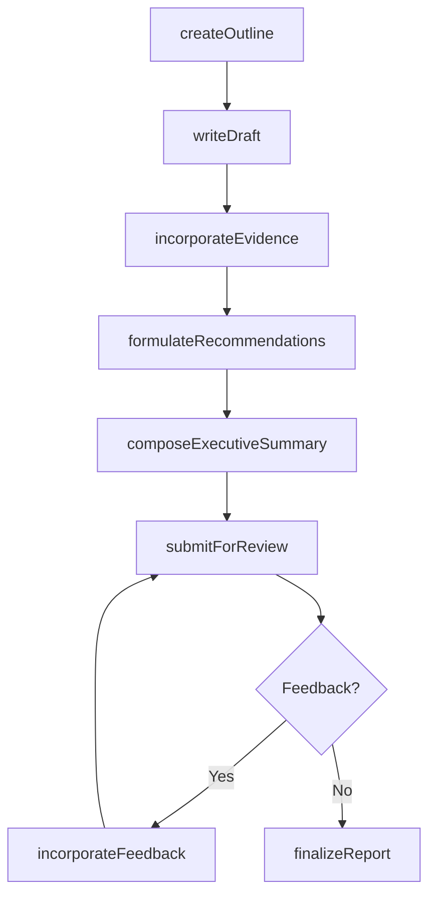
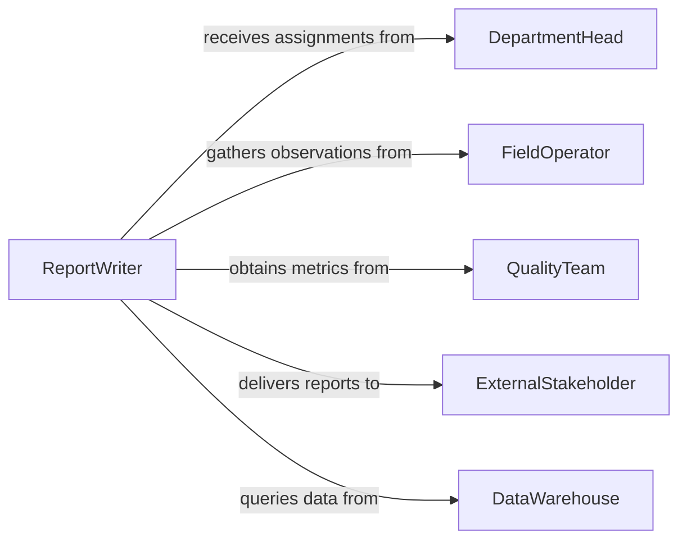

# Write Operational Reports

> Business-as-Code definition for writing operational reports. Models the authoring process for narrative operational reports that document activities, observations, and recommendations.

## Overview

Writing operational reports involves composing narrative descriptions of operational activities, documenting observations and findings, presenting analysis with supporting data, and formulating actionable recommendations. This definition focuses on the authoring process itself, covering report structuring, narrative development, evidence incorporation, and editorial review, enabling report writers to produce clear, well-organized documents that communicate operational status and drive improvement actions.

## Actors

| Actor | Description |
|-------|-------------|
| DepartmentHead | Commissions reports and receives findings for action |
| FieldOperator | Provides firsthand observations and operational details |
| QualityTeam | Supplies inspection data and quality metrics for reports |
| ExternalStakeholder | Receives reports as part of contractual or regulatory obligations |
| DataWarehouse | Provides historical data for trend analysis in reports |

## Roles

| Role | Description |
|------|-------------|
| ReportWriter | Authors the narrative content and structures the report |
| OperationsAnalyst | Provides analytical interpretation of operational data |
| Editor | Reviews the report for clarity, accuracy, and completeness |
| ApprovalAuthority | Authorizes the report for distribution |

## Entities

| Entity | Description |
|--------|-------------|
| ReportDraft | A working version of the operational report |
| ExecutiveSummary | A concise overview of key findings and recommendations |
| FindingsSection | A detailed account of observations and analysis |
| Recommendation | A proposed action based on report findings |
| SupportingEvidence | Data, charts, or photographs that substantiate findings |
| ReportOutline | A structural plan defining sections and content flow |
| ReviewComment | Feedback from reviewers on the draft report |

## Actions

| Action | Description |
|--------|-------------|
| createOutline | Define the report structure, sections, and content plan |
| writeDraft | Author the initial narrative content of the report |
| incorporateEvidence | Embed supporting data, charts, and images into the report |
| formulateRecommendations | Develop actionable proposals based on findings |
| composeExecutiveSummary | Write a concise summary of key points for leadership |
| submitForReview | Send the draft to editors and subject matter reviewers |
| incorporateFeedback | Revise the report based on reviewer comments |
| finalizeReport | Complete the report and prepare for distribution |

## Events

| Event | Description |
|-------|-------------|
| outlineCreated | The report structure has been defined |
| draftWritten | The initial narrative content has been authored |
| evidenceIncorporated | Supporting materials have been embedded |
| recommendationsFormulated | Actionable proposals have been developed |
| executiveSummaryComposed | The leadership summary has been written |
| reviewFeedbackReceived | Reviewer comments have been collected |
| feedbackIncorporated | Revisions based on feedback have been completed |
| reportFinalized | The report is approved and ready for distribution |

## Searches

| Search | Description |
|--------|-------------|
| findDrafts | List report drafts by author, topic, or status |
| getRecommendations | Retrieve recommendations by report, priority, or status |
| findPendingReview | Locate reports awaiting editorial or technical review |
| getReviewComments | Retrieve feedback for a specific report draft |
| searchByTopic | Find reports covering specific operational topics |

## Workflow



## Actor Relationships



## Usage

### Calling Actions

```typescript
import { writeOperationalReports } from '@headlessly/write-operational-reports'

const reports = writeOperationalReports()

// Create report outline
const outline = await reports.createOutline({
  title: 'Q1 2026 Warehouse Operations Assessment',
  sections: ['throughput-analysis', 'quality-metrics', 'staffing-observations', 'recommendations'],
  audience: 'operations-leadership'
})

// Write the draft
const draft = await reports.writeDraft({
  outlineId: outline.id,
  narrativeStyle: 'analytical',
  dataRange: { start: '2026-01-01', end: '2026-03-31' }
})

// Formulate recommendations
await reports.formulateRecommendations({
  draftId: draft.id,
  recommendations: [
    { priority: 'high', action: 'Add second shift to loading dock B', rationale: 'Throughput down 15%' },
    { priority: 'medium', action: 'Install automated sorting system', rationale: 'Error rate above threshold' }
  ]
})

// Finalize
await reports.finalizeReport({ draftId: draft.id })
```

### Event-Driven Automation

```typescript
// Notify reviewers when draft is ready
reports.draftWritten(async ({ draftId, title }) => {
  await notify({
    to: 'report-review-team',
    message: `Draft ready for review: "${title}"`
  })
})

// Auto-compose executive summary when recommendations are complete
reports.recommendationsFormulated(async ({ draftId }) => {
  await reports.composeExecutiveSummary({ draftId })
})
```
