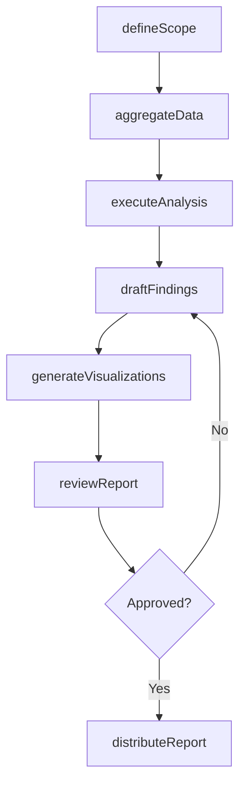
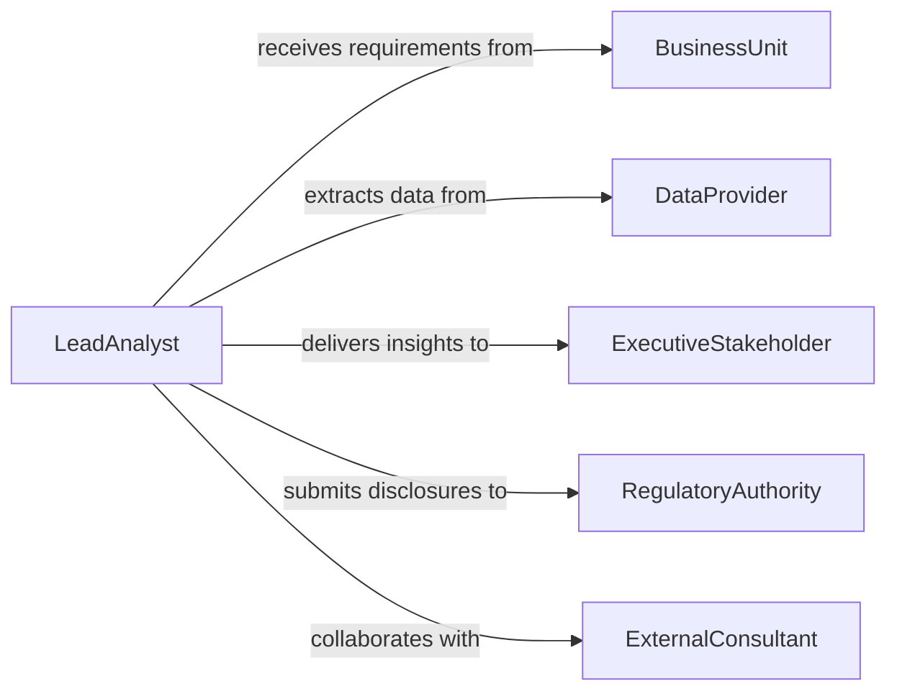

# Prepare Analytical Reports

> Business-as-Code definition for preparing analytical reports, covering data aggregation, statistical analysis, interpretation of findings, and structured document generation for decision-making.

## Overview

Preparing analytical reports involves transforming raw data into structured insights through statistical methods, trend analysis, and interpretive commentary. This definition exposes actions for scoping analysis objectives, executing analytical workflows, drafting findings, and distributing finished reports to decision-makers. It supports event-driven automation for report lifecycle tracking and searches for locating reports by domain, methodology, or conclusion.

## Actors

| Actor | Description |
|-------|-------------|
| BusinessUnit | Department or division requesting the analytical report |
| DataProvider | Internal or external source supplying raw data for analysis |
| ExecutiveStakeholder | Senior leader who consumes the report for strategic decisions |
| RegulatoryAuthority | Government or industry body requiring analytical disclosures |
| ExternalConsultant | Third-party specialist contributing analytical expertise |

## Roles

| Role | Description |
|------|-------------|
| LeadAnalyst | Defines the analytical approach and owns the report output |
| DataEngineer | Prepares and validates data pipelines feeding the analysis |
| ReportAuthor | Writes the narrative interpretation of analytical findings |
| QualityReviewer | Validates methodology, calculations, and conclusions |

## Entities

| Entity | Description |
|--------|-------------|
| AnalyticalReport | A document presenting data-driven findings and recommendations |
| AnalysisScope | The defined boundaries, objectives, and questions for the analysis |
| DataSource | A repository or feed providing input data for the analysis |
| Finding | A discrete insight or conclusion derived from the analysis |
| Visualization | A chart, graph, or table embedded in the report |
| ReportDistribution | The list of recipients and channels for report delivery |

## Actions

| Action | Description |
|--------|-------------|
| defineScope | Establish the objectives, questions, and boundaries of the analysis |
| aggregateData | Collect and consolidate data from specified sources |
| executeAnalysis | Run statistical or quantitative methods against the data |
| draftFindings | Write the interpretive narrative summarizing analytical results |
| generateVisualizations | Create charts, graphs, and tables to illustrate findings |
| reviewReport | Submit the draft for quality review and methodology validation |
| distributeReport | Deliver the finalized report to designated stakeholders |

## Events

| Event | Description |
|-------|-------------|
| scopeDefined | The analysis objectives and boundaries have been established |
| dataAggregated | Input data has been collected and consolidated |
| analysisExecuted | Statistical or quantitative methods have been applied |
| findingsDrafted | The interpretive narrative has been written |
| visualizationsGenerated | Charts and graphs have been created for the report |
| reportReviewed | The draft has been validated for quality and accuracy |
| reportDistributed | The finalized report has been delivered to stakeholders |

## Searches

| Search | Description |
|--------|-------------|
| findAnalyticalReports | Retrieve reports by domain, date range, or status |
| getFindingsByTopic | Search for specific findings across multiple reports |
| getReportsByMethodology | Locate reports that used a particular analytical method |
| findPendingReviews | Identify reports awaiting quality review |

## Workflow



## Actor Relationships



## Usage

### Calling Actions

```typescript
import { prepareAnalyticalReports } from '@headlessly/prepare-analytical-reports'

const analytics = prepareAnalyticalReports()

// Define analysis scope
const scope = await analytics.defineScope({
  title: 'Q1 2026 Customer Churn Analysis',
  objectives: ['Identify churn drivers', 'Quantify revenue impact', 'Recommend retention strategies'],
  dataSources: ['crm-export', 'billing-transactions', 'support-tickets'],
  methodology: 'logistic-regression'
})

// Aggregate and analyze data
await analytics.aggregateData({ scopeId: scope.id })
const results = await analytics.executeAnalysis({ scopeId: scope.id })

// Generate visualizations and distribute
await analytics.generateVisualizations({
  scopeId: scope.id,
  charts: ['churn-trend-line', 'driver-importance-bar', 'cohort-survival']
})

await analytics.distributeReport({
  scopeId: scope.id,
  recipients: ['vp-customer-success', 'cfo'],
  channels: ['email', 'dashboard']
})
```

### Event-Driven Automation

```typescript
// Trigger visualization generation after analysis completes
analytics.analysisExecuted(async ({ scopeId, methodology }) => {
  await analytics.generateVisualizations({
    scopeId,
    charts: ['summary-dashboard', 'detail-breakdown']
  })
})

// Notify stakeholders when report is ready
analytics.reportDistributed(async ({ scopeId, recipients }) => {
  await notify({
    to: recipients,
    message: `Analytical report for scope ${scopeId} is now available`
  })
})
```
