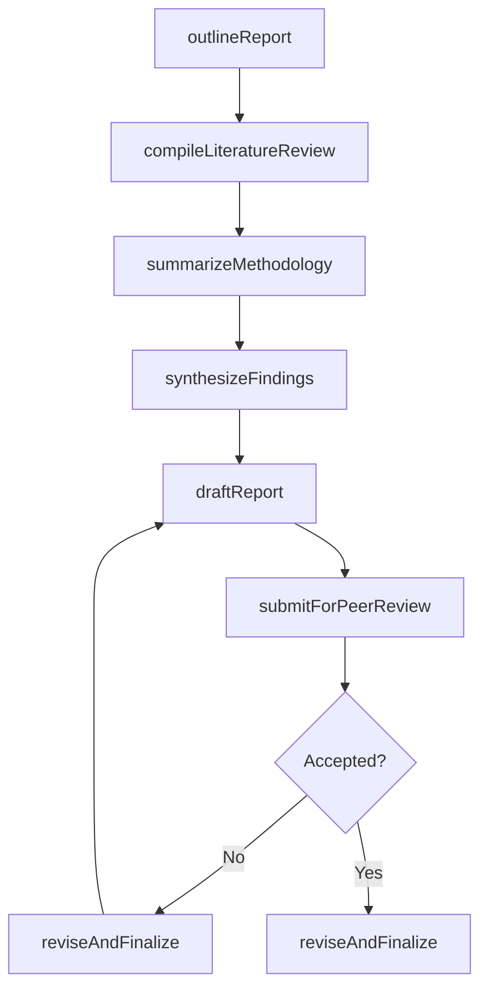
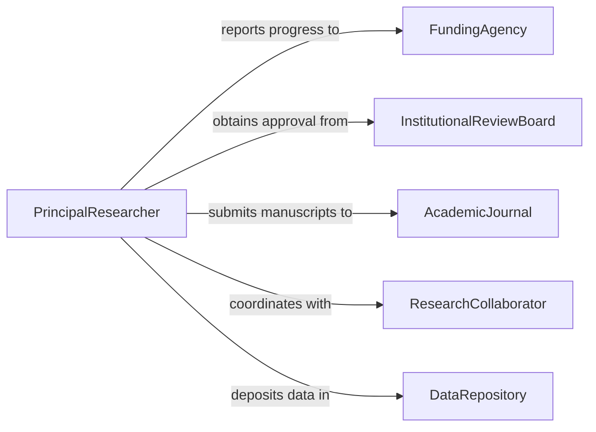

# Prepare Research Reports

> Business-as-Code definition for preparing research reports, encompassing study design documentation, data collection summaries, findings synthesis, and formal report composition for academic and organizational audiences.

## Overview

Preparing research reports involves documenting the design, methodology, data collection, analysis, and conclusions of a research study in a formal written format. This definition exposes actions for structuring reports, compiling literature reviews, summarizing findings, and managing the review-to-publication workflow. It supports event-driven lifecycle tracking and searches for locating reports by study, discipline, or publication status.

## Actors

| Actor | Description |
|-------|-------------|
| FundingAgency | Organization providing grants or financial support for the research |
| InstitutionalReviewBoard | Ethics oversight body approving research protocols |
| AcademicJournal | Publication venue for peer-reviewed research output |
| ResearchCollaborator | External researcher contributing to the study |
| DataRepository | Archive or database where research data is deposited |

## Roles

| Role | Description |
|------|-------------|
| PrincipalResearcher | Leads the study and owns the final report content |
| ResearchAssistant | Supports data collection, literature review, and drafting |
| StatisticalConsultant | Advises on and validates analytical methods and results |
| EditorialCoordinator | Manages formatting, submission, and revision cycles |

## Entities

| Entity | Description |
|--------|-------------|
| ResearchReport | The formal document presenting study findings |
| StudyProtocol | The documented methodology and procedures for the research |
| LiteratureReview | A synthesis of prior published work relevant to the study |
| DataCollection | Raw or processed data gathered during the research |
| Finding | A discrete result or conclusion drawn from the analysis |
| Appendix | Supplementary material attached to the report |

## Actions

| Action | Description |
|--------|-------------|
| outlineReport | Create the structural framework and section plan for the report |
| compileLiteratureReview | Gather and synthesize relevant prior research |
| summarizeMethodology | Document the study design, procedures, and analytical approach |
| synthesizeFindings | Combine analytical results into coherent conclusions |
| draftReport | Write the full narrative content of the research report |
| submitForPeerReview | Send the completed draft to reviewers for evaluation |
| reviseAndFinalize | Incorporate feedback and produce the final version |

## Events

| Event | Description |
|-------|-------------|
| reportOutlined | The structural framework for the report has been created |
| literatureReviewCompiled | Prior research has been gathered and synthesized |
| methodologySummarized | Study procedures have been documented |
| findingsSynthesized | Analytical results have been combined into conclusions |
| reportDrafted | The full narrative content has been written |
| reportSubmittedForReview | The draft has been sent to peer reviewers |
| reportFinalized | Feedback has been incorporated and the final version produced |

## Searches

| Search | Description |
|--------|-------------|
| findResearchReports | Retrieve reports by study, discipline, author, or status |
| getReportsByFundingSource | Locate reports associated with a specific grant or sponsor |
| findPendingRevisions | Identify reports with outstanding reviewer feedback |
| getReportsByKeyword | Search reports by subject keyword or abstract content |

## Workflow



## Actor Relationships



## Usage

### Calling Actions

```typescript
import { prepareResearchReports } from '@headlessly/prepare-research-reports'

const research = prepareResearchReports()

// Outline a new research report
const report = await research.outlineReport({
  title: 'Effects of Remote Work on Employee Productivity',
  studyId: 'study-2026-rw-prod',
  sections: ['introduction', 'literature-review', 'methodology', 'results', 'discussion', 'conclusion']
})

// Compile the literature review
await research.compileLiteratureReview({
  reportId: report.id,
  sources: ['database-psycinfo', 'database-scopus'],
  keywords: ['remote work', 'productivity', 'telework', 'hybrid workforce']
})

// Synthesize findings and draft
await research.synthesizeFindings({
  reportId: report.id,
  dataCollectionId: 'dc-survey-2026-q1'
})

await research.submitForPeerReview({
  reportId: report.id,
  reviewers: ['dr-martinez', 'dr-okafor'],
  deadline: '2026-04-30'
})
```

### Event-Driven Automation

```typescript
// Notify funding agency when report is finalized
research.reportFinalized(async ({ reportId, studyId }) => {
  await notify({
    to: 'funding-agency-portal',
    message: `Research report for study ${studyId} has been finalized`
  })
})

// Auto-trigger literature review after outline
research.reportOutlined(async ({ reportId, sections }) => {
  if (sections.includes('literature-review')) {
    await research.compileLiteratureReview({
      reportId,
      sources: ['database-default'],
      keywords: []
    })
  }
})
```
