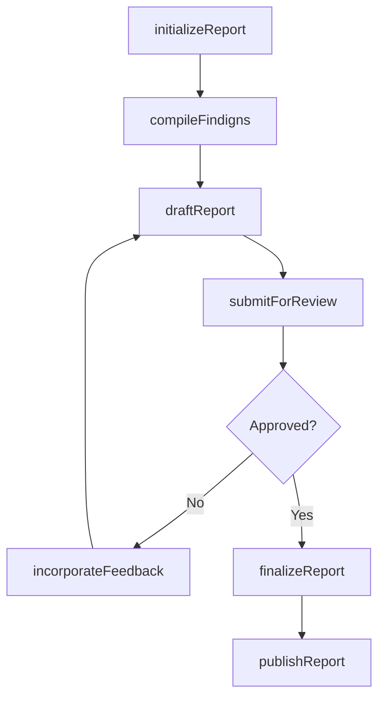
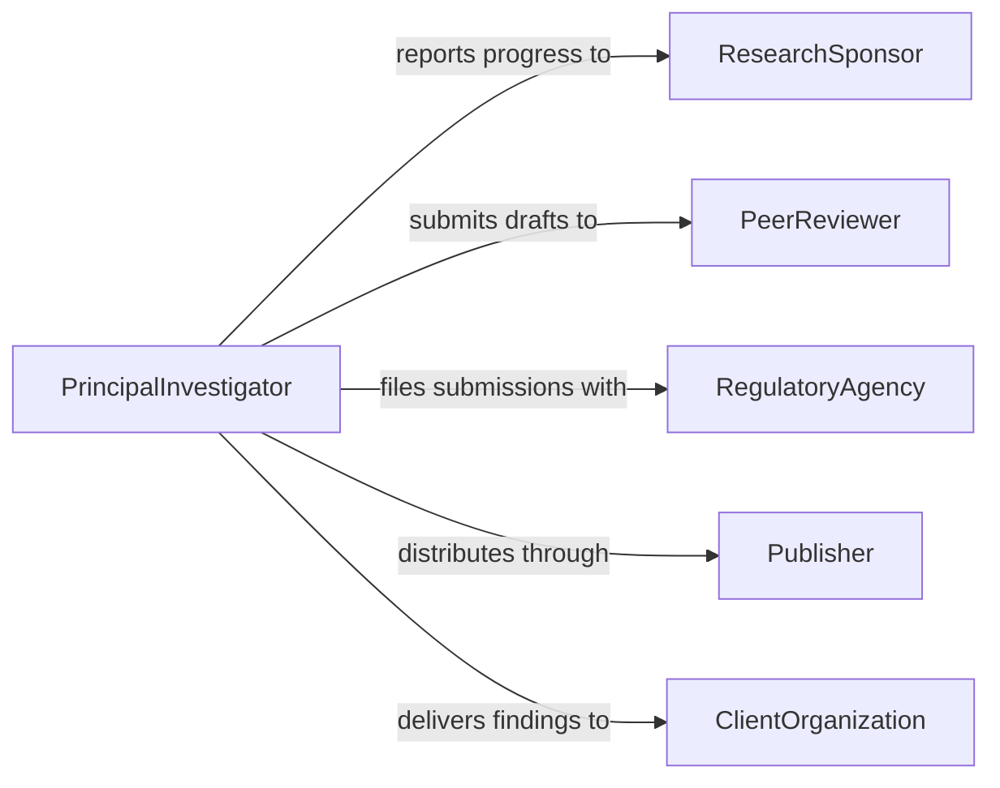

# Prepare Research Technical Reports

> Business-as-Code definition for preparing research or technical reports, encompassing data compilation, analysis documentation, and structured report generation for stakeholder distribution.

## Overview

Preparing research or technical reports involves gathering findings from investigations, experiments, or engineering analyses and composing them into formal documents that communicate methodology, results, and recommendations. This definition exposes actions for drafting, reviewing, and publishing reports, events for tracking report lifecycle milestones, and searches for retrieving reports by project, author, or status.

## Actors

| Actor | Description |
|-------|-------------|
| ResearchSponsor | Organization or individual funding the research effort |
| PeerReviewer | External subject matter expert who validates report accuracy |
| RegulatoryAgency | Government body that may require technical reporting submissions |
| Publisher | Journal, conference, or internal platform that distributes the report |
| ClientOrganization | External entity commissioning the technical analysis |

## Roles

| Role | Description |
|------|-------------|
| PrincipalInvestigator | Leads the research effort and owns report content |
| TechnicalWriter | Structures and drafts the report document |
| ReviewCoordinator | Manages the peer review and approval workflow |
| DataAnalyst | Compiles and validates data included in the report |

## Entities

| Entity | Description |
|--------|-------------|
| Report | A formal document containing research or technical findings |
| ReportDraft | A working version of the report prior to finalization |
| DataSet | Structured data referenced or appended to the report |
| Citation | A bibliographic reference to external sources |
| ReviewComment | Feedback from a reviewer on a specific section of the report |
| ReportTemplate | A predefined structure and formatting standard for reports |

## Actions

| Action | Description |
|--------|-------------|
| initializeReport | Create a new report shell with metadata and template |
| compileFindigns | Aggregate research data and analysis into report sections |
| draftReport | Write the narrative content of the report |
| submitForReview | Send the draft to peer reviewers for feedback |
| incorporateFeedback | Apply reviewer comments and corrections to the draft |
| finalizeReport | Lock the report content and assign a version number |
| publishReport | Distribute the finalized report to intended audiences |

## Events

| Event | Description |
|-------|-------------|
| reportInitialized | A new report shell has been created |
| findingsCompiled | Research data has been aggregated into report sections |
| reportDrafted | The narrative content of the report has been written |
| reportSubmittedForReview | The draft has been sent to reviewers |
| feedbackIncorporated | Reviewer comments have been applied to the draft |
| reportFinalized | The report has been locked and versioned |
| reportPublished | The finalized report has been distributed |

## Searches

| Search | Description |
|--------|-------------|
| findReports | Retrieve reports by project, author, status, or date range |
| getReportDrafts | List all draft versions for a given report |
| findPendingReviews | Identify reports awaiting peer review feedback |
| getReportsByTopic | Search reports by subject area or keyword |

## Workflow



## Actor Relationships



## Usage

### Calling Actions

```typescript
import { prepareResearchTechnicalReports } from '@headlessly/prepare-research-technical-reports'

const reports = prepareResearchTechnicalReports()

// Initialize a new research report
const report = await reports.initializeReport({
  title: 'Thermal Conductivity Analysis of Composite Materials',
  projectId: 'proj-2026-mat-science',
  templateId: 'template-research-standard',
  authors: ['dr-chen', 'dr-patel']
})

// Compile findings from data sets
await reports.compileFindigns({
  reportId: report.id,
  dataSets: ['ds-thermal-tests-q4', 'ds-material-specs'],
  sections: ['methodology', 'results', 'discussion']
})

// Submit for peer review
await reports.submitForReview({
  reportId: report.id,
  reviewers: ['reviewer-johnson', 'reviewer-nakamura'],
  deadline: '2026-03-15'
})
```

### Event-Driven Automation

```typescript
// Notify authors when review feedback arrives
reports.reportSubmittedForReview(async ({ reportId, reviewers }) => {
  await notify({
    to: reviewers,
    message: `Report ${reportId} is ready for your review`
  })
})

// Auto-publish when finalized
reports.reportFinalized(async ({ reportId, version }) => {
  await reports.publishReport({
    reportId,
    channels: ['internal-repository', 'sponsor-portal']
  })
})
```
