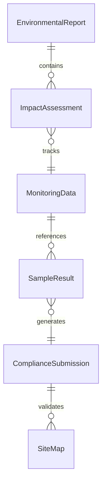
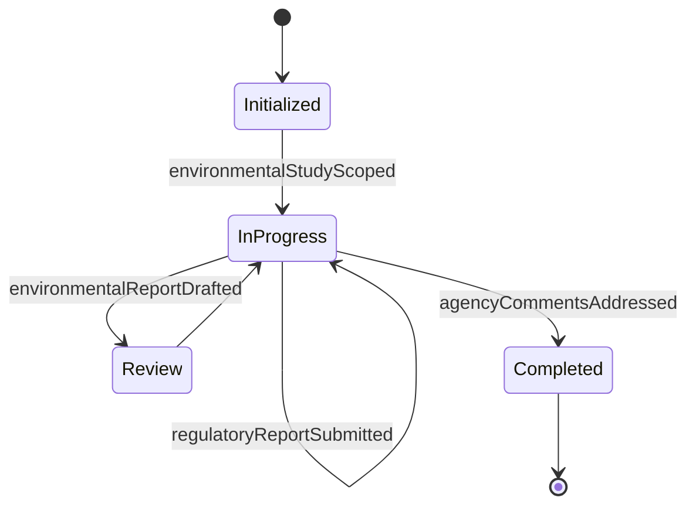
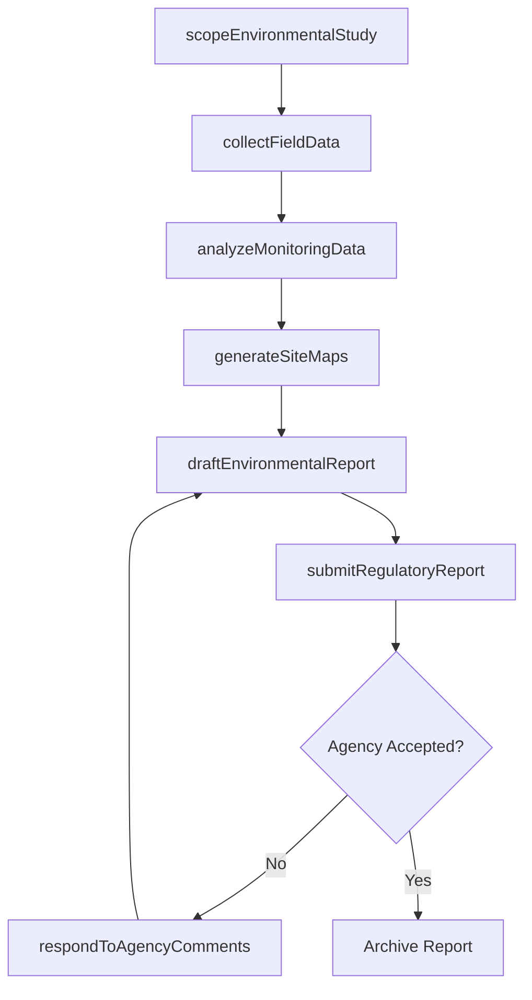
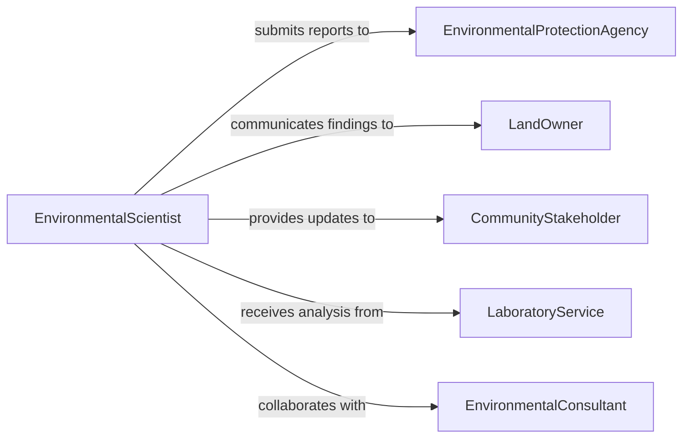

# Prepare Research Technical Reports Environmental

> Business-as-Code definition for preparing research or technical reports on environmental issues, covering environmental impact assessments, pollution monitoring documentation, regulatory compliance reporting, and sustainability analyses.

## Overview

Preparing research or technical reports on environmental issues involves documenting environmental impact assessments, monitoring data, regulatory compliance findings, and sustainability analyses in formal reports for regulatory agencies, stakeholders, and the public. This definition exposes actions for scoping environmental studies, collecting field and laboratory data, drafting compliance narratives, and submitting reports to regulatory bodies. It supports event-driven workflows for submission deadlines and searches for locating reports by site, regulation, or environmental medium.

## Actors

| Actor | Description |
|-------|-------------|
| EnvironmentalProtectionAgency | Regulatory authority receiving compliance and monitoring reports |
| LandOwner | Property holder affected by or responsible for environmental conditions |
| CommunityStakeholder | Local residents or groups with interest in environmental outcomes |
| LaboratoryService | Analytical lab providing environmental sample test results |
| EnvironmentalConsultant | Third-party specialist conducting field assessments |

## Roles

| Role | Description |
|------|-------------|
| EnvironmentalScientist | Leads the environmental study and authors the report |
| FieldTechnician | Collects samples and field measurements at study sites |
| RegulatoryComplianceOfficer | Ensures reports meet agency submission requirements |
| GISAnalyst | Produces spatial data and maps for inclusion in reports |
| ProjectManager | Coordinates timelines, budgets, and deliverables for the study |

## Entities

| Entity | Description |
|--------|-------------|
| EnvironmentalReport | A formal document presenting environmental findings and analyses |
| ImpactAssessment | An evaluation of potential environmental effects of a project or site |
| MonitoringData | Time-series measurements of environmental parameters |
| SampleResult | Laboratory analysis of environmental samples (soil, water, air) |
| ComplianceSubmission | A regulatory filing containing the environmental report |
| SiteMap | A geospatial representation of the study area |

## Actions

| Action | Description |
|--------|-------------|
| scopeEnvironmentalStudy | Define the study area, parameters, regulations, and objectives |
| collectFieldData | Gather environmental samples and field measurements |
| analyzeMonitoringData | Process and interpret environmental monitoring results |
| draftEnvironmentalReport | Write the technical narrative with findings and compliance status |
| generateSiteMaps | Produce geospatial visualizations of study area and data |
| submitRegulatoryReport | File the completed report with the appropriate environmental agency |
| respondToAgencyComments | Address regulatory feedback and resubmit if required |

## Events

| Event | Description |
|-------|-------------|
| environmentalStudyScoped | The study parameters and regulatory context have been defined |
| fieldDataCollected | Environmental samples and measurements have been gathered |
| monitoringDataAnalyzed | Environmental data has been processed and interpreted |
| environmentalReportDrafted | The technical narrative has been written |
| siteMapsGenerated | Geospatial visualizations have been produced |
| regulatoryReportSubmitted | The report has been filed with the environmental agency |
| agencyCommentsAddressed | Regulatory feedback has been incorporated and the report resubmitted |

## Searches

| Search | Description |
|--------|-------------|
| findEnvironmentalReports | Retrieve reports by site, regulation, environmental medium, or date |
| getMonitoringDataBySite | Look up time-series environmental measurements for a specific site |
| findComplianceSubmissions | Locate regulatory filings by agency, status, or deadline |
| getReportsByRegulation | Search for reports associated with a specific environmental regulation |


## Entity Relationships



## State Diagram


## Workflow



## Actor Relationships



## Usage

### Calling Actions

```typescript
import { prepareResearchTechnicalReportsEnvironmental } from '@headlessly/prepare-research-technical-reports-environmental'

const envReports = prepareResearchTechnicalReportsEnvironmental()

// Scope a new environmental study
const study = await envReports.scopeEnvironmentalStudy({
  title: 'Phase II Environmental Site Assessment - Industrial Park West',
  siteId: 'site-industrial-park-west',
  regulations: ['RCRA', 'CERCLA', 'state-brownfield-program'],
  parameters: ['soil-contamination', 'groundwater-quality', 'vapor-intrusion'],
  agency: 'state-environmental-agency'
})

// Collect and analyze data
await envReports.collectFieldData({
  studyId: study.id,
  samples: [
    { medium: 'soil', locations: ['MW-1', 'MW-2', 'MW-3'], depth: '0-10ft' },
    { medium: 'groundwater', locations: ['MW-1', 'MW-2'], depth: 'water-table' }
  ]
})

await envReports.analyzeMonitoringData({ studyId: study.id })

// Draft and submit
await envReports.draftEnvironmentalReport({ studyId: study.id })
await envReports.submitRegulatoryReport({
  studyId: study.id,
  agency: 'state-environmental-agency',
  deadline: '2026-06-30'
})
```

### Event-Driven Automation

```typescript
// Auto-generate maps when field data is collected
envReports.fieldDataCollected(async ({ studyId, siteId }) => {
  await envReports.generateSiteMaps({
    studyId,
    layers: ['sample-locations', 'contamination-plume', 'site-boundary']
  })
})

// Alert compliance officer when deadline approaches
envReports.environmentalStudyScoped(async ({ studyId, agency, deadline }) => {
  await scheduleReminder({
    date: subtractDays(deadline, 30),
    to: 'compliance-officer',
    message: `Regulatory submission for study ${studyId} due to ${agency} in 30 days`
  })
})
```
