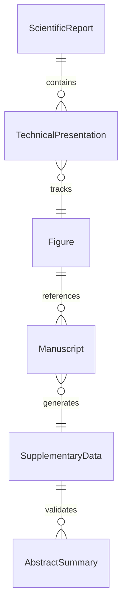
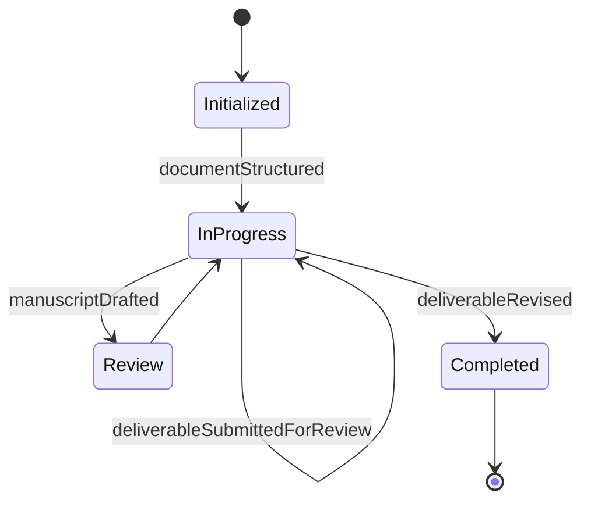
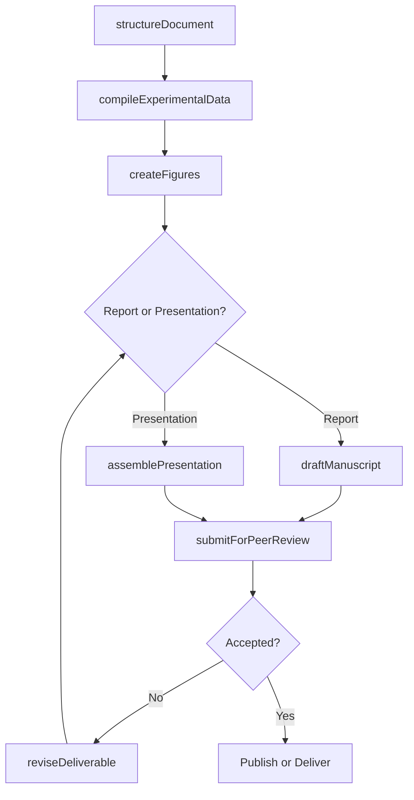
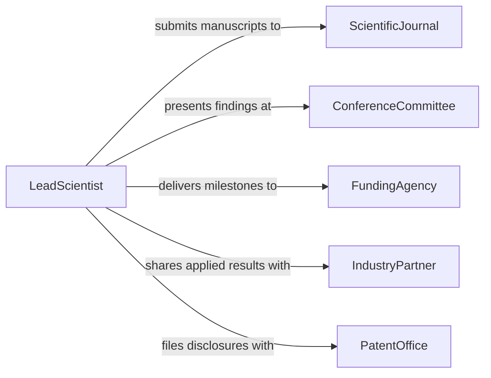

# Prepare Scientific Technical Reports Presentations

> Business-as-Code definition for preparing scientific or technical reports and presentations, covering experimental documentation, data visualization, manuscript composition, and presentation material creation.

## Overview

Preparing scientific or technical reports and presentations involves transforming experimental data, engineering analyses, and research outcomes into formal written reports and visual presentation materials suitable for peer review, conference delivery, and stakeholder briefings. This definition exposes actions for structuring documents, creating data visualizations, managing peer review workflows, and assembling presentation decks. It supports event-driven automation for review cycles and searches for locating deliverables by discipline, project, or delivery format.

## Actors

| Actor | Description |
|-------|-------------|
| ScientificJournal | Peer-reviewed publication venue for formal manuscripts |
| ConferenceCommittee | Organizing body for scientific or technical conferences |
| FundingAgency | Sponsor requiring deliverable reports as grant milestones |
| IndustryPartner | Commercial collaborator interested in applied findings |
| PatentOffice | Intellectual property authority for technical disclosures |

## Roles

| Role | Description |
|------|-------------|
| LeadScientist | Directs the research and owns the deliverable content |
| TechnicalIllustrator | Creates figures, diagrams, and data visualizations |
| ManuscriptEditor | Ensures scientific writing meets style and formatting guidelines |
| PresentationCoordinator | Assembles and schedules presentation materials |
| CoAuthor | Contributes sections or data to the report or presentation |

## Entities

| Entity | Description |
|--------|-------------|
| ScientificReport | A formal written document presenting experimental or analytical findings |
| TechnicalPresentation | A slide deck or visual briefing for live or recorded delivery |
| Figure | A chart, micrograph, schematic, or data visualization |
| Manuscript | The submission-ready version of a scientific report |
| SupplementaryData | Additional datasets, tables, or materials appended to the report |
| AbstractSummary | A concise summary of findings for conference or journal submission |

## Actions

| Action | Description |
|--------|-------------|
| structureDocument | Define the sections, outline, and format for the report or presentation |
| compileExperimentalData | Gather and organize data from experiments or analyses |
| createFigures | Generate charts, diagrams, and visualizations from data |
| draftManuscript | Write the formal scientific or technical narrative |
| assemblePresentation | Build the slide deck with key findings and visuals |
| submitForPeerReview | Send the manuscript or report to reviewers for evaluation |
| reviseDeliverable | Update the report or presentation based on reviewer feedback |

## Events

| Event | Description |
|-------|-------------|
| documentStructured | The outline and format for the deliverable have been defined |
| experimentalDataCompiled | Data from experiments or analyses has been organized |
| figuresCreated | Visualizations and diagrams have been generated |
| manuscriptDrafted | The scientific or technical narrative has been written |
| presentationAssembled | The slide deck has been built with findings and visuals |
| deliverableSubmittedForReview | The manuscript or report has been sent to reviewers |
| deliverableRevised | The report or presentation has been updated based on feedback |

## Searches

| Search | Description |
|--------|-------------|
| findDeliverables | Retrieve reports and presentations by project, discipline, or status |
| getFiguresByProject | Locate figures and visualizations associated with a project |
| findPendingSubmissions | Identify manuscripts or reports awaiting peer review |
| getDeliverablesByFormat | Search for deliverables by type (report, presentation, manuscript) |
| findDeliverablesByAuthor | Retrieve all deliverables authored or co-authored by a specific person |


## Entity Relationships



## State Diagram


## Workflow



## Actor Relationships



## Usage

### Calling Actions

```typescript
import { prepareScientificTechnicalReportsPresentations } from '@headlessly/prepare-scientific-technical-reports-presentations'

const deliverables = prepareScientificTechnicalReportsPresentations()

// Structure a new scientific report
const report = await deliverables.structureDocument({
  title: 'Characterization of Novel Polymer Blends for Biomedical Applications',
  format: 'journal-manuscript',
  projectId: 'proj-polymer-biomed-2026',
  sections: ['abstract', 'introduction', 'materials-methods', 'results', 'discussion', 'conclusion']
})

// Compile data and create figures
await deliverables.compileExperimentalData({
  documentId: report.id,
  dataSources: ['tensile-test-results', 'biocompatibility-assays', 'sem-imaging']
})

await deliverables.createFigures({
  documentId: report.id,
  figures: [
    { type: 'stress-strain-curve', dataSource: 'tensile-test-results' },
    { type: 'micrograph-grid', dataSource: 'sem-imaging' }
  ]
})

// Draft and submit
await deliverables.draftManuscript({ documentId: report.id })
await deliverables.submitForPeerReview({
  documentId: report.id,
  targetJournal: 'journal-biomaterials-science'
})
```

### Event-Driven Automation

```typescript
// Auto-create figures when experimental data is compiled
deliverables.experimentalDataCompiled(async ({ documentId, dataSources }) => {
  await deliverables.createFigures({
    documentId,
    figures: dataSources.map(ds => ({ type: 'auto-summary', dataSource: ds }))
  })
})

// Notify funding agency when manuscript is submitted
deliverables.deliverableSubmittedForReview(async ({ documentId, projectId }) => {
  await notify({
    to: 'funding-agency',
    message: `Manuscript for project ${projectId} has been submitted for peer review`
  })
})
```
