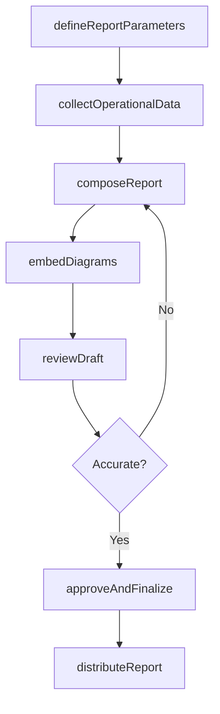
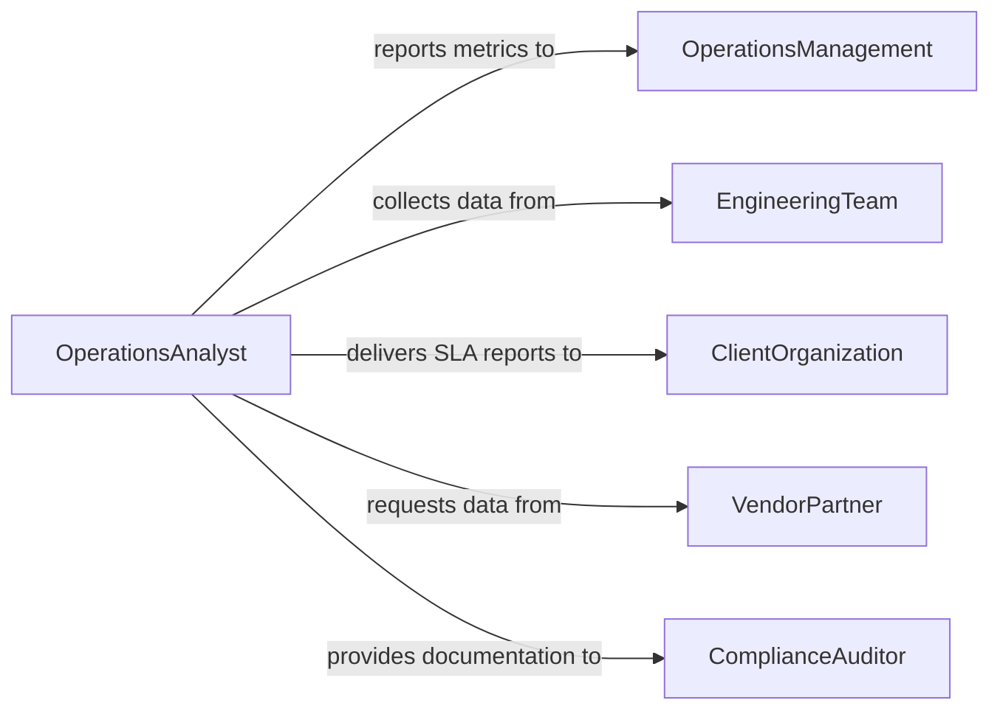

# Prepare Technical Operational Reports

> Business-as-Code definition for preparing technical or operational reports, covering system performance documentation, operational metrics compilation, and structured reporting for engineering and operations teams.

## Overview

Preparing technical or operational reports involves documenting system performance, operational metrics, incident analyses, and process outcomes in formal reports used by engineering and operations stakeholders. This definition exposes actions for defining report parameters, collecting operational data, composing technical narratives, and distributing reports. It supports event-driven workflows for automated reporting cycles and searches for retrieving reports by system, period, or operational domain.

## Actors

| Actor | Description |
|-------|-------------|
| OperationsManagement | Leadership overseeing day-to-day operational performance |
| EngineeringTeam | Technical staff providing system data and incident details |
| ClientOrganization | External customer receiving operational performance reports |
| VendorPartner | Third-party provider whose systems contribute to operational data |
| ComplianceAuditor | Reviewer ensuring operational reports meet regulatory standards |

## Roles

| Role | Description |
|------|-------------|
| OperationsAnalyst | Collects metrics and drafts operational performance narratives |
| TechnicalReportAuthor | Composes the formal technical report document |
| SystemsEngineer | Provides technical data and validates system-related content |
| ReportingManager | Oversees report schedules, templates, and distribution |

## Entities

| Entity | Description |
|--------|-------------|
| OperationalReport | A document summarizing system or process performance |
| MetricSet | A collection of key performance indicators for the reporting period |
| IncidentSummary | A brief analysis of operational incidents included in the report |
| ReportSchedule | The cadence and deadlines for recurring report generation |
| TechnicalDiagram | A schematic or architecture diagram included in the report |
| DistributionList | The set of recipients designated to receive the report |

## Actions

| Action | Description |
|--------|-------------|
| defineReportParameters | Set the scope, period, systems, and metrics for the report |
| collectOperationalData | Gather performance metrics and incident data from systems |
| composeReport | Write the technical narrative and compile supporting materials |
| embedDiagrams | Insert technical diagrams and visualizations into the report |
| reviewDraft | Submit the report draft for technical accuracy review |
| approveAndFinalize | Sign off on the report and lock the final version |
| distributeReport | Deliver the finalized report to the designated recipients |

## Events

| Event | Description |
|-------|-------------|
| reportParametersDefined | The scope and metrics for the report have been established |
| operationalDataCollected | Performance metrics and incident data have been gathered |
| reportComposed | The technical narrative and materials have been assembled |
| diagramsEmbedded | Technical diagrams have been inserted into the report |
| draftReviewed | The report draft has been reviewed for technical accuracy |
| reportApproved | The final version of the report has been signed off |
| reportDistributed | The finalized report has been delivered to recipients |

## Searches

| Search | Description |
|--------|-------------|
| findOperationalReports | Retrieve reports by system, period, or operational domain |
| getMetricsByReport | Look up the key performance indicators for a specific report |
| findIncidentSummaries | Search for incident analyses across operational reports |
| getReportSchedule | Retrieve the cadence and deadlines for recurring reports |

## Workflow



## Actor Relationships



## Usage

### Calling Actions

```typescript
import { prepareTechnicalOperationalReports } from '@headlessly/prepare-technical-operational-reports'

const reports = prepareTechnicalOperationalReports()

// Define report parameters for a monthly ops report
const report = await reports.defineReportParameters({
  title: 'January 2026 Infrastructure Operations Report',
  period: { start: '2026-01-01', end: '2026-01-31' },
  systems: ['prod-cluster-east', 'prod-cluster-west', 'cdn-global'],
  metrics: ['uptime', 'latency-p99', 'error-rate', 'throughput']
})

// Collect data and compose the report
await reports.collectOperationalData({ reportId: report.id })
await reports.composeReport({ reportId: report.id })

// Embed architecture diagrams and distribute
await reports.embedDiagrams({
  reportId: report.id,
  diagrams: ['infrastructure-topology', 'incident-timeline']
})

await reports.distributeReport({
  reportId: report.id,
  distributionList: ['ops-management', 'client-portal', 'compliance-archive']
})
```

### Event-Driven Automation

```typescript
// Auto-collect data when report parameters are defined
reports.reportParametersDefined(async ({ reportId, systems, period }) => {
  await reports.collectOperationalData({ reportId })
})

// Notify management when report is distributed
reports.reportDistributed(async ({ reportId, title, recipients }) => {
  await notify({
    to: 'ops-management',
    message: `Report "${title}" has been distributed to ${recipients.length} recipients`
  })
})
```
