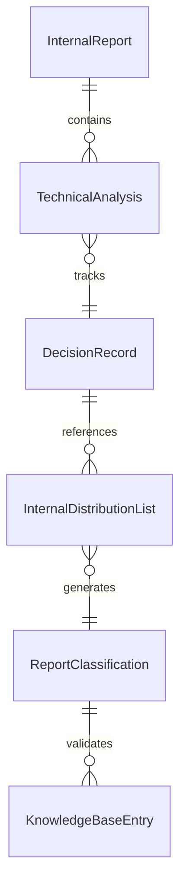
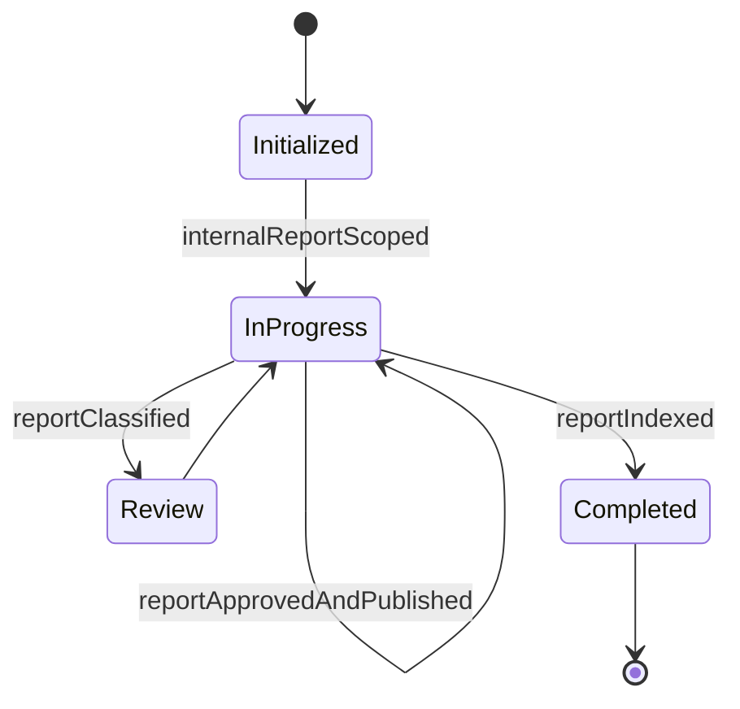
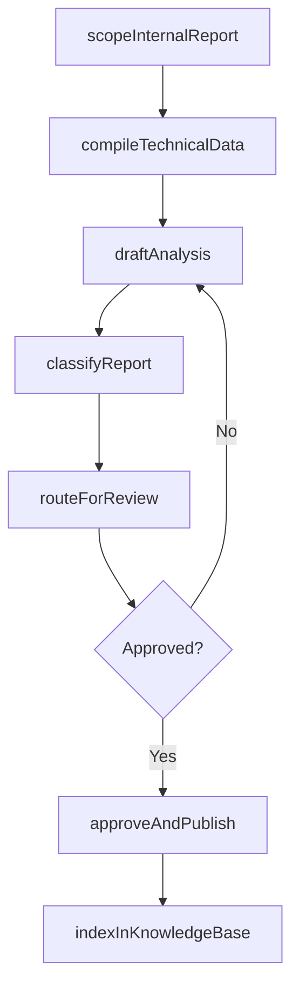
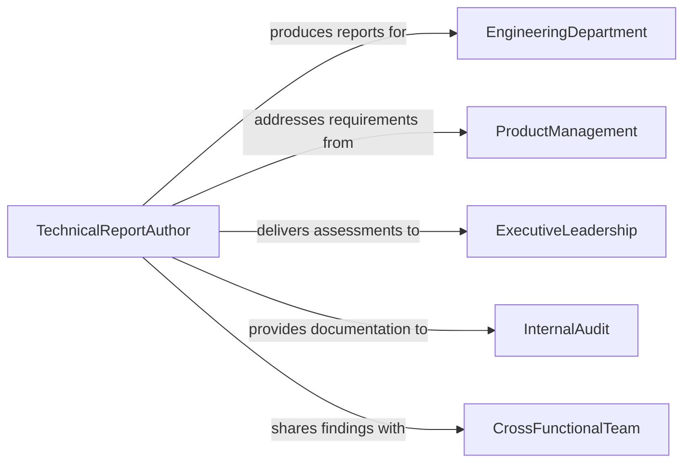

# Prepare Technical Reports Internal Use

> Business-as-Code definition for preparing technical reports for internal use, covering internal documentation of engineering decisions, system analyses, and operational assessments for organizational consumption.

## Overview

Preparing technical reports for internal use involves creating formal documentation that captures engineering analyses, system evaluations, architecture decisions, and operational assessments intended for internal stakeholders rather than external publication. This definition exposes actions for scoping internal reports, compiling technical data, drafting analyses, and routing documents through internal review and distribution channels. It supports event-driven automation for recurring reporting cadences and searches for retrieving internal reports by department, system, or topic.

## Actors

| Actor | Description |
|-------|-------------|
| EngineeringDepartment | Technical team producing or consuming the internal report |
| ProductManagement | Leadership defining requirements that drive technical analyses |
| ExecutiveLeadership | Senior management reviewing strategic technical assessments |
| InternalAudit | Team verifying compliance and accuracy of internal documentation |
| CrossFunctionalTeam | Multi-department group consuming the report for joint initiatives |

## Roles

| Role | Description |
|------|-------------|
| TechnicalReportAuthor | Writes and owns the internal technical report |
| TechnicalLead | Reviews content for technical accuracy and completeness |
| KnowledgeManager | Catalogs and indexes internal reports for organizational retrieval |
| DepartmentHead | Approves and authorizes distribution of the report |

## Entities

| Entity | Description |
|--------|-------------|
| InternalReport | A technical document intended solely for organizational use |
| TechnicalAnalysis | A detailed examination of a system, process, or design decision |
| DecisionRecord | A documented rationale for an engineering or architectural choice |
| InternalDistributionList | The set of internal teams or individuals receiving the report |
| ReportClassification | The sensitivity level assigned to the internal report |
| KnowledgeBaseEntry | The indexed record of the report in the internal knowledge system |

## Actions

| Action | Description |
|--------|-------------|
| scopeInternalReport | Define the subject, audience, and objectives for the report |
| compileTechnicalData | Gather system metrics, test results, and analysis inputs |
| draftAnalysis | Write the technical narrative and document findings |
| classifyReport | Assign a sensitivity level and access restrictions to the report |
| routeForReview | Send the draft to technical leads for accuracy review |
| approveAndPublish | Sign off on the report and release it to internal channels |
| indexInKnowledgeBase | Catalog the report in the organizational knowledge management system |

## Events

| Event | Description |
|-------|-------------|
| internalReportScoped | The subject and objectives for the report have been defined |
| technicalDataCompiled | System metrics and analysis inputs have been gathered |
| analysisDrafted | The technical narrative and findings have been written |
| reportClassified | A sensitivity level has been assigned to the report |
| reportRoutedForReview | The draft has been sent to reviewers |
| reportApprovedAndPublished | The report has been signed off and released internally |
| reportIndexed | The report has been cataloged in the knowledge management system |

## Searches

| Search | Description |
|--------|-------------|
| findInternalReports | Retrieve internal reports by department, system, or topic |
| getReportsByClassification | Locate reports by sensitivity level or access restriction |
| findDecisionRecords | Search for documented engineering or architecture decisions |
| getRecentReports | List internal reports published within a specified period |


## Entity Relationships



## State Diagram


## Workflow



## Actor Relationships



## Usage

### Calling Actions

```typescript
import { prepareTechnicalReportsInternalUse } from '@headlessly/prepare-technical-reports-internal-use'

const internalReports = prepareTechnicalReportsInternalUse()

// Scope a new internal technical report
const report = await internalReports.scopeInternalReport({
  title: 'Database Migration Feasibility Assessment - PostgreSQL to CockroachDB',
  department: 'platform-engineering',
  audience: ['engineering', 'product-management', 'infrastructure'],
  objectives: ['Evaluate migration complexity', 'Estimate downtime impact', 'Recommend migration strategy']
})

// Compile data and draft
await internalReports.compileTechnicalData({
  reportId: report.id,
  sources: ['query-performance-benchmarks', 'schema-compatibility-analysis', 'cost-projections']
})

await internalReports.draftAnalysis({ reportId: report.id })

// Classify and distribute
await internalReports.classifyReport({
  reportId: report.id,
  classification: 'internal-confidential'
})

await internalReports.approveAndPublish({
  reportId: report.id,
  approver: 'vp-engineering'
})
```

### Event-Driven Automation

```typescript
// Auto-index reports when published
internalReports.reportApprovedAndPublished(async ({ reportId, title, department }) => {
  await internalReports.indexInKnowledgeBase({
    reportId,
    tags: [department, 'technical-report'],
    searchable: true
  })
})

// Notify audience when report is available
internalReports.reportIndexed(async ({ reportId, title }) => {
  await notify({
    to: 'engineering-all',
    message: `New internal technical report available: "${title}"`
  })
})
```
