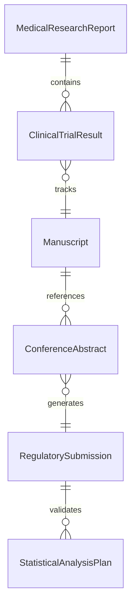
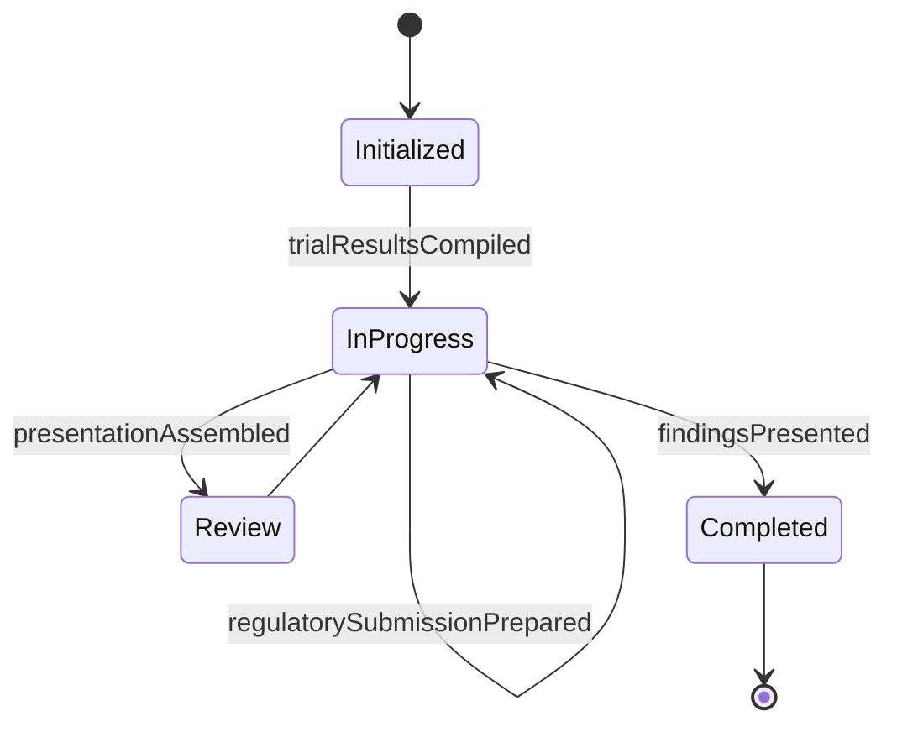
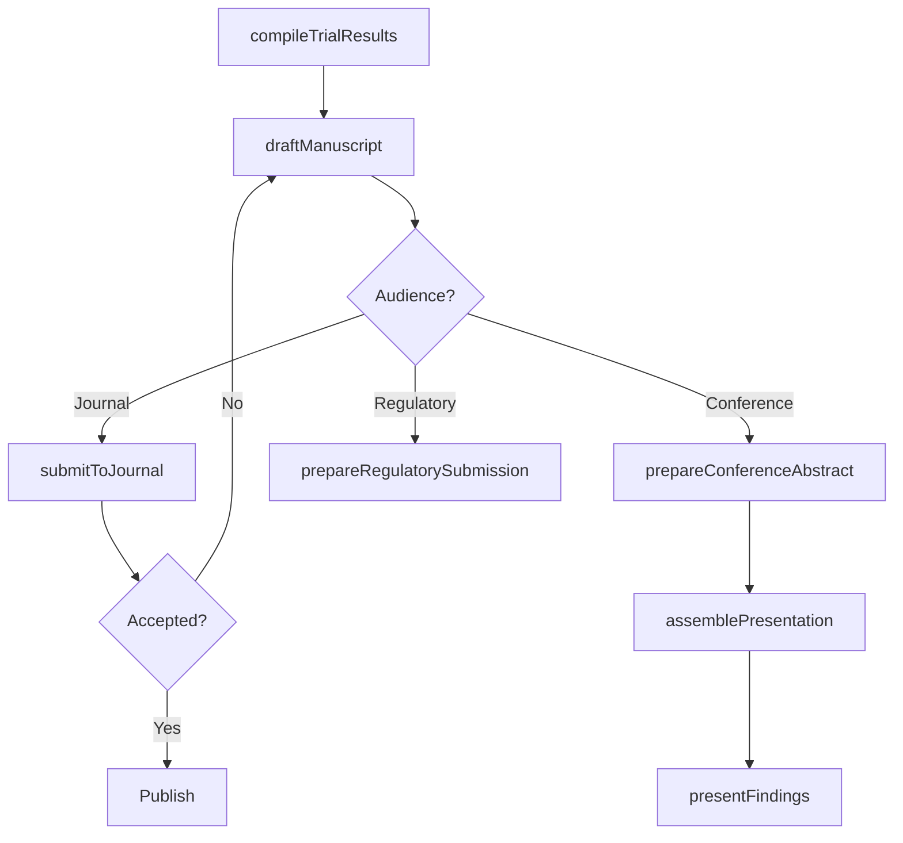
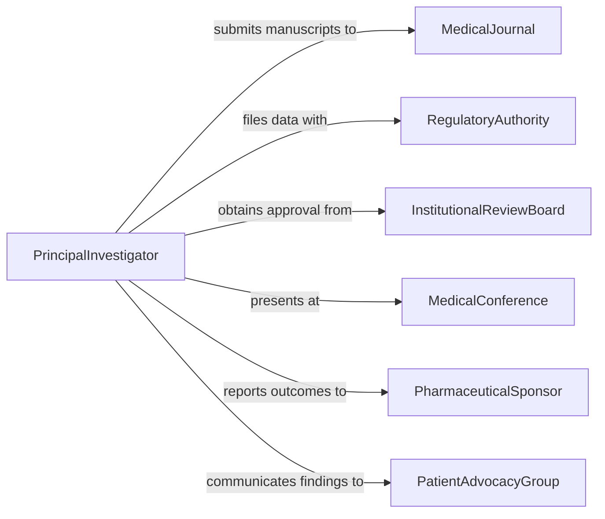

# Present Medical Research Reports

> Business-as-Code definition for presenting medical research reports, covering clinical trial results dissemination, medical conference presentations, journal manuscript preparation, and regulatory submission documentation.

## Overview

Presenting medical research reports involves communicating clinical findings, trial outcomes, and biomedical research results to professional audiences through conferences, journal publications, and regulatory submissions. This definition exposes actions for preparing medical manuscripts, assembling conference presentations, managing institutional review processes, and submitting results to regulatory authorities. It supports event-driven workflows for publication milestones and searches for locating reports by therapeutic area, trial phase, or publication status.

## Actors

| Actor | Description |
|-------|-------------|
| MedicalJournal | Peer-reviewed publication venue for clinical and biomedical research |
| RegulatoryAuthority | Government body (e.g., FDA, EMA) requiring clinical data submissions |
| InstitutionalReviewBoard | Ethics committee overseeing research involving human subjects |
| MedicalConference | Professional gathering where research findings are presented |
| PharmaceuticalSponsor | Company or organization funding the clinical research |
| PatientAdvocacyGroup | Organization representing patient interests in research outcomes |

## Roles

| Role | Description |
|------|-------------|
| PrincipalInvestigator | Leads the clinical study and presents primary findings |
| MedicalWriter | Drafts manuscripts and regulatory documents |
| Biostatistician | Validates statistical analyses and prepares data tables |
| RegulatoryAffairsSpecialist | Manages submissions to regulatory authorities |
| ClinicalResearchCoordinator | Organizes study data and supports presentation preparation |

## Entities

| Entity | Description |
|--------|-------------|
| MedicalResearchReport | A formal document presenting clinical or biomedical findings |
| ClinicalTrialResult | Outcome data from a controlled medical study |
| Manuscript | The submission-ready version of a medical research paper |
| ConferenceAbstract | A summary of findings submitted for conference presentation |
| RegulatorySubmission | A formal filing of clinical data to a regulatory authority |
| StatisticalAnalysisPlan | The documented methodology for analyzing clinical trial data |

## Actions

| Action | Description |
|--------|-------------|
| compileTrialResults | Aggregate and validate clinical trial outcome data |
| draftManuscript | Write the formal medical research paper |
| prepareConferenceAbstract | Create a summary of findings for conference submission |
| assemblePresentation | Build the slide deck for medical conference delivery |
| submitToJournal | File the manuscript with a peer-reviewed medical journal |
| prepareRegulatorySubmission | Compile clinical data and reports for regulatory filing |
| presentFindings | Deliver the research presentation at a conference or meeting |

## Events

| Event | Description |
|-------|-------------|
| trialResultsCompiled | Clinical trial outcome data has been aggregated and validated |
| manuscriptDrafted | The medical research paper has been written |
| conferenceAbstractPrepared | A summary of findings has been created for conference submission |
| presentationAssembled | The conference slide deck has been built |
| manuscriptSubmittedToJournal | The paper has been filed with a peer-reviewed journal |
| regulatorySubmissionPrepared | Clinical data has been compiled for regulatory filing |
| findingsPresented | The research has been delivered at a conference or meeting |

## Searches

| Search | Description |
|--------|-------------|
| findMedicalReports | Retrieve reports by therapeutic area, trial phase, or status |
| getTrialResultsByStudy | Look up clinical outcome data for a specific study |
| findPendingSubmissions | Identify manuscripts or regulatory filings awaiting response |
| getReportsByInvestigator | Search for reports authored by a specific principal investigator |
| findConferenceAbstracts | Locate abstracts submitted to or accepted by conferences |


## Entity Relationships



## State Diagram


## Workflow



## Actor Relationships



## Usage

### Calling Actions

```typescript
import { presentMedicalResearchReports } from '@headlessly/present-medical-research-reports'

const medicalReports = presentMedicalResearchReports()

// Compile trial results
const results = await medicalReports.compileTrialResults({
  studyId: 'NCT-2025-04892',
  trialPhase: 'phase-3',
  endpoints: ['primary-efficacy', 'secondary-safety', 'quality-of-life'],
  statisticalPlan: 'sap-intention-to-treat'
})

// Draft manuscript and submit
await medicalReports.draftManuscript({
  resultsId: results.id,
  title: 'Efficacy and Safety of Compound XR-7 in Treatment-Resistant Depression',
  authors: ['dr-rivera', 'dr-yamamoto', 'dr-oconnell']
})

await medicalReports.submitToJournal({
  resultsId: results.id,
  journal: 'new-england-journal-of-medicine',
  coverLetter: true
})

// Prepare conference presentation
await medicalReports.prepareConferenceAbstract({
  resultsId: results.id,
  conference: 'american-psychiatric-association-2026',
  wordLimit: 300
})
```

### Event-Driven Automation

```typescript
// Auto-prepare regulatory submission when trial results are compiled
medicalReports.trialResultsCompiled(async ({ resultsId, studyId, trialPhase }) => {
  if (trialPhase === 'phase-3') {
    await medicalReports.prepareRegulatorySubmission({
      resultsId,
      authority: 'fda',
      submissionType: 'supplemental-nda'
    })
  }
})

// Notify sponsor when manuscript is submitted
medicalReports.manuscriptSubmittedToJournal(async ({ resultsId, journal }) => {
  await notify({
    to: 'pharmaceutical-sponsor',
    message: `Manuscript for study ${resultsId} submitted to ${journal}`
  })
})
```
